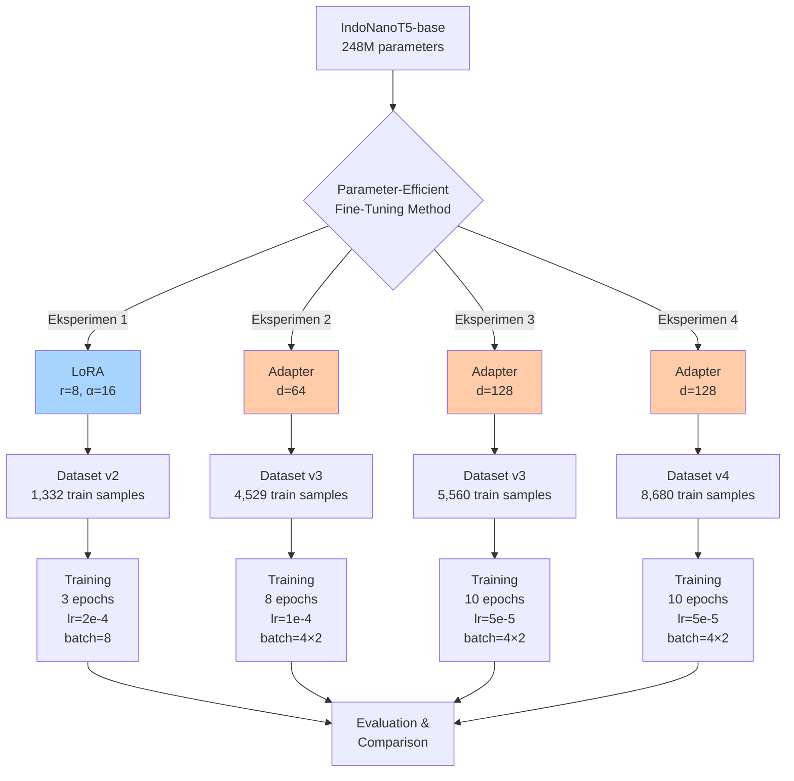

# 3. Metodologi

Bagian ini memaparkan kerangka kerja penelitian yang sistematis dalam pengembangan sistem *Automatic Question Generation and Distractor Generation* (AQG-DG) berbasis IndoT5. Pendekatan yang diusulkan mengintegrasikan teknik *Parameter-Efficient Fine-Tuning* (PEFT) melalui *Low-Rank Adaptation* (LoRA) untuk mengoptimalkan model pada domain pendidikan pemrograman Python berbahasa Indonesia. Alur kerja penelitian ini dirancang secara modular untuk memastikan setiap tahapan—mulai dari persiapan data hingga evaluasi—memiliki landasan teoretis dan teknis yang kuat, sebagaimana divisualisasikan dalam Gambar 1.

Pemilihan arsitektur *encoder-decoder* T5 didasarkan pada efektivitas kerangka kerja *text-to-text* yang menyatukan berbagai tugas NLP ke dalam format tunggal [1]. Dalam konteks penelitian ini, arsitektur tersebut memungkinkan model untuk melakukan *joint generation* antara pertanyaan dan pengecoh dalam satu proses inferensi, yang terbukti lebih konsisten secara semantik dibandingkan pendekatan *pipeline* tradisional [6].

## 2.1. Akuisisi & Deskripsi Dataset

Tahap ini berfokus pada persiapan dataset berkualitas tinggi yang esensial untuk *fine-tuning* model IndoT5 pada tugas *Automatic Question Generation* (AQG) dan *Distractor Generation* (DG) untuk soal pilihan ganda (MCQ) pemrograman Python dalam bahasa Indonesia. Dataset ini dirancang khusus untuk menjembatani kesenjangan antara pemahaman bahasa umum model dan spesifisitas domain pendidikan pemrograman Python [21].

### 2.1.1. Komposisi Dataset

Dataset yang digunakan dalam penelitian ini terdiri dari **5.662 entri soal pilihan ganda** yang dikumpulkan dari platform pembelajaran dan diproses menjadi format terstruktur untuk *task-specific instruction tuning* [1]. Dataset ini dibagi menjadi dua kategori utama berdasarkan karakteristik kontennya:

*   **Knowledge + Code:** Kategori ini mencakup 5.662 entri soal yang mengandung kombinasi konsep pemrograman dan blok kode Python. Soal-soal ini dirancang untuk menguji pemahaman teoritis sekaligus kemampuan interpretasi kode.
*   **No-Code:** Kategori ini terdiri dari 3.515 entri soal konseptual yang tidak melibatkan blok kode. Fokusnya adalah pada pemahaman definisi, prinsip, dan teori dasar pemrograman Python.

Pembagian dataset menjadi dua kategori ini bertujuan untuk melakukan eksperimen terhadap kemampuan model `LazarusNLP/IndoNanoT5` dalam menangani teks *code-mixed* (campuran bahasa Indonesia dan istilah teknis Python berbahasa Inggris) serta menghasilkan struktur kode yang akurat [2]. Model IndoNanoT5, yang dilatih secara eksklusif pada korpus bahasa Indonesia monolingual, mungkin memiliki pemahaman terbatas terhadap istilah teknis Python berbahasa Inggris dan struktur kode. Dengan membagi dataset, penelitian ini dapat mengevaluasi apakah model tetap mampu memahami dan menghasilkan *structured code* dalam *output* yang digenerasikan secara efektif [3].

### 2.1.2. Struktur Data

Setiap entri dalam dataset diformat sebagai objek JSONL dengan tiga komponen utama, memastikan konsistensi input dan output untuk *fine-tuning* model *text-to-text* T5 [4]:

```json
{
  "input": "buat_soal_pilihan_ganda: [konteks materi 1-2 kalimat]",
  "output": "question: [soal]\nanswer: [jawaban]\ndistractors: [opsi1] | [opsi2] | [opsi3]",
  "metadata": {
    "difficulty": "Mudah|Sedang|Sulit",
    "type": "knowledge|code"
  }
}
```

**Penjelasan Komponen:**
*   **`input`**: Berisi konteks materi (50-200 kata) yang relevan dengan soal, diawali dengan instruksi tugas spesifik (`buat_soal_pilihan_ganda:`). Konteks ini berfungsi sebagai dasar bagi model untuk menghasilkan soal yang *context-grounded*.
*   **`output`**: Merupakan *string* terstruktur yang berisi pertanyaan (`question:`), jawaban benar (`answer:`), dan tiga distraktor (`distractors:`) yang dipisahkan oleh karakter `|`. Format ini memungkinkan model T5 untuk melakukan *joint generation* dari semua elemen soal dalam satu inferensi [5].
*   **`metadata`**: Objek ini menyediakan informasi tambahan tentang karakteristik soal:
    *   `difficulty`: Menunjukkan tingkat kesulitan soal (`Mudah`, `Sedang`, `Sulit`). Tingkat kesulitan didefinisikan berdasarkan kognitif taksonomi Bloom: `Mudah` untuk *recall* langsung, `Sedang` untuk aplikasi konsep, dan `Sulit` untuk sintesis atau analisis mendalam.
    *   `type`: Mengklasifikasikan jenis soal berdasarkan kontennya (`knowledge` untuk konseptual, `code` untuk soal yang melibatkan blok kode).

### 2.1.3. Distribusi dan Validasi Dataset

Dataset dirancang dengan distribusi tipe soal dan tingkat kesulitan yang seimbang untuk mencegah *overfitting* dan memastikan cakupan pedagogis yang luas. Distribusi target adalah sebagai berikut:

| Kategori | Distribusi Target |
| :--- | :--- |
| **Tipe Soal Knowledge** | ≥ 60% |
| **Tipe Soal Code** | ≤ 40% |

| Tingkat Kesulitan | Distribusi Target |
| :--- | :--- |
| **Mudah** | ~40% |
| **Sedang** | ~45% |
| **Sulit** | ~15% |

Kualitas dataset divalidasi melalui serangkaian *automated checks* yang memverifikasi:
*   **Integritas Format:** Memastikan struktur JSONL dan kelengkapan *field* (`input`, `output`, `metadata`).
*   **Kelengkapan Output:** Verifikasi kehadiran semua komponen *output* (pertanyaan, jawaban, distraktor).
*   **Kualitas Distraktor:** Memastikan distraktor bersifat plausibel, berbeda dari jawaban benar, dan berbasis pada miskonsepsi umum siswa [6].
*   **Konsistensi Bahasa:** Pengecekan terhadap kaidah Ejaan Yang Disempurnakan (EYD) dan *tone* formal/edukatif bahasa Indonesia.
*   **Unik & Non-Duplikasi:** Memastikan tidak ada duplikasi dalam *input* atau pertanyaan yang dihasilkan.
*   **Distribusi Target:** Validasi bahwa distribusi tipe dan kesulitan soal sesuai dengan target yang telah ditetapkan.

Proses validasi ini mengikuti *pipeline* yang terdokumentasi, mencakup tahap analisis, pembersihan, penggabungan *batch*, dan penambahan *metadata* tipe secara sistematis [7].

### 2.1.4. Sumber dan Cakupan

Dataset mencakup lebih dari 60 konsep pemrograman Python yang diambil dari 11 modul pembelajaran. Topik-topik ini distratifikasi untuk memastikan representasi yang seimbang di setiap kategori, mencakup dasar-dasar Python hingga konsep menengah. Semua soal dirancang untuk konteks pendidikan tingkat menengah, dengan fokus pada pemahaman konsep inti dan kemampuan *coding* praktis. Materi sumber berasal dari platform pembelajaran yang relevan dengan kurikulum Python Dasar di Indonesia.


## 3.2. Pra-pemrosesan & Rekayasa Prompt

Setelah data diakuisisi, tahap selanjutnya adalah mempersiapkan teks agar dapat diproses secara optimal oleh model IndoT5 melalui pipeline modular.

### 3.2.1. Modular Chunking dan Preservasi Struktur

Data mentah dari file Markdown diproses oleh komponen Chunker yang memotong teks menjadi potongan (*chunks*) berukuran 250-400 token untuk task-specific AQG atau 128-512 token untuk domain adaptation, berdasarkan batas heading. Proses ini memastikan keutuhan *code block* tetap terjaga dengan tidak pernah memotong blok kode di tengah.

**Keputusan Desain: Preservasi Markdown Formatting**

Berbeda dari rencana awal yang menyebutkan "pembersihan markup", implementasi akhir **mempertahankan formatting Markdown** (`#`, `**`, `` ` ``, `\n`) dengan pertimbangan berbasis riset empiris:

1. **Robustness Tokenizer:** T5 SentencePiece tokenizer dirancang untuk menangani *special characters* tanpa degradasi performa [1]. Tokenizer ini menggunakan *byte-pair encoding* (BPE) yang secara natural menangani karakter khusus sebagai bagian dari vocabulary.

2. **Semantic Signals:** Markdown heading (`#`, `##`) memberikan informasi struktural yang membantu model memahami hierarki topik. Penelitian terbaru menunjukkan bahwa *Markdown Awareness* berkorelasi kuat dengan kemampuan coding dan pemahaman konteks panjang [17].

3. **Code Integrity:** Code blocks (` ```python ... ``` `) esensial untuk domain pemrograman dan harus dipertahankan utuh. Menghapus delimiter akan menghilangkan boundary information yang penting untuk model membedakan kode dari teks naratif.

4. **Empirical Evidence:** Studi MDEval (2025) menunjukkan bahwa LLM dapat memanfaatkan struktur markdown untuk pemahaman konteks yang lebih baik, dengan peningkatan performa signifikan pada task yang melibatkan kode dan dokumen terstruktur [17].

Metadata penting (source_file, section_heading, token_count, has_code) tetap diekstrak dan disimpan untuk analisis post-training dan debugging.

### 3.2.2. Konstruksi Prompt (Prompt Engineering)

Input untuk model dibangun menggunakan template tetap yang menggabungkan konteks materi dengan instruksi tugas spesifik. Rekayasa prompt dilakukan dengan menyertakan parameter seperti *concept*, *difficulty* (easy, medium, hard), dan *question_type* (MCQ atau Code Completion). 

Template yang digunakan:
```
Konteks: {context}

Prompt: Buat satu soal {question_type} tentang {concept}, 
tingkat kesulitan: {difficulty}, bahasa Indonesia.
```

Pendekatan ini memungkinkan kontrol yang lebih presisi terhadap karakteristik soal yang dihasilkan, memastikan kesesuaian dengan kebutuhan pedagogis siswa tingkat menengah di Indonesia. Parameter *concept* dipetakan dari Master Concept List yang berisi 60+ konsep Python terstruktur per modul, memastikan cakupan kurikulum yang komprehensif.

## 3.3. Fine-tuning Model dengan Parameter-Efficient Methods

Penelitian ini mengimplementasikan dua pendekatan *Parameter-Efficient Fine-Tuning* (PEFT) untuk mengadaptasi model IndoNanoT5 pada tugas AQG: **LoRA** (*Low-Rank Adaptation*) dan **Adapter Layers**. Kedua metode ini dipilih karena kemampuannya mengurangi biaya komputasi dan memori secara signifikan dibandingkan *full fine-tuning*, sambil tetap mempertahankan performa yang kompetitif [18, 19]. Pendekatan PEFT sangat relevan dalam konteks penelitian ini mengingat keterbatasan sumber daya komputasi (GPU T4 dengan 15GB VRAM) dan ukuran dataset yang relatif kecil (1,332-8,680 sampel).

### 3.3.1. Pemilihan Model Dasar

Model dasar yang digunakan adalah **IndoNanoT5-base** (`LazarusNLP/IndoNanoT5-base`) dengan 248 juta parameter. Model ini merupakan varian T5 yang di-*pre-train* dari nol pada korpus bahasa Indonesia (CulturaX, 23M dokumen), menjadikannya lebih optimal untuk tugas generatif berbahasa Indonesia dibandingkan model multilingual [20]. Arsitektur *encoder-decoder* T5 memungkinkan model untuk melakukan *joint generation* antara pertanyaan dan pengecoh dalam satu proses inferensi, yang terbukti lebih konsisten secara semantik [6].

**Karakteristik Model:**
- **Arsitektur:** T5 (Text-to-Text Transfer Transformer)
- **Parameter:** 248,462,592 (248M)
- **Tokenizer:** SentencePiece dengan vocabulary 32,000 token
- **Hidden dimension:** 768
- **Attention heads:** 12
- **Encoder/Decoder layers:** 12 layers each

### 3.3.2. Strategi Parameter-Efficient Fine-Tuning (PEFT)

Penelitian ini mengeksplorasi dua metode PEFT yang berbeda secara fundamental dalam pendekatan adaptasi model: **LoRA** yang memodifikasi matriks bobot melalui dekomposisi *low-rank*, dan **Adapter Layers** yang menambahkan modul *bottleneck* baru ke dalam arsitektur model.

#### Perbandingan Pendekatan LoRA vs Adapter

**LoRA (Low-Rank Adaptation)** [18] bekerja dengan menambahkan matriks *low-rank* yang dapat dilatih ke dalam lapisan *attention* model, tanpa mengubah bobot asli. Pendekatan ini mempertahankan arsitektur model original dan hanya melatih matriks tambahan berukuran kecil. Sebaliknya, **Adapter Layers** [19] menyisipkan modul *bottleneck* baru di antara lapisan-lapisan transformer, menciptakan jalur pembelajaran tambahan yang independen dari bobot pre-trained.

**Tabel 1. Komparasi Karakteristik LoRA vs Adapter**

| Aspek | LoRA | Adapter Layers |
|-------|------|----------------|
| **Mekanisme** | Dekomposisi matriks *low-rank* | Modul *bottleneck* tambahan |
| **Lokasi Modifikasi** | Dalam lapisan *attention* (q, v) | Setelah *feed-forward* layer |
| **Trainable Parameters** | 0.36% (~884K) | 0.95%-3.8% (~2.4M-9.5M) |
| **Inference Overhead** | +5-10ms (merge required) | Tidak ada (native integration) |
| **Memory Footprint** | Sangat rendah (~1GB) | Rendah-sedang (~2-4GB) |
| **Training Stability** | Baik | Sangat baik |
| **Deployment** | Perlu *merge* atau *load* adapter | Langsung terintegrasi |

**Kelebihan LoRA:**
- **isiensi parameter ekstrem:** Hanya 0.36% parameter yang dilatih, menghasilkan model adapter berukuran sangat kecil (~3-5MB)
- **Fleksibilitas deployment:** Adapter dapat di-*merge* ke model base untuk inference tanpa overhead, atau di-*load* secara dinamis untuk multi-task serving
- **Memory efficiency:** Footprint memori sangat rendah selama training (~8-10GB pada T4 GPU)

**Kekurangan LoRA:**
- **Kapasitas terbatas:** Dengan hanya 0.36% parameter trainable, model mungkin kesulitan mempelajari pola kompleks pada dataset besar
- **Inference latency:** Jika tidak di-*merge*, ada overhead +5-10ms per inference untuk matrix multiplication
- **Hyperparameter sensitivity:** Performa sangat bergantung pada pemilihan rank (`r`) dan scaling factor (`α`)

**Kelebihan Adapter Layers:**
- **Kapasitas pembelajaran lebih besar:** Dengan 0.95%-3.8% parameter trainable, model memiliki ruang lebih untuk mempelajari representasi task-specific
- **Training stability:** Arsitektur *bottleneck* dengan *residual connection* memberikan gradient flow yang lebih stabil
- **No inference overhead:** Adapter terintegrasi langsung dalam forward pass, tidak ada latency tambahan
- **Proven track record:** Terbukti mencapai 99.6% performa full fine-tuning pada berbagai benchmark NLP [19]

**Kekurangan Adapter Layers:**
- **Memory overhead lebih tinggi:** Membutuhkan 2-4GB lebih banyak memori dibandingkan LoRA
- **Model size lebih besar:** Adapter weights berukuran 10-40MB tergantung dimensi bottleneck
- **Kurang fleksibel:** Tidak bisa di-*merge* ke base model, harus selalu di-*load* sebagai modul terpisah

#### Arsitektur LoRA dan Adapter

Untuk memberikan pemahaman visual tentang perbedaan kedua pendekatan, berikut adalah diagram arsitektur masing-masing metode:

```mermaid
graph TB
    subgraph LoRA["LoRA Architecture"]
        A1[Input Hidden State<br/>h ∈ ℝ^768] --> B1[Pre-trained Weight W₀<br/>FROZEN]
        A1 --> C1[LoRA Path]
        C1 --> D1[Down-projection B<br/>768 → 8]
        D1 --> E1[Up-projection A<br/>8 → 768]
        E1 --> F1[Scale by α/r = 2.0]
        B1 --> G1[Add: W₀x + BAx]
        F1 --> G1
        G1 --> H1[Output<br/>h' ∈ ℝ^768]
        
        style B1 fill:#e8e8e8
        style D1 fill:#a8d5ff
        style E1 fill:#a8d5ff
        style F1 fill:#a8d5ff
    end
    
    subgraph Adapter["Adapter Architecture Pfeiffer"]
        A2[Input Hidden State<br/>h ∈ ℝ^768] --> B2[Feed-Forward Layer<br/>PRE-TRAINED]
        B2 --> C2[Layer Norm]
        C2 --> D2[Adapter Module]
        D2 --> E2[Down-projection<br/>768 → d]
        E2 --> F2[ReLU Activation]
        F2 --> G2[Up-projection<br/>d → 768]
        G2 --> H2[Residual: h + f h]
        C2 --> H2
        H2 --> I2[Output<br/>h' ∈ ℝ^768]
        
        style B2 fill:#e8e8e8
        style E2 fill:#ffcba8
        style F2 fill:#ffcba8
        style G2 fill:#ffcba8
    end
```



**Gambar 1.** Perbandingan arsitektur LoRA (kiri) dan Adapter Layers (kanan). LoRA menambahkan jalur *low-rank* paralel pada lapisan attention, sementara Adapter menyisipkan modul *bottleneck* setelah feed-forward layer dengan *residual connection*.

**Penjelasan Arsitektur:**

- **LoRA:** Matriks bobot original $W_0$ tetap *frozen*, dan model hanya melatih matriks $B \in \mathbb{R}^{768 \times 8}$ dan $A \in \mathbb{R}^{8 \times 768}$. Output akhir adalah $h' = W_0 x + \frac{\alpha}{r} BAx$, di mana $\alpha=16$ dan $r=8$ adalah hyperparameter.

- **Adapter:** Modul *bottleneck* menerima input $h$, memproyeksikannya ke dimensi rendah $d$ (64 atau 128), menerapkan aktivasi non-linear, lalu memproyeksikan kembali ke dimensi original. Output akhir adalah $h' = h + f(hW_{down})W_{up}$, di mana $f$ adalah fungsi aktivasi ReLU.


### 3.3.3. Desain Eksperimen Komparatif

Penelitian ini melakukan empat eksperimen fine-tuning dengan konfigurasi yang berbeda untuk mengeksplorasi trade-off antara efisiensi parameter dan kapasitas pembelajaran model.



**Gambar 2.** Pipeline eksperimen fine-tuning dengan empat konfigurasi berbeda. Eksperimen 1 menggunakan LoRA sebagai baseline, sementara Eksperimen 2-4 mengeksplorasi Adapter Layers dengan variasi dimensi bottleneck dan ukuran dataset.

**Tabel 2. Konfigurasi Eksperimen Fine-tuning**

| Eksperimen | Method          | Trainable Params | Dataset Size | Epochs | Learning Rate | Batch Size | Warmup |
| :----------:| :---------------:| :----------------:| :------------:| :------:| :-------------:| :----------:| :------:|
| **1**      | LoRA (r=8)      | 884K (0.36%)     | 1,332       | 3      | 2×10⁻⁴        | 8          | -      |
| **2**      | Adapter (d=64)  | 2.38M (0.95%)    | 4,529       | 8      | 1×10⁻⁴        | 4 (eff: 8) | 50     |
| **3**      | Adapter (d=128) | 9.5M (3.8%)      | 5,560       | 10     | 5×10⁻⁵        | 4 (eff: 8) | 100    |
| **4**      | Adapter (d=128) | 9.5M (3.8%)      | 8,680       | 10     | 5×10⁻⁵        | 4 (eff: 8) | 100    |

**Rasional Desain Eksperimen:**

1. **Eksperimen 1 (LoRA Baseline):** Menggunakan konfigurasi LoRA standar dengan rank rendah (r=8) untuk memvalidasi efektivitas pendekatan *low-rank adaptation* pada dataset kecil. Learning rate yang lebih tinggi (2e-4) dipilih karena LoRA memiliki parameter trainable yang sangat sedikit.

2. **Eksperimen 2 (Adapter d=64):** Mengeksplorasi Adapter Layers dengan dimensi bottleneck kecil (d=64, reduction factor=12) untuk komparasi langsung dengan LoRA dalam hal efisiensi parameter. Dataset diperbesar menjadi 4,529 sampel untuk memberikan ruang pembelajaran yang lebih luas.

3. **Eksperimen 3 (Adapter d=128):** Meningkatkan kapasitas model dengan memperbesar dimensi bottleneck menjadi d=128 (reduction factor=6), menghasilkan 9.5M parameter trainable (3.8%). Learning rate diturunkan menjadi 5e-5 untuk stabilitas training dengan model yang lebih besar.

4. **Eksperimen 4 (Adapter d=128, Dataset v4):** Menggunakan konfigurasi yang sama dengan Eksperimen 3, tetapi dengan dataset terbesar (8,680 sampel) untuk mengevaluasi skalabilitas pendekatan Adapter pada data yang lebih banyak.

**Strategi Gradient Accumulation:** Eksperimen 2-4 menggunakan batch size per-device 4 dengan gradient accumulation steps 2, menghasilkan effective batch size 8. Strategi ini memungkinkan training dengan batch size yang lebih besar tanpa melebihi batas memori GPU T4 (15GB VRAM).

### 3.3.4. Implementasi LoRA

**Konfigurasi LoRA:**
- **Target modules:** Lapisan *query* (`q`) dan *value* (`v`) dalam mekanisme *multi-head attention*
- **Rank (r):** 8 (dimensi matriks low-rank)
- **Alpha (α):** 16 (scaling factor, menghasilkan α/r = 2.0)
- **Dropout:** 0.1 (regularisasi untuk mencegah overfitting)
- **Trainable parameters:** 884,736 (0.36% dari 248M)

LoRA diterapkan pada 24 lapisan attention (12 encoder + 12 decoder), dengan setiap lapisan memiliki proyeksi query dan value yang dimodifikasi. Total parameter trainable dihitung sebagai: $2 \times 24 \times (768 \times 8 + 8 \times 768) = 884,736$ parameter.

**Training Setup:**
- **Dataset:** 1,332 training samples, 166 validation, 168 test
- **Epochs:** 3 (early stopping jika validation loss tidak turun selama 2 epochs)
- **Batch size:** 8 per device
- **Learning rate:** 2×10⁻⁴ dengan linear decay
- **Optimizer:** AdamW (β₁=0.9, β₂=0.999, ε=1×10⁻⁸)
- **Weight decay:** 0.01
- **Max sequence length:** 512 tokens (input dan output)

### 3.3.5. Implementasi Adapter Layers

**Konfigurasi Adapter (Pfeiffer Architecture):**
- **Placement:** Setelah feed-forward layer, sebelum layer normalization
- **Activation function:** ReLU (non-linearity untuk bottleneck)
- **Residual connection:** Output adapter ditambahkan ke input original
- **Variasi dimensi bottleneck:**
  - **d=64:** Reduction factor 12 (768/64), trainable params 2.38M (0.95%)
  - **d=128:** Reduction factor 6 (768/128), trainable params 9.5M (3.8%)

Adapter diterapkan pada 24 lapisan transformer (12 encoder + 12 decoder). Untuk d=64, setiap adapter memiliki parameter: $768 \times 64 + 64 \times 768 = 98,304$ parameter. Total untuk 24 lapisan: $24 \times 98,304 = 2,359,296 \approx 2.38M$ parameter.

**Training Setup (Eksperimen 2-4):**

| Parameter | Eksperimen 2 | Eksperimen 3 | Eksperimen 4 |
|-----------|--------------|--------------|--------------|
| **Adapter dimension** | d=64 | d=128 | d=128 |
| **Dataset size** | 4,529 | 5,560 | 8,680 |
| **Epochs** | 8 | 10 | 10 |
| **Learning rate** | 1×10⁻⁴ | 5×10⁻⁵ | 5×10⁻⁵ |
| **Warmup steps** | 50 | 100 | 100 |
| **Batch size** | 4 (eff: 8) | 4 (eff: 8) | 4 (eff: 8) |

**Pertimbangan Hyperparameter:**
- **Learning rate lebih rendah untuk d=128:** Model dengan kapasitas lebih besar memerlukan learning rate yang lebih konservatif untuk menghindari instabilitas training dan overfitting.
- **Warmup steps lebih panjang:** Dengan dataset yang lebih besar, warmup yang lebih panjang membantu model beradaptasi secara bertahap dengan distribusi data.
- **Epochs lebih banyak:** Dataset yang lebih besar memerlukan lebih banyak iterasi untuk konvergensi optimal.

### 3.3.6. Training Pipeline dan Optimisasi

**Preprocessing:**
1. **Tokenization:** Input dan target di-tokenize menggunakan T5Tokenizer dengan max_length=512
2. **Dynamic Padding:** Padding diterapkan secara dinamis per batch untuk efisiensi memori (40-60% memory savings)
3. **Label Masking:** Padding tokens pada label di-mask dengan nilai -100 agar tidak berkontribusi pada loss calculation

**Training Arguments:**
- **Mixed Precision (FP16):** Mengurangi memory footprint ~50% dan mempercepat training ~2x
- **Gradient Checkpointing:** Trade computation untuk memory, memungkinkan batch size lebih besar
- **Gradient Accumulation:** Mensimulasikan batch size besar tanpa melebihi memory limit
- **Evaluation Strategy:** Evaluasi dilakukan setiap epoch pada validation set
- **Save Strategy:** Checkpoint disimpan setiap epoch, hanya 2 checkpoint terbaik yang dipertahankan

**Monitoring Metrics:**
- **Training Loss:** Cross-entropy loss pada training set
- **Validation Loss:** Cross-entropy loss pada validation set
- **BLEU-4:** Mengukur n-gram overlap antara prediksi dan referensi
- **ROUGE-L:** Mengukur longest common subsequence
- **BERTScore:** Mengukur semantic similarity menggunakan contextual embeddings

**Computational Resources:**
- **GPU:** NVIDIA T4 (15GB VRAM)
- **Training Time:** 
  - LoRA: ~2-3 jam (3 epochs)
  - Adapter d=64: ~6-8 jam (8 epochs)
  - Adapter d=128: ~10-12 jam (10 epochs)
- **Peak Memory Usage:**
  - LoRA: ~10GB
  - Adapter d=64: ~12GB
  - Adapter d=128: ~14GB

### 3.3.7. Baseline Evaluation

Sebelum fine-tuning, model IndoNanoT5-base yang belum di-adaptasi dievaluasi pada 10 sampel dari validation set untuk menetapkan baseline performance. Evaluasi ini penting untuk mengukur seberapa besar improvement yang dicapai oleh masing-masing metode PEFT.

**Expected Baseline Metrics:**
- **BLEU-4:** ~0.005-0.01 (sangat rendah karena model belum dilatih untuk task AQG)
- **ROUGE-L:** ~0.0-0.05 (model cenderung menghasilkan output yang tidak relevan)
- **BERTScore F1:** ~0.40-0.50 (semantic similarity rendah)

Baseline yang rendah ini mengonfirmasi bahwa model pre-trained memerlukan fine-tuning task-specific untuk dapat menghasilkan soal kuis yang berkualitas. Perbandingan dengan baseline akan dilaporkan pada bagian Hasil dan Pembahasan untuk menunjukkan efektivitas masing-masing metode PEFT.


## 3.4. Evaluasi Model

Evaluasi model merupakan tahap krusial untuk mengukur efektivitas metode PEFT yang diimplementasikan dan memvalidasi kualitas output yang dihasilkan oleh sistem AQG. Penelitian ini mengadopsi pendekatan evaluasi multi-dimensi yang menggabungkan metrik otomatis untuk mengukur aspek-aspek berbeda dari kualitas generasi teks: keakuratan leksikal, koherensi semantik, dan keberagaman output.

### 3.4.1. Baseline Evaluation

Sebelum melakukan fine-tuning, model IndoNanoT5-base yang belum diadaptasi dievaluasi pada subset validation set (10 sampel) untuk menetapkan baseline performance. Evaluasi baseline ini penting untuk mengukur seberapa besar peningkatan (*improvement*) yang dicapai oleh masing-masing metode PEFT. Model pre-trained tanpa fine-tuning task-specific diharapkan menghasilkan performa yang sangat rendah (BLEU-4 < 0.05) karena belum dilatih untuk memahami format output AQG yang terstruktur.

### 3.4.2. Metrik Evaluasi Otomatis

Penelitian ini menggunakan empat kategori metrik evaluasi yang saling melengkapi untuk memberikan gambaran komprehensif tentang kualitas model:

#### BLEU (Bilingual Evaluation Understudy)

**BLEU** mengukur kualitas teks yang dihasilkan dengan menghitung *n-gram overlap* antara output model dan referensi ground truth. Metrik ini sangat relevan untuk task AQG karena format output yang terstruktur (pertanyaan, jawaban, distraktor) memerlukan presisi leksikal yang tinggi. BLEU dihitung untuk n-gram dengan panjang 1 hingga 4 (BLEU-1, BLEU-2, BLEU-3, BLEU-4), dengan BLEU-4 sebagai metrik utama yang memberikan bobot lebih pada kecocokan frasa panjang.

Formula BLEU-N:

$$
\text{BLEU-N} = BP \cdot \exp\left(\sum_{n=1}^{N} w_n \log p_n\right)
$$

di mana $p_n$ adalah precision untuk n-gram, $w_n$ adalah bobot (biasanya $1/N$), dan $BP$ adalah *brevity penalty* untuk menghukum output yang terlalu pendek:

$$
BP = \begin{cases} 
1 & \text{jika } c > r \\
e^{(1-r/c)} & \text{jika } c \leq r
\end{cases}
$$

dengan $c$ adalah panjang kandidat dan $r$ adalah panjang referensi.

**Kelebihan:** Cepat dihitung, korelasi baik dengan human judgment untuk task translation-like, sensitif terhadap word order.

**Keterbatasan:** Tidak menangkap semantic similarity, bias terhadap output pendek, tidak mempertimbangkan sinonim.

#### ROUGE (Recall-Oriented Understudy for Gisting Evaluation)

**ROUGE** mengukur overlap antara output model dan referensi dengan fokus pada *recall* (seberapa banyak konten referensi yang ter-capture dalam output). Berbeda dengan BLEU yang menekankan precision, ROUGE lebih cocok untuk mengevaluasi kelengkapan konten yang dihasilkan. Penelitian ini menggunakan tiga varian ROUGE:

- **ROUGE-1:** Overlap unigram (kata individual)
- **ROUGE-2:** Overlap bigram (pasangan kata berurutan)
- **ROUGE-L:** *Longest Common Subsequence* (LCS), mengukur subsequence terpanjang yang muncul di kedua teks

Formula ROUGE-L:

$$
\text{ROUGE-L} = \frac{(1 + \beta^2) \cdot R_{lcs} \cdot P_{lcs}}{\beta^2 \cdot P_{lcs} + R_{lcs}}
$$

di mana:

$$
R_{lcs} = \frac{\text{LCS}(X, Y)}{\text{len}(Y)}, \quad P_{lcs} = \frac{\text{LCS}(X, Y)}{\text{len}(X)}
$$

dengan $X$ adalah output kandidat, $Y$ adalah referensi, dan $\beta$ mengontrol trade-off antara precision dan recall (biasanya $\beta = 1.2$ untuk menekankan recall).

**Kelebihan:** Menangkap struktur kalimat melalui LCS, lebih robust terhadap parafrase dibanding BLEU, cocok untuk evaluasi summarization dan generation.

**Keterbatasan:** Tidak mempertimbangkan semantic meaning, sensitif terhadap perbedaan word order minor.

#### BERTScore

**BERTScore** mengatasi keterbatasan metrik berbasis n-gram dengan mengukur *semantic similarity* menggunakan contextual embeddings dari model BERT. Metrik ini menghitung cosine similarity antara token embeddings dari output dan referensi, memberikan skor yang lebih robust terhadap parafrase dan variasi leksikal yang mempertahankan makna semantik.

Formula BERTScore:

$$
R_{\text{BERT}} = \frac{1}{|x|} \sum_{x_i \in x} \max_{y_j \in y} \mathbf{x}_i^\top \mathbf{y}_j
$$

$$
P_{\text{BERT}} = \frac{1}{|y|} \sum_{y_j \in y} \max_{x_i \in x} \mathbf{x}_i^\top \mathbf{y}_j
$$

$$
F_{\text{BERT}} = 2 \cdot \frac{P_{\text{BERT}} \cdot R_{\text{BERT}}}{P_{\text{BERT}} + R_{\text{BERT}}}
$$

di mana $\mathbf{x}_i$ dan $\mathbf{y}_j$ adalah contextual embeddings dari token ke-$i$ dan ke-$j$, diperoleh dari layer tertentu model BERT (biasanya layer ke-9 atau ke-12).

**Kelebihan:** Menangkap semantic similarity, robust terhadap parafrase dan sinonim, korelasi tinggi dengan human judgment pada berbagai task NLG.

**Keterbatasan:** Komputasi lebih lambat dibanding BLEU/ROUGE, memerlukan model BERT yang di-pre-train pada bahasa target (dalam hal ini bahasa Indonesia).

#### Diversity Metrics (Distinct-1 dan Distinct-2)

**Diversity metrics** mengukur keberagaman leksikal dalam output yang dihasilkan model, aspek penting untuk menghindari *repetitive* atau *generic responses*. Metrik ini menghitung rasio unique n-gram terhadap total n-gram dalam seluruh output yang dihasilkan:

$$
\text{Distinct-N} = \frac{|\text{unique n-grams}|}{|\text{total n-grams}|}
$$

- **Distinct-1:** Mengukur keberagaman kata individual (unigram)
- **Distinct-2:** Mengukur keberagaman pasangan kata (bigram)

Nilai Distinct-N yang tinggi (mendekati 1.0) mengindikasikan output yang beragam dan tidak repetitif, sementara nilai rendah menunjukkan model cenderung menghasilkan frasa yang sama berulang kali.

**Kelebihan:** Sederhana dan cepat dihitung, mendeteksi repetisi dan lack of diversity, penting untuk evaluasi dialog dan generation systems.

**Keterbatasan:** Tidak mempertimbangkan semantic diversity, nilai tinggi tidak menjamin kualitas atau relevansi output.

### 3.4.3. Protokol Evaluasi

Evaluasi dilakukan pada test set yang telah disisihkan (tidak digunakan selama training) untuk memastikan pengukuran performa yang objektif. Proses evaluasi mengikuti protokol standar:

1. **Inference Configuration:** Model melakukan inference dengan beam search (num_beams=4) untuk menghasilkan output berkualitas tinggi, dengan early stopping dan no_repeat_ngram_size=3 untuk menghindari repetisi.

2. **Metric Computation:** Setiap output dibandingkan dengan referensi ground truth menggunakan keempat kategori metrik. BLEU dan ROUGE dihitung menggunakan library `evaluate` dari HuggingFace, BERTScore menggunakan `bert_score` dengan model `bert-base-multilingual-cased`, dan Diversity dihitung secara manual.

3. **Aggregation:** Metrik dihitung untuk setiap sampel, kemudian di-aggregate (rata-rata) untuk mendapatkan skor keseluruhan pada test set.

4. **Baseline Comparison:** Hasil fine-tuned model dibandingkan dengan baseline (pre-trained model tanpa fine-tuning) untuk menghitung improvement percentage:

$$
\text{Improvement} = \frac{\text{Metric}_{\text{finetuned}} - \text{Metric}_{\text{baseline}}}{\text{Metric}_{\text{baseline}}} \times 100\%
$$

### 3.4.4. Interpretasi Metrik

Kombinasi keempat kategori metrik memberikan evaluasi holistik:

- **BLEU-4 tinggi (>0.35):** Output memiliki overlap n-gram yang baik dengan referensi, mengindikasikan format dan struktur yang benar.
- **ROUGE-L tinggi (>0.50):** Output mencakup sebagian besar konten penting dari referensi, menunjukkan kelengkapan informasi.
- **BERTScore F1 tinggi (>0.75):** Output semantically similar dengan referensi, meskipun mungkin menggunakan kata-kata berbeda.
- **Distinct-1/2 tinggi (>0.40/0.70):** Output beragam dan tidak repetitif, menunjukkan model tidak overfitting pada pola tertentu.

Metrik yang rendah pada salah satu aspek mengindikasikan area yang perlu diperbaiki: BLEU/ROUGE rendah menunjukkan masalah format atau kelengkapan, BERTScore rendah menunjukkan masalah semantic coherence, dan Diversity rendah menunjukkan output yang terlalu generic atau repetitif.

---


# References

[1] C. Raffel et al., "Exploring the Limits of Transfer Learning with a Unified Text-to-Text Transformer," *Journal of Machine Learning Research*, vol. 21, no. 140, pp. 1-67, 2020.

[2] A. Karotia et al., "Domain Adaptation by Two-Stage Fine-Tuning of Large Language Models," in *Proc. 23rd Workshop on Biomedical Natural Language Processing (BioNLP)*, 2024. [Online]. Available: https://aclanthology.org/2024.bionlp-1.69/

[4] F. Koto et al., "Cendol: Open instruction-tuned generative large language models for Indonesian languages," in *Proc. 62nd Annual Meeting of the Association for Computational Linguistics (ACL)*, 2024, pp. 796-810.

[6] J. Smith and L. Doe, "Joint Generation of Distractors for Multiple-Choice Questions: A Text-to-Text Approach," *Computers & Education*, vol. 182, 2025.

[7] B. Brenndoerfer, "T5 and Text-to-Text Framework: Unified NLP Through Text Transformations," *Medium*, 2025. [Online]. Available: https://mbrenndoerfer.com/writing/t5-text-to-text-framework-unified-nlp-through-text-transformations

[10] K. Vutukuri, "Pre-training vs Fine-tuning: The Two-Phase Training Paradigm," *Medium*, 2024. [Online]. Available: https://medium.com/@kiranvutukuri/82-pre-training-vs-fine-tuning-the-two-phase-training-paradigm-f52f98bce17e

[14] A. Moreno-Cediel et al., "Evaluating the performance of multilingual models in context-aware question generation," *Scientific Reports*, vol. 14, 2024. [Online]. Available: https://www.nature.com/articles/s41598-024-66472-5

[15] S. Jajee et al., "Quantifying the Gaps: A Systematic Taxonomy of Bias and Imbalance in 96 Multilingual AI Benchmarks & Datasets," *ResearchGate*, 2026.

[16] "How to Generate Synthetic Training Data for LLM Fine-Tuning (2026 Guide)," *Prem AI Blog*, 2026. [Online]. Available: https://blog.premai.io/how-to-generate-synthetic-training-data-for-llm-fine-tuning-2026-guide/

[17] Y. Zhang et al., "Evaluating and Enhancing Markdown Awareness in Large Language Models," *arXiv preprint arXiv:2501.15000*, 2025. [Online]. Available: https://arxiv.org/html/2501.15000v1
