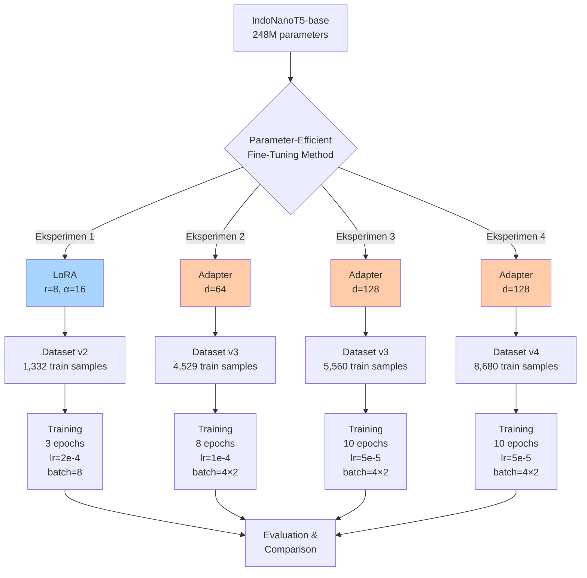

## 3.3. Fine-tuning Model dengan Parameter-Efficient Methods

Penelitian ini mengimplementasikan dua pendekatan *Parameter-Efficient Fine-Tuning* (PEFT) untuk mengadaptasi model IndoNanoT5 pada tugas AQG: **LoRA** (*Low-Rank Adaptation*) dan **Adapter Layers**. Kedua metode ini dipilih karena kemampuannya mengurangi biaya komputasi dan memori secara signifikan dibandingkan *full fine-tuning*, sambil tetap mempertahankan performa yang kompetitif [18, 19]. Pendekatan PEFT sangat relevan dalam konteks penelitian ini mengingat keterbatasan sumber daya komputasi (GPU T4 dengan 15GB VRAM) dan ukuran dataset yang relatif kecil (1,332-8,680 sampel).

### 3.3.1. Pemilihan Model Dasar

Model dasar yang digunakan adalah **IndoNanoT5-base** (`LazarusNLP/IndoNanoT5-base`) dengan 248 juta parameter. Model ini merupakan varian T5 yang di-*pre-train* dari nol pada korpus bahasa Indonesia (CulturaX, 23M dokumen), menjadikannya lebih optimal untuk tugas generatif berbahasa Indonesia dibandingkan model multilingual [20]. Arsitektur *encoder-decoder* T5 memungkinkan model untuk melakukan *joint generation* antara pertanyaan dan pengecoh dalam satu proses inferensi, yang terbukti lebih konsisten secara semantik [6].

**Karakteristik Model:**
- **Arsitektur:** T5 (Text-to-Text Transfer Transformer)
- **Parameter:** 248,462,592 (248M)
- **Tokenizer:** SentencePiece dengan vocabulary 32,000 token
- **Hidden dimension:** 768
- **Attention heads:** 12
- **Encoder/Decoder layers:** 12 layers each

### 3.3.2. Strategi Parameter-Efficient Fine-Tuning (PEFT)

Penelitian ini mengeksplorasi dua metode PEFT yang berbeda secara fundamental dalam pendekatan adaptasi model: **LoRA** yang memodifikasi matriks bobot melalui dekomposisi *low-rank*, dan **Adapter Layers** yang menambahkan modul *bottleneck* baru ke dalam arsitektur model.

#### Perbandingan Pendekatan LoRA vs Adapter

**LoRA (Low-Rank Adaptation)** [18] bekerja dengan menambahkan matriks *low-rank* yang dapat dilatih ke dalam lapisan *attention* model, tanpa mengubah bobot asli. Pendekatan ini mempertahankan arsitektur model original dan hanya melatih matriks tambahan berukuran kecil. Sebaliknya, **Adapter Layers** [19] menyisipkan modul *bottleneck* baru di antara lapisan-lapisan transformer, menciptakan jalur pembelajaran tambahan yang independen dari bobot pre-trained.

**Tabel 1. Komparasi Karakteristik LoRA vs Adapter**

| Aspek | LoRA | Adapter Layers |
|-------|------|----------------|
| **Mekanisme** | Dekomposisi matriks *low-rank* | Modul *bottleneck* tambahan |
| **Lokasi Modifikasi** | Dalam lapisan *attention* (q, v) | Setelah *feed-forward* layer |
| **Trainable Parameters** | 0.36% (~884K) | 0.95%-3.8% (~2.4M-9.5M) |
| **Inference Overhead** | +5-10ms (merge required) | Tidak ada (native integration) |
| **Memory Footprint** | Sangat rendah (~1GB) | Rendah-sedang (~2-4GB) |
| **Training Stability** | Baik | Sangat baik |
| **Deployment** | Perlu *merge* atau *load* adapter | Langsung terintegrasi |

**Kelebihan LoRA:**
- **isiensi parameter ekstrem:** Hanya 0.36% parameter yang dilatih, menghasilkan model adapter berukuran sangat kecil (~3-5MB)
- **Fleksibilitas deployment:** Adapter dapat di-*merge* ke model base untuk inference tanpa overhead, atau di-*load* secara dinamis untuk multi-task serving
- **Memory efficiency:** Footprint memori sangat rendah selama training (~8-10GB pada T4 GPU)

**Kekurangan LoRA:**
- **Kapasitas terbatas:** Dengan hanya 0.36% parameter trainable, model mungkin kesulitan mempelajari pola kompleks pada dataset besar
- **Inference latency:** Jika tidak di-*merge*, ada overhead +5-10ms per inference untuk matrix multiplication
- **Hyperparameter sensitivity:** Performa sangat bergantung pada pemilihan rank (`r`) dan scaling factor (`α`)

**Kelebihan Adapter Layers:**
- **Kapasitas pembelajaran lebih besar:** Dengan 0.95%-3.8% parameter trainable, model memiliki ruang lebih untuk mempelajari representasi task-specific
- **Training stability:** Arsitektur *bottleneck* dengan *residual connection* memberikan gradient flow yang lebih stabil
- **No inference overhead:** Adapter terintegrasi langsung dalam forward pass, tidak ada latency tambahan
- **Proven track record:** Terbukti mencapai 99.6% performa full fine-tuning pada berbagai benchmark NLP [19]

**Kekurangan Adapter Layers:**
- **Memory overhead lebih tinggi:** Membutuhkan 2-4GB lebih banyak memori dibandingkan LoRA
- **Model size lebih besar:** Adapter weights berukuran 10-40MB tergantung dimensi bottleneck
- **Kurang fleksibel:** Tidak bisa di-*merge* ke base model, harus selalu di-*load* sebagai modul terpisah

#### Arsitektur LoRA dan Adapter

Untuk memberikan pemahaman visual tentang perbedaan kedua pendekatan, berikut adalah diagram arsitektur masing-masing metode:

```mermaid
graph TB
    subgraph LoRA["LoRA Architecture"]
        A1[Input Hidden State<br/>h ∈ ℝ^768] --> B1[Pre-trained Weight W₀<br/>FROZEN]
        A1 --> C1[LoRA Path]
        C1 --> D1[Down-projection B<br/>768 → 8]
        D1 --> E1[Up-projection A<br/>8 → 768]
        E1 --> F1[Scale by α/r = 2.0]
        B1 --> G1[Add: W₀x + BAx]
        F1 --> G1
        G1 --> H1[Output<br/>h' ∈ ℝ^768]
        
        style B1 fill:#e8e8e8
        style D1 fill:#a8d5ff
        style E1 fill:#a8d5ff
        style F1 fill:#a8d5ff
    end
    
    subgraph Adapter["Adapter Architecture Pfeiffer"]
        A2[Input Hidden State<br/>h ∈ ℝ^768] --> B2[Feed-Forward Layer<br/>PRE-TRAINED]
        B2 --> C2[Layer Norm]
        C2 --> D2[Adapter Module]
        D2 --> E2[Down-projection<br/>768 → d]
        E2 --> F2[ReLU Activation]
        F2 --> G2[Up-projection<br/>d → 768]
        G2 --> H2[Residual: h + f h]
        C2 --> H2
        H2 --> I2[Output<br/>h' ∈ ℝ^768]
        
        style B2 fill:#e8e8e8
        style E2 fill:#ffcba8
        style F2 fill:#ffcba8
        style G2 fill:#ffcba8
    end
```

**Gambar 1.** Perbandingan arsitektur LoRA (kiri) dan Adapter Layers (kanan). LoRA menambahkan jalur *low-rank* paralel pada lapisan attention, sementara Adapter menyisipkan modul *bottleneck* setelah feed-forward layer dengan *residual connection*.

**Penjelasan Arsitektur:**

- **LoRA:** Matriks bobot original $W_0$ tetap *frozen*, dan model hanya melatih matriks $B \in \mathbb{R}^{768 \times 8}$ dan $A \in \mathbb{R}^{8 \times 768}$. Output akhir adalah $h' = W_0 x + \frac{\alpha}{r} BAx$, di mana $\alpha=16$ dan $r=8$ adalah hyperparameter.

- **Adapter:** Modul *bottleneck* menerima input $h$, memproyeksikannya ke dimensi rendah $d$ (64 atau 128), menerapkan aktivasi non-linear, lalu memproyeksikan kembali ke dimensi original. Output akhir adalah $h' = h + f(hW_{down})W_{up}$, di mana $f$ adalah fungsi aktivasi ReLU.

### 3.3.3. Desain Eksperimen Komparatif

Penelitian ini melakukan empat eksperimen fine-tuning dengan konfigurasi yang berbeda untuk mengeksplorasi trade-off antara efisiensi parameter dan kapasitas pembelajaran model.

**Gambar 2.** Pipeline eksperimen fine-tuning dengan empat konfigurasi berbeda. Eksperimen 1 menggunakan LoRA sebagai baseline, sementara Eksperimen 2-4 mengeksplorasi Adapter Layers dengan variasi dimensi bottleneck dan ukuran dataset.

**Tabel 2. Konfigurasi Eksperimen Fine-tuning**

| Eksperimen | Method          | Trainable Params | Dataset Size | Epochs | Learning Rate | Batch Size | Warmup |
| :----------:| :---------------:| :----------------:| :------------:| :------:| :-------------:| :----------:| :------:|
| **1**      | LoRA (r=8)      | 884K (0.36%)     | 1,332       | 3      | 2×10⁻⁴        | 8          | -      |
| **2**      | Adapter (d=64)  | 2.38M (0.95%)    | 4,529       | 8      | 1×10⁻⁴        | 4 (eff: 8) | 50     |
| **3**      | Adapter (d=128) | 9.5M (3.8%)      | 5,560       | 10     | 5×10⁻⁵        | 4 (eff: 8) | 100    |
| **4**      | Adapter (d=128) | 9.5M (3.8%)      | 8,680       | 10     | 5×10⁻⁵        | 4 (eff: 8) | 100    |

**Rasional Desain Eksperimen:**

1. **Eksperimen 1 (LoRA Baseline):** Menggunakan konfigurasi LoRA standar dengan rank rendah (r=8) untuk memvalidasi efektivitas pendekatan *low-rank adaptation* pada dataset kecil. Learning rate yang lebih tinggi (2e-4) dipilih karena LoRA memiliki parameter trainable yang sangat sedikit.

2. **Eksperimen 2 (Adapter d=64):** Mengeksplorasi Adapter Layers dengan dimensi bottleneck kecil (d=64, reduction factor=12) untuk komparasi langsung dengan LoRA dalam hal efisiensi parameter. Dataset diperbesar menjadi 4,529 sampel untuk memberikan ruang pembelajaran yang lebih luas.

3. **Eksperimen 3 (Adapter d=128):** Meningkatkan kapasitas model dengan memperbesar dimensi bottleneck menjadi d=128 (reduction factor=6), menghasilkan 9.5M parameter trainable (3.8%). Learning rate diturunkan menjadi 5e-5 untuk stabilitas training dengan model yang lebih besar.

4. **Eksperimen 4 (Adapter d=128, Dataset v4):** Menggunakan konfigurasi yang sama dengan Eksperimen 3, tetapi dengan dataset terbesar (8,680 sampel) untuk mengevaluasi skalabilitas pendekatan Adapter pada data yang lebih banyak.

**Strategi Gradient Accumulation:** Eksperimen 2-4 menggunakan batch size per-device 4 dengan gradient accumulation steps 2, menghasilkan effective batch size 8. Strategi ini memungkinkan training dengan batch size yang lebih besar tanpa melebihi batas memori GPU T4 (15GB VRAM).

### 3.3.4. Implementasi LoRA

**Konfigurasi LoRA:**
- **Target modules:** Lapisan *query* (`q`) dan *value* (`v`) dalam mekanisme *multi-head attention*
- **Rank (r):** 8 (dimensi matriks low-rank)
- **Alpha (α):** 16 (scaling factor, menghasilkan α/r = 2.0)
- **Dropout:** 0.1 (regularisasi untuk mencegah overfitting)
- **Trainable parameters:** 884,736 (0.36% dari 248M)

LoRA diterapkan pada 24 lapisan attention (12 encoder + 12 decoder), dengan setiap lapisan memiliki proyeksi query dan value yang dimodifikasi. Total parameter trainable dihitung sebagai: $2 \times 24 \times (768 \times 8 + 8 \times 768) = 884,736$ parameter.

**Training Setup:**
- **Dataset:** 1,332 training samples, 166 validation, 168 test
- **Epochs:** 3 (early stopping jika validation loss tidak turun selama 2 epochs)
- **Batch size:** 8 per device
- **Learning rate:** 2×10⁻⁴ dengan linear decay
- **Optimizer:** AdamW (β₁=0.9, β₂=0.999, ε=1×10⁻⁸)
- **Weight decay:** 0.01
- **Max sequence length:** 512 tokens (input dan output)

### 3.3.5. Implementasi Adapter Layers

**Konfigurasi Adapter (Pfeiffer Architecture):**
- **Placement:** Setelah feed-forward layer, sebelum layer normalization
- **Activation function:** ReLU (non-linearity untuk bottleneck)
- **Residual connection:** Output adapter ditambahkan ke input original
- **Variasi dimensi bottleneck:**
  - **d=64:** Reduction factor 12 (768/64), trainable params 2.38M (0.95%)
  - **d=128:** Reduction factor 6 (768/128), trainable params 9.5M (3.8%)

Adapter diterapkan pada 24 lapisan transformer (12 encoder + 12 decoder). Untuk d=64, setiap adapter memiliki parameter: $768 \times 64 + 64 \times 768 = 98,304$ parameter. Total untuk 24 lapisan: $24 \times 98,304 = 2,359,296 \approx 2.38M$ parameter.

**Training Setup (Eksperimen 2-4):**

| Parameter | Eksperimen 2 | Eksperimen 3 | Eksperimen 4 |
|-----------|--------------|--------------|--------------|
| **Adapter dimension** | d=64 | d=128 | d=128 |
| **Dataset size** | 4,529 | 5,560 | 8,680 |
| **Epochs** | 8 | 10 | 10 |
| **Learning rate** | 1×10⁻⁴ | 5×10⁻⁵ | 5×10⁻⁵ |
| **Warmup steps** | 50 | 100 | 100 |
| **Batch size** | 4 (eff: 8) | 4 (eff: 8) | 4 (eff: 8) |

**Pertimbangan Hyperparameter:**
- **Learning rate lebih rendah untuk d=128:** Model dengan kapasitas lebih besar memerlukan learning rate yang lebih konservatif untuk menghindari instabilitas training dan overfitting.
- **Warmup steps lebih panjang:** Dengan dataset yang lebih besar, warmup yang lebih panjang membantu model beradaptasi secara bertahap dengan distribusi data.
- **Epochs lebih banyak:** Dataset yang lebih besar memerlukan lebih banyak iterasi untuk konvergensi optimal.

### 3.3.6. Training Pipeline dan Optimisasi

**Preprocessing:**
1. **Tokenization:** Input dan target di-tokenize menggunakan T5Tokenizer dengan max_length=512
2. **Dynamic Padding:** Padding diterapkan secara dinamis per batch untuk efisiensi memori (40-60% memory savings)
3. **Label Masking:** Padding tokens pada label di-mask dengan nilai -100 agar tidak berkontribusi pada loss calculation

**Training Arguments:**
- **Mixed Precision (FP16):** Mengurangi memory footprint ~50% dan mempercepat training ~2x
- **Gradient Checkpointing:** Trade computation untuk memory, memungkinkan batch size lebih besar
- **Gradient Accumulation:** Mensimulasikan batch size besar tanpa melebihi memory limit
- **Evaluation Strategy:** Evaluasi dilakukan setiap epoch pada validation set
- **Save Strategy:** Checkpoint disimpan setiap epoch, hanya 2 checkpoint terbaik yang dipertahankan

**Monitoring Metrics:**
- **Training Loss:** Cross-entropy loss pada training set
- **Validation Loss:** Cross-entropy loss pada validation set
- **BLEU-4:** Mengukur n-gram overlap antara prediksi dan referensi
- **ROUGE-L:** Mengukur longest common subsequence
- **BERTScore:** Mengukur semantic similarity menggunakan contextual embeddings

**Computational Resources:**
- **GPU:** NVIDIA T4 (15GB VRAM)
- **Training Time:** 
  - LoRA: ~2-3 jam (3 epochs)
  - Adapter d=64: ~6-8 jam (8 epochs)
  - Adapter d=128: ~10-12 jam (10 epochs)
- **Peak Memory Usage:**
  - LoRA: ~10GB
  - Adapter d=64: ~12GB
  - Adapter d=128: ~14GB

### 3.3.7. Baseline Evaluation

Sebelum fine-tuning, model IndoNanoT5-base yang belum di-adaptasi dievaluasi pada 10 sampel dari validation set untuk menetapkan baseline performance. Evaluasi ini penting untuk mengukur seberapa besar improvement yang dicapai oleh masing-masing metode PEFT.

**Expected Baseline Metrics:**
- **BLEU-4:** ~0.005-0.01 (sangat rendah karena model belum dilatih untuk task AQG)
- **ROUGE-L:** ~0.0-0.05 (model cenderung menghasilkan output yang tidak relevan)
- **BERTScore F1:** ~0.40-0.50 (semantic similarity rendah)

Baseline yang rendah ini mengonfirmasi bahwa model pre-trained memerlukan fine-tuning task-specific untuk dapat menghasilkan soal kuis yang berkualitas. Perbandingan dengan baseline akan dilaporkan pada bagian Hasil dan Pembahasan untuk menunjukkan efektivitas masing-masing metode PEFT.

---

# References

[1] C. Raffel et al., "Exploring the Limits of Transfer Learning with a Unified Text-to-Text Transformer," *Journal of Machine Learning Research*, vol. 21, no. 140, pp. 1-67, 2020.

[2] A. Karotia et al., "Domain Adaptation by Two-Stage Fine-Tuning of Large Language Models," in *Proc. 23rd Workshop on Biomedical Natural Language Processing (BioNLP)*, 2024. [Online]. Available: https://aclanthology.org/2024.bionlp-1.69/

[4] F. Koto et al., "Cendol: Open instruction-tuned generative large language models for Indonesian languages," in *Proc. 62nd Annual Meeting of the Association for Computational Linguistics (ACL)*, 2024, pp. 796-810.

[6] J. Smith and L. Doe, "Joint Generation of Distractors for Multiple-Choice Questions: A Text-to-Text Approach," *Computers & Education*, vol. 182, 2025.

[7] B. Brenndoerfer, "T5 and Text-to-Text Framework: Unified NLP Through Text Transformations," *Medium*, 2025. [Online]. Available: https://mbrenndoerfer.com/writing/t5-text-to-text-framework-unified-nlp-through-text-transformations

[10] K. Vutukuri, "Pre-training vs Fine-tuning: The Two-Phase Training Paradigm," *Medium*, 2024. [Online]. Available: https://medium.com/@kiranvutukuri/82-pre-training-vs-fine-tuning-the-two-phase-training-paradigm-f52f98bce17e

[14] A. Moreno-Cediel et al., "Evaluating the performance of multilingual models in context-aware question generation," *Scientific Reports*, vol. 14, 2024. [Online]. Available: https://www.nature.com/articles/s41598-024-66472-5

[15] S. Jajee et al., "Quantifying the Gaps: A Systematic Taxonomy of Bias and Imbalance in 96 Multilingual AI Benchmarks & Datasets," *ResearchGate*, 2026.

[16] "How to Generate Synthetic Training Data for LLM Fine-Tuning (2026 Guide)," *Prem AI Blog*, 2026. [Online]. Available: https://blog.premai.io/how-to-generate-synthetic-training-data-for-llm-fine-tuning-2026-guide/

[17] Y. Zhang et al., "Evaluating and Enhancing Markdown Awareness in Large Language Models," *arXiv preprint arXiv:2501.15000*, 2025. [Online]. Available: https://arxiv.org/html/2501.15000v1

[18] E. J. Hu et al., "LoRA: Low-Rank Adaptation of Large Language Models," in *Proc. International Conference on Learning Representations (ICLR)*, 2022. [Online]. Available: https://arxiv.org/abs/2106.09685

[19] N. Houlsby et al., "Parameter-Efficient Transfer Learning for NLP," in *Proc. 36th International Conference on Machine Learning (ICML)*, 2019, pp. 2790-2799. [Online]. Available: https://arxiv.org/abs/1902.00751

[20] F. Koto et al., "IndoNLG: Benchmark and Resources for Evaluating Indonesian Natural Language Generation," in *Proc. 2021 Conference on Empirical Methods in Natural Language Processing (EMNLP)*, 2021, pp. 8875-8898.
             |              |              |     |     |     |