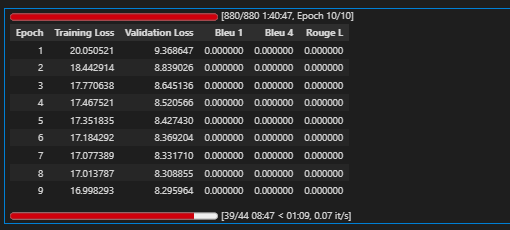

# 2 Load Model With LoRA

from src.finetuned.utils.model_loader import load_model_with_lora, print_model_info

## Load model with LoRA - UPDATED: Using IndoT5 (580M params) instead of IndoNanoT5 (248M)
## IndoNanoT5 was insufficient for complex AQG task
peft_model, tokenizer = load_model_with_lora(
    model_name='Wikidepia/IndoT5-base',  # Correct model name (not LazarusNLP)
    lora_r=8,
    lora_alpha=16,
    lora_dropout=0.1,
    target_modules=['q', 'v']
)

## Print detailed info
print_model_info(peft_model, tokenizer)


The tied weights mapping and config for this model specifies to tie shared.weight to lm_head.weight, but both are present in the checkpoints, so we will NOT tie them. You should update the config with `tie_word_embeddings=False` to silence this warning
The tied weights mapping and config for this model specifies to tie shared.weight to encoder.embed_tokens.weight, but both are present in the checkpoints, so we will NOT tie them. You should update the config with `tie_word_embeddings=False` to silence this warning
The tied weights mapping and config for this model specifies to tie shared.weight to decoder.embed_tokens.weight, but both are present in the checkpoints, so we will NOT tie them. You should update the config with `tie_word_embeddings=False` to silence this warning

✓ Base model loaded
✓ LoRA applied: r=8, alpha=16, target=['q', 'v']
  Trainable: 884,736 (0.30%)
  Total:     297,811,200
✓ Model device: cuda:0
  GPU allocated: 1.19 GB

=== Model Information ===
Model type: PeftModelForSeq2SeqLM
Tokenizer: T5Tokenizer
Vocab size: 32100
Pad token: <pad> (ID: 0)
EOS token: </s> (ID: 1)

Parameters:
  Total: 297,811,200
  Trainable: 884,736 (0.30%)
  Frozen: 296,926,464

# 3 Load Dataset 

from src.finetuned.data.dataset_loader import DatasetLoader

loader = DatasetLoader()
TASK_DIR = '/content/dataset_aqg/dataset-task-spesifc/'

## Copy dataset from Drive if needed
if not os.path.exists(TASK_DIR + 'train.jsonl'):
    drive_task = f'{DRIVE_ROOT}/dataset-task-spesifc'
    os.makedirs(TASK_DIR, exist_ok=True)
    for f in ['train.jsonl', 'validation.jsonl', 'test.jsonl']:
        shutil.copy(f'{drive_task}/{f}', f'{TASK_DIR}{f}')
    print('✓ Dataset copied from Drive')

## Load datasets
train_dataset = loader.load_dataset(TASK_DIR, split='train')
val_dataset = loader.load_dataset(TASK_DIR, split='validation')
test_dataset = loader.load_dataset(TASK_DIR, split='test')

print(f'\nDataset loaded:')
print(f'  Train: {len(train_dataset)} samples')
print(f'  Val:   {len(val_dataset)} samples')
print(f'  Test:  {len(test_dataset)} samples')


✓ Loaded 211 entries from /content/dataset_aqg/dataset-task-spesifc/test.jsonl

Dataset Example : 

```{"input": "Konteks: ### Perbandingan Penggunaan Memori\n\n```python\nimport numpy\nimport sys\n\nvar_list = [[1, 2, 3], [4, 5, 6], [7, 8, 9]]\nvar_array = numpy.array([[1, 2, 3], [4, 5, 6], [7, 8, 9]])\n\nprint(\"Ukuran keseluruhan elemen list dalam bytes =\", sys.getsizeof(var_list) * len(var_list))\nprint(\"Ukuran keseluruhan elemen NumPy dalam bytes =\", var_array.size * var_array.itemsize)\n\n\"\"\"\nOutput:\nUkuran keseluruhan elemen list dalam bytes = 240\nUkuran keseluruhan elemen NumPy dalam bytes = 72\n\"\"\"\n```\nDengan matriks yang sama, NumPy hanya menggunakan **72 bytes** dibanding list Python yang menggunakan **240 bytes** — inilah alasan banyak programmer memilih NumPy untuk memproses matriks. > **Catatan:** Seluruh materi pada modul ini akan menggunakan list Python untuk mengimplementasikan matriks, agar kita memahami fundamental matriks tanpa melibatkan library apa pun.\n\nPrompt: Buat satu soal Code Completion tentang Fundamental Matriks, tingkat kesulitan: hard, bahasa Indonesia.", "target": "Pertanyaan: Sesuai catatan modul yang menggunakan list Python untuk matriks, lengkapi kode berikut untuk menghitung ukuran memori list: import sys; var_list = [[1, 2, 3], [4, 5, 6], [7, 8, 9]]; ukuran_memori = ________________.? Jawaban benar: `sys.getsizeof(var_list) * len(var_list)`. Distraktor: 1) `var_array.size * var_array.itemsize` 2) `sys.getsizeof(var_list)` 3) `sys.getsizeof(var_list) + len(var_list)` 4) `240`", "metadata": {"difficulty": "hard", "question_type": "Code Completion", "concept": "Fundamental Matriks", "misconception_tags": ["`miskonsepsi_numpy_formula`", "`lupa_operasi_perkalian`", "`hafalan_nilai_output`"], "source_file": "dataset_aqg/materi/07-matriks/01-fundamental-matriks.md", "section": "### Perbandingan Penggunaan Memori", "source": "synthetic", "validated": true}}
{"input": "Konteks: ### Memanggil Fungsi\n\n```python\ndef mencari_luas_persegi_panjang(panjang, lebar):\n    luas_persegi_panjang = panjang * lebar\n    return luas_persegi_panjang\n\npersegi_panjang_pertama = mencari_luas_persegi_panjang(5, 10)\nprint(persegi_panjang_pertama)\n\n\"\"\"\nOutput:\n50\n\"\"\"\n```\n\n\nElemen pemanggil fungsi:\n\n- **Nama fungsi** — nama fungsi yang ingin digunakan, diikuti `()`\n- **Argumen** — nilai yang diberikan kepada fungsi, disimpan dalam parameter\n\nPrompt: Buat satu soal Code Completion tentang Fungsi Python, tingkat kesulitan: medium, bahasa Indonesia.", "target": "Pertanyaan: Berdasarkan komentar Output pada konteks, nilai apa yang harus mengisi hasil eksekusi `print(persegi_panjang_pertama)` setelah pemanggilan fungsi? Jawaban benar: 50. Distraktor: 1) 15 2) 25 3) 5 4) 100", "metadata": {"difficulty": "medium", "question_type": "Code Completion", "concept": "Fungsi Python", "misconception_tags": ["salah_operasi", "salah_argumen", "salah_hitung."], "source_file": "dataset_aqg/materi/08-subprogram/02-fungsi.md", "section": "### Memanggil Fungsi", "source": "synthetic", "validated": true}}

```


Dataset loaded:
  Train: 876 samples
  Val:   175 samples
  Test:  211 samples

=== Dataset Validation Summary ===
Total Entries: 876
Duplicate Count: 1
Avg Input Length: 821.26 chars
Avg Target Length: 343.94 chars
Has Metadata: True
⚠ Warning: Found 1 duplicate entries

=== Sample Entry ===
Input: Konteks: ### Perbandingan Penggunaan Memori

```python
import numpy
import sys

var_list = [[1, 2, 3], [4, 5, 6], [7, 8, 9]]
var_array = numpy.array([[1, 2, 3], [4, 5, 6], [7, 8, 9]])

print("Ukuran k...
Target: Pertanyaan: Sesuai catatan modul yang menggunakan list Python untuk matriks, lengkapi kode berikut untuk menghitung ukuran memori list: import sys; var_list = [[1, 2, 3], [4, 5, 6], [7, 8, 9]]; ukuran...
```

✓ Metadata dropped
  Columns: ['input', 'target']
  Train: 876 | Val: 175 | Test: 211

# 4 baseline Evaluation ( Pre-Training )

```
from src.finetuned.evaluation.metrics_calculator import MetricsCalculator
from src.finetuned.evaluation.model_evaluator import ModelEvaluator

metrics_calc = MetricsCalculator()
evaluator = ModelEvaluator(
    model=peft_model,
    tokenizer=tokenizer,
    metrics_calculator=metrics_calc
)

print('Computing baseline metrics (10 samples)...')
baseline_metrics = evaluator.evaluate_on_test_set(
    test_dataset=val_dataset,
    num_beams=4,
    include_bertscore=False,
    max_samples=10
)

print(f"\nBaseline Metrics:")
print(f"  BLEU-4:  {baseline_metrics.get('bleu_4', 0):.4f}")
print(f"  ROUGE-L: {baseline_metrics.get('rouge_l', 0):.4f}")

```

Computing baseline metrics (10 samples)...

============================================================
EVALUATING ON TEST SET
============================================================

Evaluating 10 samples...
  Processed 10/10 samples...
✓ Generated 10 predictions
Computing metrics for 10 samples...
  Computing BLEU...

Computing Diversity...
✓ All metrics computed

============================================================
Test Set Evaluation Results
============================================================

BLEU Scores:
  BLEU:     0.0280
  BLEU-1:   0.2625
  BLEU-2:   0.0669
  BLEU-3:   0.0281
  BLEU-4:   0.0143

ROUGE Scores:
  ROUGE-1:  0.1692
  ROUGE-2:  0.0389
  ROUGE-L:  0.1387

Diversity:
  Distinct-1: 0.5763
  Distinct-2: 0.9093

============================================================

Baseline Metrics:
  BLEU-4:  0.0143
  ROUGE-L: 0.1387

# 5 Configure Training 
```
from src.finetuned.training.task_trainer import TaskSpecificTrainer

CHECKPOINT_DIR = '/content/drive/MyDrive/dataset_aqg/checkpoints/aqg'

# Initialize trainer (all logic in task_trainer.py)
trainer = TaskSpecificTrainer(
    model=peft_model,
    tokenizer=tokenizer,
    output_dir=CHECKPOINT_DIR,
    max_length=512,
    metrics_calculator=metrics_calc
)

print('✓ Trainer initialized')
print(f'  Checkpoints will be saved to: {CHECKPOINT_DIR}')
```

✓ Trainer initialized
  Checkpoints will be saved to: /content/drive/MyDrive/dataset_aqg/checkpoints/aqg

# 6 Start Training

```
import time

start_time = time.time()

print('Starting task-specific AQG training...')
print('='*60)

# Train (all logic in task_trainer.py)
results = trainer.train(
    train_dataset=train_dataset,
    eval_dataset=val_dataset,
    early_stopping=True,
    early_stopping_patience=2
)

elapsed = (time.time() - start_time) / 3600
print(f'\n✓ Training completed in {elapsed:.2f} hours')
print(f'  Final training loss: {results["training_loss"]:.4f}')
```


Starting task-specific AQG training...
============================================================

============================================================
STARTING TASK-SPECIFIC AQG TRAINING
============================================================

Preprocessing datasets...
Preprocessing 876 samples...

✓ Preprocessed 876 samples
  Note: Padding and label masking will be handled by DataCollatorForSeq2Seq
Preprocessing 175 samples...

✓ Preprocessed 175 samples
  Note: Padding and label masking will be handled by DataCollatorForSeq2Seq

=== Training Configuration ===
Epochs: 3
Batch size: 8
Gradient accumulation: 4
Effective batch size: 32
Learning rate: 0.0001
Warmup steps: 50
FP16: True
Train samples: 876
Eval samples: 175
Metrics: BLEU-4, ROUGE-L

Starting training...
/usr/local/lib/python3.12/dist-packages/transformers/tokenization_utils_base.py:2402: UserWarning: `max_length` is ignored when `padding`=`True` and there is no truncation strategy. To pad to max length, use `padding='max_length'`.
  warnings.warn(
/usr/local/lib/python3.12/dist-packages/transformers/tokenization_utils_base.py:2402: UserWarning: `max_length` is ignored when `padding`=`True` and there is no truncation strategy. To pad to max length, use `padding='max_length'`.
  warnings.warn(



/usr/local/lib/python3.12/dist-packages/transformers/tokenization_utils_base.py:2402: UserWarning: `max_length` is ignored when `padding`=`True` and there is no truncation strategy. To pad to max length, use `padding='max_length'`.
  warnings.warn(
/usr/local/lib/python3.12/dist-packages/transformers/tokenization_utils_base.py:2402: UserWarning: `max_length` is ignored when `padding`=`True` and there is no truncation strategy. To pad to max length, use `padding='max_length'`.
  warnings.warn(
/usr/local/lib/python3.12/dist-packages/transformers/tokenization_utils_base.py:2402: UserWarning: `max_length` is ignored when `padding`=`True` and there is no truncation strategy. To pad to max length, use `padding='max_length'`.
  warnings.warn(
/usr/local/lib/python3.12/dist-packages/transformers/tokenization_utils_base.py:2402: UserWarning: `max_length` is ignored when `padding`=`True` and there is no truncation strategy. To pad to max length, use `padding='max_length'`.
  warnings.warn(
/usr/local/lib/python3.12/dist-packages/transformers/tokenization_utils_base.py:2402: UserWarning: `max_length` is ignored when `padding`=`True` and there is no truncation strategy. To pad to max length, use `padding='max_length'`.
  warnings.warn(
/usr/local/lib/python3.12/dist-packages/transformers/tokenization_utils_base.py:2402: UserWarning: `max_length` is ignored when `padding`=`True` and there is no truncation strategy. To pad to max length, use `padding='max_length'`.
  warnings.warn(
/usr/local/lib/python3.12/dist-packages/transformers/tokenization_utils_base.py:2402: UserWarning: `max_length` is ignored when `padding`=`True` and there is no truncation strategy. To pad to max length, use `padding='max_length'`.
  warnings.warn(
/usr/local/lib/python3.12/dist-packages/transformers/tokenization_utils_base.py:2402: UserWarning: `max_length` is ignored when `padding`=`True` and there is no truncation strategy. To pad to max length, use `padding='max_length'`.
  warnings.warn(
/usr/local/lib/python3.12/dist-packages/transformers/tokenization_utils_base.py:2402: UserWarning: `max_length` is ignored when `padding`=`True` and there is no truncation strategy. To pad to max length, use `padding='max_length'`.
  warnings.warn(
/usr/local/lib/python3.12/dist-packages/transformers/tokenization_utils_base.py:2402: UserWarning: `max_length` is ignored when `padding`=`True` and there is no truncation strategy. To pad to max length, use `padding='max_length'`.
  warnings.warn(

=== Training Complete ===
Final training loss: 0.0000
Training time: 637.98 seconds
Training samples per second: 4.12
/usr/local/lib/python3.12/dist-packages/transformers/tokenization_utils_base.py:2402: UserWarning: `max_length` is ignored when `padding`=`True` and there is no truncation strategy. To pad to max length, use `padding='max_length'`.
  warnings.warn(
/usr/local/lib/python3.12/dist-packages/transformers/tokenization_utils_base.py:2402: UserWarning: `max_length` is ignored when `padding`=`True` and there is no truncation strategy. To pad to max length, use `padding='max_length'`.
  warnings.warn(

=== Final Evaluation Metrics ===
eval_loss: nan
eval_bleu_1: 0.0277
eval_bleu_4: 0.0277
eval_rouge_l: 0.0000
eval_runtime: 119.5063
eval_samples_per_second: 1.4640
eval_steps_per_second: 0.1840
✓ Training results saved to /content/drive/MyDrive/dataset_aqg/checkpoints/aqg/training_results.json

✓ Training completed in 0.21 hours
  Final training loss: 0.0000

# 8  Final Evaluation 

```
# Re-initialize evaluator with trained model
evaluator_final = ModelEvaluator(
    model=peft_model,
    tokenizer=tokenizer,
    metrics_calculator=metrics_calc
)

print('Running comprehensive evaluation on test set...')
final_metrics = evaluator_final.evaluate_on_test_set(
    test_dataset=test_dataset,
    num_beams=4,
    include_bertscore=True,
    max_samples=None
)

print('\n=== Evaluation Results ===')
for key, value in final_metrics.items():
    print(f'{key}: {value:.4f}')
```

Running comprehensive evaluation on test set...

============================================================
EVALUATING ON TEST SET
============================================================

Evaluating 211 samples...
  Processed 10/211 samples...
  Processed 20/211 samples...
  Processed 30/211 samples...
  Processed 40/211 samples...
  Processed 50/211 samples...
  Processed 60/211 samples...
  Processed 70/211 samples...
  Processed 80/211 samples...
  Processed 90/211 samples...
  Processed 100/211 samples...
  Processed 110/211 samples...
  Processed 120/211 samples...
  Processed 130/211 samples...
  Processed 140/211 samples...
  Processed 150/211 samples...
  Processed 160/211 samples...
  Processed 170/211 samples...
  Processed 180/211 samples...
  Processed 190/211 samples...
  Processed 200/211 samples...
  Processed 210/211 samples...
✓ Generated 211 predictions
Computing metrics for 211 samples...
  Computing BLEU...
  Computing ROUGE...
  Computing BERTScore...

BertModel LOAD REPORT from: bert-base-multilingual-cased
Key                                        | Status     |  | 
-------------------------------------------+------------+--+-
cls.predictions.transform.LayerNorm.weight | UNEXPECTED |  | 
cls.predictions.transform.dense.bias       | UNEXPECTED |  | 
cls.seq_relationship.bias                  | UNEXPECTED |  | 
cls.seq_relationship.weight                | UNEXPECTED |  | 
cls.predictions.transform.LayerNorm.bias   | UNEXPECTED |  | 
cls.predictions.transform.dense.weight     | UNEXPECTED |  | 
cls.predictions.bias                       | UNEXPECTED |  | 

Notes:
- UNEXPECTED	:can be ignored when loading from different task/architecture; not ok if you expect identical arch.
  Computing Diversity...
✓ All metrics computed

============================================================
Test Set Evaluation Results
============================================================

BLEU Scores:
  BLEU:     0.0304
  BLEU-1:   0.2449
  BLEU-2:   0.0534
  BLEU-3:   0.0241
  BLEU-4:   0.0133

ROUGE Scores:
  ROUGE-1:  0.1633
  ROUGE-2:  0.0430
  ROUGE-L:  0.1224

BERTScore:
  Precision: 0.6347
  Recall:    0.6273
  F1:        0.6305

Diversity:
  Distinct-1: 0.2330
  Distinct-2: 0.5990

============================================================

=== Evaluation Results ===
bleu: 0.0304
bleu_1: 0.2449
bleu_2: 0.0534
bleu_3: 0.0241
bleu_4: 0.0133
brevity_penalty: 0.6737
length_ratio: 0.7169
rouge_1: 0.1633
rouge_2: 0.0430
rouge_l: 0.1224
rouge_1_fmeasure: 0.1633
rouge_2_fmeasure: 0.0430
rouge_l_fmeasure: 0.1224
bertscore_precision: 0.6347
bertscore_recall: 0.6273
bertscore_f1: 0.6305
distinct_1: 0.2330
distinct_2: 0.5990

# 9 Sample Outputs 

```
EVAL_DIR = '/content/drive/MyDrive/dataset_aqg/evaluation_results'

samples = evaluator_final.generate_samples(
    test_dataset=test_dataset,
    num_samples=5,
    num_beams=4,
    save_path=f'{EVAL_DIR}/sample_outputs.json'
)

print(f'✓ {len(samples)} sample outputs generated and saved')

# Preview first sample
if samples:
    print('\n=== Sample Output ===')
    print(f"Input: {samples[0]['input']}...")
    print(f"Target: {samples[0]['target']}...")
    print(f"Generated: {samples[0]['generated']}...")
```

--- Sample 1 ---
Input: Konteks: # Memformat Kode

Jika proses lint atau linting hanya melakukan pengecekan, kali ini adalah arahan gaya penulisan kode agar bisa sesuai denga...
Reference: Pertanyaan: Untuk menginstal formatter yang dikembangkan di repository Google dengan lisensi Apache, paket yang tepat untuk melengkapi perintah `pip i...
Prediction: kode. Proses memformat kode sama halnya dengan proses linting atau linning. Memformat Kode Memformat kode adalah proses memformat script. memformat ko...
BLEU: 0.0000

--- Sample 2 ---
Input: Konteks: ## Lint

Lint adalah proses pengecekan kode atas kemungkinan terjadi kesalahan (error), termasuk dalam proses ini adalah mengecek kesesuaian ...
Reference: Pertanyaan: Berdasarkan deskripsi fungsi pada teks, string apa yang tepat untuk melengkapi perintah terminal berikut agar fokus secara spesifik pada p...
Prediction: lint dan linting.  Konteks Konteks: ## Lint Lint adalah proses pengecekan kode Python atas kemungkinan terjadi kesalahan( warning) pemrograman. ```bas...
BLEU: 0.0000

--- Sample 10 ---
Input: Konteks: ### Contoh: Urutan mempengaruhi hasil

```python
a = 6
b = 9

print(a**2)
print(b//3)

"""
Output:
36
3
"""
```
Jika urutan `print()` diubah:...
Reference: Pertanyaan: Perhatikan kode berikut!
```python
a = 6
b = 9

print(a**2)
print(b//3)
```
Apa output yang ditampilkan pada baris pertama? Jawaban benar:...
Prediction: Urutan mempengaruhi hasil `print() `python a = 6 b = 9 print( b//3) print( assets/urutan-print. jpeg) ### Konteks:### Contoh: Urutan mempengaruhi urut...
BLEU: 0.2780


# Final Summary 


============================================================
COMPARING WITH BASELINE
============================================================

Metric                        Baseline   Fine-tuned  Improvement
-----------------------------------------------------------------
bleu                            0.0280       0.0304        8.61%
bleu_1                          0.2625       0.2449       -6.74%
bleu_2                          0.0669       0.0534      -20.19%
bleu_3                          0.0281       0.0241      -14.40%
bleu_4                          0.0143       0.0133       -7.61%
brevity_penalty                 0.5433       0.6737       23.99%
length_ratio                    0.6211       0.7169       15.42%
rouge_1                         0.1692       0.1633       -3.48%
rouge_2                         0.0389       0.0430       10.45%
rouge_l                         0.1387       0.1224      -11.76%
rouge_1_fmeasure                0.1692       0.1633       -3.48%
rouge_2_fmeasure                0.0389       0.0430       10.45%
rouge_l_fmeasure                0.1387       0.1224      -11.76%
distinct_1                      0.5763       0.2330      -59.57%
distinct_2                      0.9093       0.5990      -34.12%

============================================================
TASK-SPECIFIC AQG TRAINING SUMMARY
============================================================
Training Time: 0.21 hours
Model saved: /content/drive/MyDrive/dataset_aqg/checkpoints/aqg/indot5-python-aqg

Metrics Comparison:
  BLEU-4:       0.0143 → 0.0133
  ROUGE-L:      0.1387 → 0.1224
  BERTScore F1: 0.0000 → 0.6305

BLEU-4 Improvement: -7.6%

⚠ BLEU-4 = 0.0133 (target: >= 0.35)
  Consider: more epochs, lower lr, or larger dataset

✓ Fine-tuning pipeline complete!
  Evaluation report: /content/drive/MyDrive/dataset_aqg/evaluation_results/evaluation_report.json
  Sample outputs: /content/drive/MyDrive/dataset_aqg/evaluation_results/sample_outputs.json

