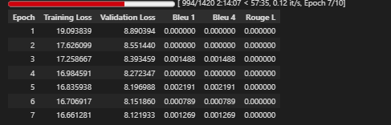

# IndoNanoT5 Fine-tued + LoRA with Dataset V3  03

Note = letaknya di akun gmail ardmuhammadm@gmail.com

## 1 Setup Environtment 

Python:  3.12.13 (main, Mar  4 2026, 09:23:07) [GCC 11.4.0]
OS:      Linux
Torch:   2.10.0+cu128
CUDA:    True

 
=== Library Versions ===
  transformers         5.0.0
  peft                 0.18.1
  datasets             4.0.0
  accelerate           1.13.0
  evaluate             0.4.6
  torch                2.10.0+cu128
  tokenizers           0.22.2
  rouge_score          unknown
  bert_score           0.3.12

  python               3.12.13
  cuda available       True
  cuda version         12.8
  gpu name             Tesla T4

## 2 Load Model With LoRA 

```

from src.finetuned.utils.model_loader import load_model_with_lora, print_model_info

# Load model with LoRA - UPDATED: Using IndoT5 (580M params) instead of IndoNanoT5 (248M)
# IndoNanoT5 was insufficient for complex AQG task
peft_model, tokenizer = load_model_with_lora(
    model_name='LazarusNLP/IndoNanoT5-base',  
    lora_r=8,
    lora_alpha=16,
    lora_dropout=0.1,
    target_modules=['q', 'v']
)

# Print detailed info
print_model_info(peft_model, tokenizer)

```

✓ Base model loaded
✓ LoRA applied: r=8, alpha=16, target=['q', 'v']
  Trainable: 884,736 (0.36%)
  Total:     248,462,592
✓ Model device: cuda:0
  GPU allocated: 1.00 GB

=== Model Information ===
Model type: PeftModelForSeq2SeqLM
Tokenizer: T5Tokenizer
Vocab size: 32000
Pad token: <pad> (ID: 0)
EOS token: </s> (ID: 1)

Parameters:
  Total: 248,462,592
  Trainable: 884,736 (0.36%)
  Frozen: 247,577,856

## 3 Load Dataset 

```

from src.finetuned.data.dataset_loader import DatasetLoader

loader = DatasetLoader()
TASK_DIR = '/content/dataset_aqg/dataset-task-spesifc/'

# Copy dataset from Drive if needed
if not os.path.exists(TASK_DIR + 'train.jsonl'):
    drive_task = f'{DRIVE_ROOT}/dataset-task-spesifc'
    os.makedirs(TASK_DIR, exist_ok=True)
    for f in ['train.jsonl', 'validation.jsonl', 'test.jsonl']:
        shutil.copy(f'{drive_task}/{f}', f'{TASK_DIR}{f}')
    print('✓ Dataset copied from Drive')

# Load datasets
train_dataset = loader.load_dataset(TASK_DIR, split='train')
val_dataset = loader.load_dataset(TASK_DIR, split='validation')
test_dataset = loader.load_dataset(TASK_DIR, split='test')

print(f'\nDataset loaded:')
print(f'  Train: {len(train_dataset)} samples')
print(f'  Val:   {len(val_dataset)} samples')
print(f'  Test:  {len(test_dataset)} samples')

```


✓ Loaded 567 entries from /content/dataset_aqg/dataset-task-spesifc/test.jsonl

Dataset loaded:
  Train: 4529 samples
  Val:   566 samples
  Test:  567 samples

✓ Using output field: 'output'

=== Dataset Validation Summary ===
Total Entries: 4529
Duplicate Count: 0
Avg Input Length: 195.65 chars
Avg Target Length: 239.35 chars
Has Metadata: True
✓ No duplicates found

=== Sample Entry ===
Input: buat_soal_pilihan_ganda: Perhatikan kode berikut:
```python
var_mat = [[10, 20],
           [30, 40],
           [50, 60]]
print(var_mat[0][1] + var_mat[2][1])
```
Kode ini menjumlahkan elemen kolom kedua dari baris pertama dan baris terakhir....
Output: question: Perhatikan kode berikut:
```python
var_mat = [[10, 20],
           [30, 40],
           [50, 60]]
print(var_mat[0][1] + var_mat[2][1])
```
Apa output dari kode tersebut?
answer: 80
distractors: 70 | 90 | 60...

## 4 baseline Evaluation ( Pre-Training )

```

from src.finetuned.evaluation.metrics_calculator import MetricsCalculator
from src.finetuned.evaluation.model_evaluator import ModelEvaluator

metrics_calc = MetricsCalculator()
evaluator = ModelEvaluator(
    model=peft_model,
    tokenizer=tokenizer,
    metrics_calculator=metrics_calc
)

print('Computing baseline metrics (10 samples)...')
baseline_metrics = evaluator.evaluate_on_test_set(
    test_dataset=val_dataset,
    num_beams=4,
    include_bertscore=False,
    max_samples=10
)

print(f"\nBaseline Metrics:")
print(f"  BLEU-4:  {baseline_metrics.get('bleu_4', 0):.4f}")
print(f"  ROUGE-L: {baseline_metrics.get('rouge_l', 0):.4f}")

```

Computing baseline metrics (10 samples)...

============================================================
EVALUATING ON TEST SET
============================================================

The following generation flags are not valid and may be ignored: ['top_p']. Set `TRANSFORMERS_VERBOSITY=info` for more details.
Evaluating 10 samples...
  Processed 10/10 samples...
✓ Generated 10 predictions
Computing metrics for 10 samples...
  Computing BLEU...

Computing Diversity...
✓ All metrics computed

============================================================
Test Set Evaluation Results
============================================================

BLEU Scores:
  BLEU:     0.0459
  BLEU-1:   0.1410
  BLEU-2:   0.0515
  BLEU-3:   0.0319
  BLEU-4:   0.0191

ROUGE Scores:
  ROUGE-1:  0.1504
  ROUGE-2:  0.0636
  ROUGE-L:  0.1293

Diversity:
  Distinct-1: 0.3591
  Distinct-2: 0.6799

============================================================

Baseline Metrics:
  BLEU-4:  0.0191
  ROUGE-L: 0.1293

## 5 Start Training 


Starting task-specific AQG training...
============================================================

============================================================
STARTING TASK-SPECIFIC AQG TRAINING
============================================================
✓ Preprocessed 566 samples
  Note: Padding and label masking will be handled by DataCollatorForSeq2Seq

=== Training Configuration ===
Epochs: 10
Batch size: 16
Gradient accumulation: 2
Effective batch size: 32
Learning rate: 0.0001
Warmup steps: 50
FP16: True
Train samples: 4529
Eval samples: 566
Metrics: BLEU-4, ROUGE-L

🆕 Starting fresh training (no resume)



=== Final Evaluation Metrics ===
eval_loss: 8.1970
eval_bleu_1: 0.0022
eval_bleu_4: 0.0022
eval_rouge_l: 0.0000
eval_runtime: 994.3919
eval_samples_per_second: 0.5690
eval_steps_per_second: 0.0710
✓ Training results saved to /content/drive/MyDrive/dataset_aqg/checkpoints/04-indonanoot5-report/training_results.json

✓ Training completed in 2.51 hours
  Final training loss: 17.3540

##  Save Model 

✓ Final model saved to: /content/drive/MyDrive/dataset_aqg/checkpoints/04-indonanoot5-report/indot5-python-aqg
✓ Model saved to: /content/drive/MyDrive/dataset_aqg/checkpoints/04-indonanoot5-report/indot5-python-aqg
✓ Training curves saved to /content/drive/MyDrive/dataset_aqg/checkpoints/04-indonanoot5-report/training_curves.png

## 8 Final Evaluation

```
# Re-initialize evaluator with trained model
evaluator_final = ModelEvaluator(
    model=peft_model,
    tokenizer=tokenizer,
    metrics_calculator=metrics_calc
)

print('Running comprehensive evaluation on test set...')
final_metrics = evaluator_final.evaluate_on_test_set(
    test_dataset=test_dataset,
    num_beams=4,
    include_bertscore=True,
    max_samples=None
)

print('\n=== Evaluation Results ===')
for key, value in final_metrics.items():
    print(f'{key}: {value:.4f}')

```

Running comprehensive evaluation on test set...


============================================================
Test Set Evaluation Results
============================================================

BLEU Scores:
  BLEU:     0.0405
  BLEU-1:   0.2147
  BLEU-2:   0.0641
  BLEU-3:   0.0265
  BLEU-4:   0.0074

ROUGE Scores:
  ROUGE-1:  0.0760
  ROUGE-2:  0.0211
  ROUGE-L:  0.0647

BERTScore:
  Precision: 0.6135
  Recall:    0.5685
  F1:        0.5897

Diversity:
  Distinct-1: 0.0735
  Distinct-2: 0.4171

============================================================

=== Evaluation Results ===
bleu: 0.0405
bleu_1: 0.2147
bleu_2: 0.0641
bleu_3: 0.0265
bleu_4: 0.0074
brevity_penalty: 1.0000
length_ratio: 1.0326
rouge_1: 0.0760
rouge_2: 0.0211
rouge_l: 0.0647
rouge_1_fmeasure: 0.0760
rouge_2_fmeasure: 0.0211
rouge_l_fmeasure: 0.0647
bertscore_precision: 0.6135
bertscore_recall: 0.5685
bertscore_f1: 0.5897
distinct_1: 0.0735
distinct_2: 0.4171

## 9 Generate Smaple Outputs 


## 10 Final Summary 

