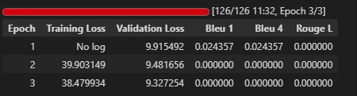

# IndoNanoT5 Fine-tued + LoRA with Dataset V3 No Code Blocks  

## 1 Setup Environtment 

Python:  3.12.13 (main, Mar  4 2026, 09:23:07) [GCC 11.4.0]
OS:      Linux
Torch:   2.10.0+cu128
CUDA:    True

 
=== Library Versions ===
  transformers         5.0.0
  peft                 0.18.1
  datasets             4.0.0
  accelerate           1.13.0
  evaluate             0.4.6
  torch                2.10.0+cu128
  tokenizers           0.22.2
  rouge_score          unknown
  bert_score           0.3.12

  python               3.12.13
  cuda available       True
  cuda version         12.8
  gpu name             Tesla T4

## 2 Load Model With LoRA 

```

from src.finetuned.utils.model_loader import load_model_with_lora, print_model_info

# Load model with LoRA - UPDATED: Using IndoT5 (580M params) instead of IndoNanoT5 (248M)
# IndoNanoT5 was insufficient for complex AQG task
peft_model, tokenizer = load_model_with_lora(
    model_name='LazarusNLP/IndoNanoT5-base',  
    lora_r=8,
    lora_alpha=16,
    lora_dropout=0.1,
    target_modules=['q', 'v']
)

# Print detailed info
print_model_info(peft_model, tokenizer)

```

✓ Base model loaded
✓ LoRA applied: r=8, alpha=16, target=['q', 'v']
  Trainable: 884,736 (0.36%)
  Total:     248,462,592
✓ Model device: cuda:0
  GPU allocated: 1.00 GB

=== Model Information ===
Model type: PeftModelForSeq2SeqLM
Tokenizer: T5Tokenizer
Vocab size: 32000
Pad token: <pad> (ID: 0)
EOS token: </s> (ID: 1)

Parameters:
  Total: 248,462,592
  Trainable: 884,736 (0.36%)
  Frozen: 247,577,856

## 3 Load Dataset 

```

from src.finetuned.data.dataset_loader import DatasetLoader

loader = DatasetLoader()
TASK_DIR = '/content/dataset_aqg/dataset-task-spesifc/'

# Copy dataset from Drive if needed
if not os.path.exists(TASK_DIR + 'train.jsonl'):
    drive_task = f'{DRIVE_ROOT}/dataset-task-spesifc'
    os.makedirs(TASK_DIR, exist_ok=True)
    for f in ['train.jsonl', 'validation.jsonl', 'test.jsonl']:
        shutil.copy(f'{drive_task}/{f}', f'{TASK_DIR}{f}')
    print('✓ Dataset copied from Drive')

# Load datasets
train_dataset = loader.load_dataset(TASK_DIR, split='train')
val_dataset = loader.load_dataset(TASK_DIR, split='validation')
test_dataset = loader.load_dataset(TASK_DIR, split='test')

print(f'\nDataset loaded:')
print(f'  Train: {len(train_dataset)} samples')
print(f'  Val:   {len(val_dataset)} samples')
print(f'  Test:  {len(test_dataset)} samples')

```


✓ Loaded 168 entries from /content/dataset_aqg/dataset-task-spesifc/test.jsonl

Dataset loaded:
  Train: 1332 samples
  Val:   166 samples
  Test:  168 samples

✓ Using output field: 'output'

✓ Using output field: 'output'

=== Dataset Validation Summary ===
Total Entries: 1332
Duplicate Count: 0
Avg Input Length: 153.71 chars
Avg Target Length: 195.2 chars
Has Metadata: True
✓ No duplicates found

=== Sample Entry ===
Input: buat_soal_pilihan_ganda: Perulangan while adalah indefinite iteration, artinya perulangan berhenti ketika kondisi tertentu terpenuhi. While digunakan ketika jumlah iterasi tidak diketahui sebelumnya....
Output: question: Apa yang dimaksud dengan indefinite iteration?
answer: Perulangan berhenti ketika kondisi terpenuhi
distractors: Perulangan dengan jumlah pasti | Perulangan tanpa kondisi | Perulangan satu kali...

## 4 baseline Evaluation ( Pre-Training )

```

from src.finetuned.evaluation.metrics_calculator import MetricsCalculator
from src.finetuned.evaluation.model_evaluator import ModelEvaluator

metrics_calc = MetricsCalculator()
evaluator = ModelEvaluator(
    model=peft_model,
    tokenizer=tokenizer,
    metrics_calculator=metrics_calc
)

print('Computing baseline metrics (10 samples)...')
baseline_metrics = evaluator.evaluate_on_test_set(
    test_dataset=val_dataset,
    num_beams=4,
    include_bertscore=False,
    max_samples=10
)

print(f"\nBaseline Metrics:")
print(f"  BLEU-4:  {baseline_metrics.get('bleu_4', 0):.4f}")
print(f"  ROUGE-L: {baseline_metrics.get('rouge_l', 0):.4f}")

```


Computing baseline metrics (10 samples)...

============================================================
EVALUATING ON TEST SET
============================================================

Evaluating 10 samples...
  Processed 10/10 samples...
✓ Generated 10 predictions
Computing metrics for 10 samples...
  Computing BLEU...

Computing Diversity...
✓ All metrics computed

============================================================
Test Set Evaluation Results
============================================================

BLEU Scores:
  BLEU:     0.0205
  BLEU-1:   0.1042
  BLEU-2:   0.0269
  BLEU-3:   0.0128
  BLEU-4:   0.0049

ROUGE Scores:
  ROUGE-1:  0.1382
  ROUGE-2:  0.0356
  ROUGE-L:  0.1175

Diversity:
  Distinct-1: 0.3836
  Distinct-2: 0.7416

============================================================

Baseline Metrics:
  BLEU-4:  0.0049
  ROUGE-L: 0.1175


## 5 Start Training 

```

from src.finetuned.training.task_trainer import TaskSpecificTrainer

CHECKPOINT_DIR = '/content/drive/MyDrive/dataset_aqg/checkpoints/aqg'

# Initialize trainer (all logic in task_trainer.py)
trainer = TaskSpecificTrainer(
    model=peft_model,
    tokenizer=tokenizer,
    output_dir=CHECKPOINT_DIR,
    max_length=512,
    metrics_calculator=metrics_calc
)

print('✓ Trainer initialized')
print(f'  Checkpoints will be saved to: {CHECKPOINT_DIR}')

```


```
import time

start_time = time.time()

print('Starting task-specific AQG training...')
print('='*60)

# Train (all logic in task_trainer.py)
results = trainer.train(
    train_dataset=train_dataset,
    eval_dataset=val_dataset,
    early_stopping=True,
    early_stopping_patience=2
)

elapsed = (time.time() - start_time) / 3600
print(f'\n✓ Training completed in {elapsed:.2f} hours')
print(f'  Final training loss: {results["training_loss"]:.4f}')

```

Parameter 'function'=<function TaskSpecificTrainer.preprocess_dataset.<locals>.tokenize_function at 0x7c059c1d2e80> of the transform datasets.arrow_dataset.Dataset._map_single couldn't be hashed properly, a random hash was used instead. Make sure your transforms and parameters are serializable with pickle or dill for the dataset fingerprinting and caching to work. If you reuse this transform, the caching mechanism will consider it to be different from the previous calls and recompute everything. This warning is only showed once. Subsequent hashing failures won't be showed.
WARNING:datasets.fingerprint:Parameter 'function'=<function TaskSpecificTrainer.preprocess_dataset.<locals>.tokenize_function at 0x7c059c1d2e80> of the transform datasets.arrow_dataset.Dataset._map_single couldn't be hashed properly, a random hash was used instead. Make sure your transforms and parameters are serializable with pickle or dill for the dataset fingerprinting and caching to work. If you reuse this transform, the caching mechanism will consider it to be different from the previous calls and recompute everything. This warning is only showed once. Subsequent hashing failures won't be showed.


Starting task-specific AQG training...
============================================================

============================================================
STARTING TASK-SPECIFIC AQG TRAINING
============================================================

Preprocessing datasets...
Preprocessing 1332 samples...

✓ Preprocessed 166 samples
  Note: Padding and label masking will be handled by DataCollatorForSeq2Seq

=== Training Configuration ===
Epochs: 3
Batch size: 8
Gradient accumulation: 4
Effective batch size: 32
Learning rate: 0.0001
Warmup steps: 50
FP16: True
Train samples: 1332
Eval samples: 166
Metrics: BLEU-4, ROUGE-L

Starting training...




=== Training Complete ===
Final training loss: 38.8484
Training time: 694.08 seconds
Training samples per second: 5.76

=== Final Evaluation Metrics ===
eval_loss: 9.9155
eval_bleu_1: 0.0244
eval_bleu_4: 0.0244
eval_rouge_l: 0.0000
eval_runtime: 70.4592
eval_samples_per_second: 2.3560
eval_steps_per_second: 0.2980
✓ Training results saved to /content/drive/MyDrive/dataset_aqg/checkpoints/aqg/training_results.json

✓ Training completed in 0.21 hours
  Final training loss: 38.8484 


## 7 Final Evaluation 

```
# Re-initialize evaluator with trained model
evaluator_final = ModelEvaluator(
    model=peft_model,
    tokenizer=tokenizer,
    metrics_calculator=metrics_calc
)

print('Running comprehensive evaluation on test set...')
final_metrics = evaluator_final.evaluate_on_test_set(
    test_dataset=test_dataset,
    num_beams=4,
    include_bertscore=True,
    max_samples=None
)

print('\n=== Evaluation Results ===')
for key, value in final_metrics.items():
    print(f'{key}: {value:.4f}')

```

BertModel LOAD REPORT from: bert-base-multilingual-cased
Key                                        | Status     |  | 
-------------------------------------------+------------+--+-
cls.predictions.transform.dense.bias       | UNEXPECTED |  | 
cls.predictions.transform.dense.weight     | UNEXPECTED |  | 
cls.predictions.bias                       | UNEXPECTED |  | 
cls.seq_relationship.weight                | UNEXPECTED |  | 
cls.seq_relationship.bias                  | UNEXPECTED |  | 
cls.predictions.transform.LayerNorm.bias   | UNEXPECTED |  | 
cls.predictions.transform.LayerNorm.weight | UNEXPECTED |  | 

Notes:
- UNEXPECTED	:can be ignored when loading from different task/architecture; not ok if you expect identical arch.
  Computing Diversity...
✓ All metrics computed

============================================================
Test Set Evaluation Results
============================================================

BLEU Scores:
  BLEU:     0.0336
  BLEU-1:   0.1261
  BLEU-2:   0.0449
  BLEU-3:   0.0217
  BLEU-4:   0.0104

ROUGE Scores:
  ROUGE-1:  0.1800
  ROUGE-2:  0.0699
  ROUGE-L:  0.1469

BERTScore:
  Precision: 0.6349
  Recall:    0.6429
  F1:        0.6386

Diversity:
  Distinct-1: 0.2068
  Distinct-2: 0.5988

============================================================

=== Evaluation Results ===
bleu: 0.0336
bleu_1: 0.1261
bleu_2: 0.0449
bleu_3: 0.0217
bleu_4: 0.0104
brevity_penalty: 1.0000
length_ratio: 1.9803
rouge_1: 0.1800
rouge_2: 0.0699
rouge_l: 0.1469
rouge_1_fmeasure: 0.1800
rouge_2_fmeasure: 0.0699
rouge_l_fmeasure: 0.1469
bertscore_precision: 0.6349
bertscore_recall: 0.6429
bertscore_f1: 0.6386
distinct_1: 0.2068
distinct_2: 0.5988


## 9 Generate Smaple Outputs 

Generating 5 sample outputs...

--- Sample 1 ---
Input: buat_soal_pilihan_ganda: Abstraksi data memastikan bahwa setiap variabel memiliki tujuan yang jelas dalam program....
Reference: question: Apa dampak dari memiliki tujuan variabel yang jelas melalui abstraksi?
answer: Meminimalkan kesalahan penggunaan variabel dalam kode
distrac...
Prediction: tujuan dari setiap variabel adalah untuk mencapai tujuan yang jelas dalam program. tujuan dari sebuah program adalah untuk menghasilkan output yang di...
BLEU: 0.0000

--- Sample 2 ---
Input: buat_soal_pilihan_ganda: String dapat menggunakan escape character seperti \n untuk newline, \t untuk tab, dan \\ untuk backslash....
Reference: question: Apa fungsi \n dalam string?
answer: Membuat baris baru (newline)
distractors: Membuat tab | Membuat backslash | Membuat spasi...
Prediction: untuk backslash dapat menggunakan escape character seperti \n untuk newline, \\ untuk tab, dan \ \ untuk atau bisa juga menggunakan embassy atau bisa ...
BLEU: 0.0000

--- Sample 3 ---
Input: buat_soal_pilihan_ganda: Pengguna Mac OS atau Ubuntu umumnya sudah memiliki Python yang terinstal secara otomatis....
Reference: question: Sistem operasi mana yang umumnya sudah memiliki Python terinstal secara otomatis?
answer: Mac OS dan Ubuntu
distractors: Windows dan DOS | A...
Prediction: selain itu juga sudah memiliki  dengan kata lain sudah memiliki aplikasi   dengan demikian, akan lebih mudah bagi pengguna untuk melakukan pengaturan ...
BLEU: 0.0000

--- Sample 4 ---
Input: buat_soal_pilihan_ganda: Pemrosesan sekuensial dapat digunakan untuk menghitung mode (nilai yang paling sering muncul). Ini memerlukan frequency count...
Reference: question: Bagaimana cara menghitung mode dengan pemrosesan sekuensial?
answer: Hitung frekuensi setiap nilai kemudian cari nilai dengan frekuensi maks...
Prediction: untuk menghitung mode (nilai yang paling sering muncul), kita dapat menggunakan frequency counting (request counter) dan frequency.  untuk menghitung ...
BLEU: 0.0000

--- Sample 5 ---
Input: buat_soal_pilihan_ganda: Aksi sekuensial adalah fondasi dari semua paradigma pemrograman. Bahkan dalam pemrograman paralel, setiap thread menjalankan ...
Reference: question: Apakah aksi sekuensial relevan dalam pemrograman paralel?
answer: Ya, setiap thread menjalankan instruksi secara sekuensial
distractors: Tid...
Prediction: setiap thread menjalankan instruksi secara sekuensial. setiap th setiap thtread menjalankan perintah secara sekual. thread dijalankan secara paralel, ...
BLEU: 0.0742

✓ Samples saved to /content/drive/MyDrive/dataset_aqg/evaluation_results/sample_outputs.json
✓ 5 sample outputs generated and saved

=== Sample Output ===
Input: buat_soal_pilihan_ganda: Abstraksi data memastikan bahwa setiap variabel memiliki tujuan yang jelas dalam program....


## 10 Final Summary 


============================================================
COMPARING WITH BASELINE
============================================================

Metric                        Baseline   Fine-tuned  Improvement
-----------------------------------------------------------------
bleu                            0.0205       0.0336       64.10%
bleu_1                          0.1042       0.1261       21.01%
bleu_2                          0.0269       0.0449       67.10%
bleu_3                          0.0128       0.0217       68.67%
bleu_4                          0.0049       0.0104      112.64%
brevity_penalty                 1.0000       1.0000        0.00%
length_ratio                    2.0348       1.9803       -2.68%
rouge_1                         0.1382       0.1800       30.26%
rouge_2                         0.0356       0.0699       96.22%
rouge_l                         0.1175       0.1469       25.00%
rouge_1_fmeasure                0.1382       0.1800       30.26%
rouge_2_fmeasure                0.0356       0.0699       96.22%
rouge_l_fmeasure                0.1175       0.1469       25.00%
distinct_1                      0.3836       0.2068      -46.10%
distinct_2                      0.7416       0.5988      -19.25%

============================================================
TASK-SPECIFIC AQG TRAINING SUMMARY
============================================================
Training Time: 0.21 hours
Model saved: /content/drive/MyDrive/dataset_aqg/checkpoints/aqg/indot5-python-aqg

Metrics Comparison:
  BLEU-4:       0.0049 → 0.0104
  ROUGE-L:      0.1175 → 0.1469
  BERTScore F1: 0.0000 → 0.6386

BLEU-4 Improvement: +112.6%

⚠ BLEU-4 = 0.0104 (target: >= 0.35)
  Consider: more epochs, lower lr, or larger dataset

✓ Fine-tuning pipeline complete!
  Evaluation report: /content/drive/MyDrive/dataset_aqg/evaluation_results/evaluation_report.json
  Sample outputs: /content/drive/MyDrive/dataset_aqg/evaluation_results/sample_outputs.json