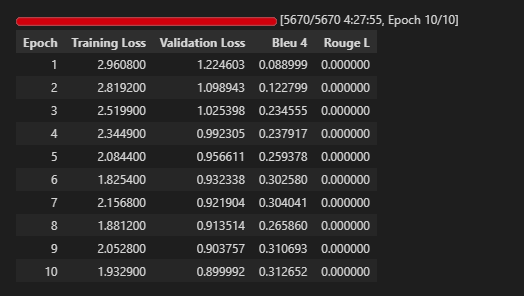
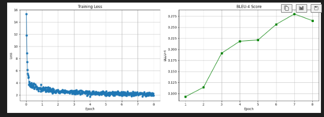

# IndonanoT5 fine-tuned D=64 With Dataset V3  04


Model:           IndoNanoT5-base (248M params)
Adapter:         Pfeiffer, d=64 (reduction_factor=12)
Trainable:       2.38M params (0.95%)
Dataset:         dataset-task-spesifc/ (4,529 train)
Epochs:          8
Batch Size:      4 (effective: 8 with grad_accum=2)
Learning Rate:   1e-4
Warmup:          50 steps

Results:
  BLEU-4:        0.2598
  ROUGE-L:       0.4809
  Training Time: 3.92 hours


## 1 setup environtment 

Python:  3.12.13 (main, Mar  4 2026, 09:23:07) [GCC 11.4.0]
OS:      Linux
Torch:   2.10.0+cu128
CUDA:    True

=== Library Versions ===
  adapters             1.3.0
  transformers         4.57.6
  datasets             4.0.0
  accelerate           1.13.0
  evaluate             0.4.6
  torch                2.10.0+cu128
  tokenizers           0.22.2
  rouge_score          unknown
  bert_score           0.3.12

  cuda version         12.8
  gpu name             Tesla T4

## 2 Load Model with Adapter s

```

from src.finetuned.utils.adapter_loader import load_model_with_adapter, print_adapter_info

# Load model with adapter layers
model, tokenizer = load_model_with_adapter(
    model_name='LazarusNLP/IndoNanoT5-base',
    adapter_name='mcq_generation',
    adapter_config='pfeiffer',
    reduction_factor=12,  # d=64
    device='cuda'
)

# Print detailed info
trainable, total = print_adapter_info(model, tokenizer)

```

/usr/local/lib/python3.12/dist-packages/huggingface_hub/utils/_auth.py:104: UserWarning: 
Error while fetching `HF_TOKEN` secret value from your vault: 'Requesting secret HF_TOKEN timed out. Secrets can only be fetched when running from the Colab UI.'.
You are not authenticated with the Hugging Face Hub in this notebook.
If the error persists, please let us know by opening an issue on GitHub (https://github.com/huggingface/huggingface_hub/issues/new).
  warnings.warn(

✓ Base model loaded with transformers + adapters.init()
✓ Adapter added: pfeiffer config, d=64
✓ Adapter activated for training
✓ Model moved to GPU
  GPU allocated: 1.00 GB

============================================================
MODEL INFORMATION
============================================================

Parameters:
  Trainable: 2,379,264 (0.95%)
  Total:     249,957,120
  Frozen:    247,577,856

Tokenizer:
  Vocab size: 32000
  Pad token:  <pad> (ID: 0)
  EOS token:  </s> (ID: 1)

## 3 Load Dataset 

```


from src.finetuned.data.dataset_loader import DatasetLoader

loader = DatasetLoader()
TASK_DIR = '/content/dataset_aqg/dataset-task-spesifc/'

# Copy dataset from Drive if needed
if not os.path.exists(TASK_DIR + 'train.jsonl'):
    drive_task = f'{DRIVE_ROOT}/dataset-task-spesifc'
    os.makedirs(TASK_DIR, exist_ok=True)
    for f in ['train.jsonl', 'validation.jsonl', 'test.jsonl']:
        shutil.copy(f'{drive_task}/{f}', f'{TASK_DIR}{f}')
    print('✓ Dataset copied from Drive')

# Load datasets
train_dataset = loader.load_dataset(TASK_DIR, split='train')
val_dataset = loader.load_dataset(TASK_DIR, split='validation')
test_dataset = loader.load_dataset(TASK_DIR, split='test')

print(f'\nDataset loaded:')
print(f'  Train: {len(train_dataset)} samples')
print(f'  Val:   {len(val_dataset)} samples')
print(f'  Test:  {len(test_dataset)} samples')

# Validate and preview
validation_results = loader.validate_dataset(train_dataset)

sample = train_dataset[0]
print('\n=== Sample Entry ===')
print(f"Input: {sample['input']}...")
output_field = 'target' if 'target' in sample else 'output'
print(f"Output: {sample[output_field]}...")
print(f'\n✓ Dataset ready (supports both v2 and v3 formats)')

```

✓ Loaded 567 entries from /content/dataset_aqg/dataset-task-spesifc/test.jsonl

Dataset loaded:
  Train: 4529 samples
  Val:   566 samples
  Test:  567 samples
✓ Using output field: 'output'

=== Dataset Validation Summary ===
Total Entries: 4529
Duplicate Count: 0
Avg Input Length: 195.65 chars
Avg Target Length: 239.35 chars
Has Metadata: True
✓ No duplicates found

=== Sample Entry ===
Input: buat_soal_pilihan_ganda: Perhatikan kode berikut:
```python
var_mat = [[10, 20],
           [30, 40],
           [50, 60]]
print(var_mat[0][1] + var_mat[2][1])
```
Kode ini menjumlahkan elemen kolom kedua dari baris pertama dan baris terakhir....
Output: question: Perhatikan kode berikut:
```python
var_mat = [[10, 20],
           [30, 40],
           [50, 60]]
print(var_mat[0][1] + var_mat[2][1])
```
Apa output dari kode tersebut?
answer: 80
distractors: 70 | 90 | 60...

✓ Dataset ready (supports both v2 and v3 formats)

## 4 Baseline Evaluation

```

from src.finetuned.evaluation.metrics_calculator import MetricsCalculator
from src.finetuned.evaluation.model_evaluator import ModelEvaluator

metrics_calc = MetricsCalculator()
evaluator = ModelEvaluator(
    model=model,
    tokenizer=tokenizer,
    metrics_calculator=metrics_calc
)

print('Computing baseline metrics (10 samples)...')
baseline_metrics = evaluator.evaluate_on_test_set(
    test_dataset=val_dataset,
    num_beams=4,
    include_bertscore=False,
    max_samples=10
)

print(f"\nBaseline Metrics:")
print(f"  BLEU-4:  {baseline_metrics.get('bleu_4', 0):.4f}")
print(f"  ROUGE-L: {baseline_metrics.get('rouge_l', 0):.4f}")

```

Computing Diversity...
✓ All metrics computed

============================================================
Test Set Evaluation Results
============================================================

BLEU Scores:
  BLEU:     0.0142
  BLEU-1:   0.0891
  BLEU-2:   0.0215
  BLEU-3:   0.0073
  BLEU-4:   0.0030

ROUGE Scores:
  ROUGE-1:  0.1743
  ROUGE-2:  0.0335
  ROUGE-L:  0.1355

Diversity:
  Distinct-1: 0.3139
  Distinct-2: 0.5944

============================================================

Baseline Metrics:
  BLEU-4:  0.0030
  ROUGE-L: 0.1355

# 5 configure Traing 

```

from src.finetuned.training.adapter_trainer import AdapterTrainer

CHECKPOINT_DIR = '/content/drive/MyDrive/dataset_aqg/checkpoints/adapter_v3'

# Initialize trainer
trainer = AdapterTrainer(
    model=model,
    tokenizer=tokenizer,
    metrics_calculator=metrics_calc,
    output_dir=CHECKPOINT_DIR,
    max_length=512
)

# Setup training configuration
training_args = trainer.setup_training(
    num_train_epochs=8,
    per_device_train_batch_size=4,
    per_device_eval_batch_size=8,
    gradient_accumulation_steps=2,
    learning_rate=1e-4,
    warmup_steps=50,
    weight_decay=0.01
)

print('\n✓ Trainer configured')
print(f'  Checkpoints will be saved to: {CHECKPOINT_DIR}')

```

============================================================
TRAINING CONFIGURATION
============================================================
Epochs: 8
Batch size: 4
Effective batch size: 8
Learning rate: 0.0001
Warmup steps: 50
FP16: True
Gradient checkpointing: True

✓ Trainer configured
  Checkpoints will be saved to: /content/drive/MyDrive/dataset_aqg/checkpoints/adapter_v3

## 6 STart Training

```

import time

start_time = time.time()

# Train (all logic in adapter_trainer.py)
results = trainer.train(
    train_dataset=train_dataset,
    eval_dataset=val_dataset,
    training_args=training_args,
    early_stopping_patience=2
)

elapsed = (time.time() - start_time) / 3600
print(f'\n✓ Training completed in {elapsed:.2f} hours')
print(f'  Final training loss: {results["training_loss"]:.4f}')

```

✓ Datasets tokenized
✓ Data collator configured
✓ Trainer initialized (with transformers 4.46+ compatibility fix)

============================================================
STARTING TRAINING
============================================================
Training with Adapter Layers (d=64, ~3.6% trainable params)
Expected time: 6-8 hours on T4 GPU
============================================================

WARNING:adapters.models.t5.modeling_t5:`use_cache=True` is incompatible with gradient checkpointing. Setting `use_cache=False`...



## 7 save Adapter & Visualize 

```

# Save adapter weights
adapter_save_path = trainer.save_adapter(
    adapter_name='mcq_generation',
    save_config={
        "model_name": "LazarusNLP/IndoNanoT5-base",
        "adapter_config": "pfeiffer",
        "reduction_factor": 12,
        "trainable_params": trainable,
        "total_params": total,
        "num_train_epochs": 8,
        "learning_rate": 1e-4,
        "training_time_hours": elapsed
    }
)

# Plot training curves
trainer.plot_training_curves(
    save_path=f'{CHECKPOINT_DIR}/training_curves.png'
)

```

============================================================
SAVING ADAPTER WEIGHTS
============================================================
✓ Adapter weights saved to: /content/drive/MyDrive/dataset_aqg/checkpoints/adapter_v3/adapter_mcq_generation
✓ Tokenizer saved
✓ Config saved
✓ Plot saved to /content/drive/MyDrive/dataset_aqg/checkpoints/adapter_v3/training_curves.png




## 8 final Evaluation 

```

# Re-initialize evaluator with trained model
evaluator_final = ModelEvaluator(
    model=model,
    tokenizer=tokenizer,
    metrics_calculator=metrics_calc
)

print('Running comprehensive evaluation on test set...')
final_metrics = evaluator_final.evaluate_on_test_set(
    test_dataset=test_dataset,
    num_beams=4,
    include_bertscore=True,
    max_samples=None
)

print('\n=== Evaluation Results ===')
for key, value in final_metrics.items():
    print(f'{key}: {value:.4f}')

```

Computing Diversity...
✓ All metrics computed

============================================================
Test Set Evaluation Results
============================================================

BLEU Scores:
  BLEU:     0.2909
  BLEU-1:   0.6286
  BLEU-2:   0.4333
  BLEU-3:   0.3160
  BLEU-4:   0.2598

ROUGE Scores:
  ROUGE-1:  0.5285
  ROUGE-2:  0.3488
  ROUGE-L:  0.4809

BERTScore:
  Precision: 0.8040
  Recall:    0.7837
  F1:        0.7933

Diversity:
  Distinct-1: 0.1498
  Distinct-2: 0.4470

============================================================

=== Evaluation Results ===
bleu: 0.2909
bleu_1: 0.6286
bleu_2: 0.4333
bleu_3: 0.3160
bleu_4: 0.2598
brevity_penalty: 0.7523
length_ratio: 0.7784
rouge_1: 0.5285
rouge_2: 0.3488
rouge_l: 0.4809
rouge_1_fmeasure: 0.5285
rouge_2_fmeasure: 0.3488
rouge_l_fmeasure: 0.4809
bertscore_precision: 0.8040
bertscore_recall: 0.7837
bertscore_f1: 0.7933
distinct_1: 0.1498
distinct_2: 0.4470

## 9 generate Sample Outputs 

```

EVAL_DIR = '/content/drive/MyDrive/dataset_aqg/evaluation_results_v3'

samples = evaluator_final.generate_samples(
    test_dataset=test_dataset,
    num_samples=20,
    num_beams=4,
    save_path=f'{EVAL_DIR}/sample_outputs.json'
)

print(f'✓ {len(samples)} samples generated')

# Preview first 3 samples
if samples:
    print('\n=== Sample Outputs ===')
    for i, sample in enumerate(samples[:3], 1):
        print(f"\n--- Sample {i} ---")
        print(f"Input: {sample['input']}...")
        print(f"Generated: {sample['generated']}...")

```

Generating 20 sample outputs...

--- Sample 1 ---
Input: buat_soal_pilihan_ganda: Matriks dapat digunakan untuk merepresentasikan berbagai data dalam kehidupan nyata, seperti gambar digital (pixel), tabel da...
Reference: question: Apa saja contoh penggunaan matriks dalam kehidupan nyata?
answer: Gambar digital, tabel data, graf, sistem persamaan linear
distractors: Han...
Prediction: question: bagaimana matriks dapat digunakan untuk merepresentasikan berbagai data dalam kehidupan nyata? answer: gambar digital (pixel), tabel data, g...
BLEU: 0.2405

--- Sample 2 ---
Input: buat_soal_pilihan_ganda: Dalam penerapan unit test, test case dapat menggunakan assertion untuk memverifikasi bahwa string tidak mengandung substring....
Reference: question: Apa yang dapat diverifikasi dengan assertion untuk substring tidak dalam string?
answer: Memastikan bahwa string tidak mengandung substring
...
Prediction: question: apa fungsi assertion dalam unit test case? answer: memastikan bahwa string tidak mengandung substring distractors: memastikan string berisi ...
BLEU: 0.1936

--- Sample 3 ---
Input: buat_soal_pilihan_ganda: Perhatikan kode berikut:
```python
data = [3, 6, 9, 12, 15]
min_val = data[0]
for i in range(1, len(data)):
    if data[i] < ...
Reference: question: Perhatikan kode berikut:
```python
data = [3, 6, 9, 12, 15]
min_val = data[0]
for i in range(1, len(data)):
    if data[i] < min_val:
      ...
Prediction: question: perhatikan kode berikut: ```python data = [3, 6, 9, 12, 35] min_val = data[0] for i in range(1, len(data)): if data[i] < min-val: min_arri =...
BLEU: 0.6683

--- Sample 4 ---
Input: buat_soal_pilihan_ganda: Untuk membuat virtual environment, gunakan perintah python -m venv nama_env di terminal....
Reference: question: Bagaimana cara membuat virtual environment?
answer: python -m venv nama_env
distractors: create venv nama_env | new env nama_env | make venv...
Prediction: question: perintah apa yang digunakan untuk membuat virtual environment? answer: python -m venv nama_env di terminal distractors: perintah | perintah ...
BLEU: 0.3466

## 10 Final Summary 

============================================================
COMPARING WITH BASELINE
============================================================

Metric                        Baseline   Fine-tuned  Improvement
-----------------------------------------------------------------
bleu                            0.0142       0.2909     1941.41%
bleu_1                          0.0891       0.6286      605.40%
bleu_2                          0.0215       0.4333     1913.34%
bleu_3                          0.0073       0.3160     4242.16%
bleu_4                          0.0030       0.2598     8693.94%
brevity_penalty                 1.0000       0.7523      -24.77%
length_ratio                    1.4638       0.7784      -46.82%
rouge_1                         0.1743       0.5285      203.24%
rouge_2                         0.0335       0.3488      939.73%
rouge_l                         0.1355       0.4809      254.95%
rouge_1_fmeasure                0.1743       0.5285      203.24%
rouge_2_fmeasure                0.0335       0.3488      939.73%
rouge_l_fmeasure                0.1355       0.4809      254.95%
distinct_1                      0.3139       0.1498      -52.26%
distinct_2                      0.5944       0.4470      -24.80%

============================================================
ADAPTER-BASED AQG TRAINING SUMMARY
============================================================
Method: Adapter Layers (d=64)
Training Time: 3.92 hours
Trainable: 0.95%

Metrics Comparison:
  BLEU-4:  0.0030 → 0.2598
  ROUGE-L: 0.1355 → 0.4809

BLEU-4 Improvement: +8693.9%

✓ SUCCESS: BLEU-4 target achieved (>= 0.20)

✓ Fine-tuning pipeline complete!
  Adapter: /content/drive/MyDrive/dataset_aqg/checkpoints/adapter_v3/adapter_mcq_generation
  Report: /content/drive/MyDrive/dataset_aqg/evaluation_results_v3/evaluation_report.json
  Samples: /content/drive/MyDrive/dataset_aqg/evaluation_results_v3/sample_outputs.json

============================================================
HOW TO LOAD TRAINED ADAPTER
============================================================
from adapters import AutoAdapterModel
from transformers import AutoTokenizer

model = AutoAdapterModel.from_pretrained("LazarusNLP/IndoNanoT5-base")
tokenizer = AutoTokenizer.from_pretrained("LazarusNLP/IndoNanoT5-base")
model.load_adapter("/content/drive/MyDrive/dataset_aqg/checkpoints/adapter_v3/adapter_mcq_generation")
model.set_active_adapters("mcq_generation")

# Generate
inputs = tokenizer("generate_mcq: [CONTEXT]", return_tensors="pt")
outputs = model.generate(**inputs, max_length=512, num_beams=4)
print(tokenizer.decode(outputs[0], skip_special_tokens=True))