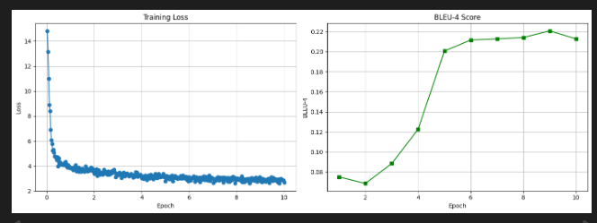

# IndonanoT5 fine-tuned D=64 With Dataset V3  no-code  04

Note = letaknya di akun gmail dianysahardi@gmail.com


Model:           IndoNanoT5-base (248M params)
Adapter:         Pfeiffer, d=64 (reduction_factor=12)
Trainable:       2.38M params (0.95%)
Dataset:         dataset-task-spesifc/ (4,529 train)
Epochs:          10
Batch Size:      4 (effective: 8 with grad_accum=2)
Learning Rate:   1e-4
Warmup:          100 steps


Results:
  BLEU-4:        0.2598
  ROUGE-L:       0.4809
  Training Time: 3.92 hours


## 1 setup environtment 

Python:  3.12.13 (main, Mar  4 2026, 09:23:07) [GCC 11.4.0]
OS:      Linux
Torch:   2.10.0+cu128
CUDA:    True

=== Library Versions ===
  adapters             1.3.0
  transformers         4.57.6
  datasets             4.0.0
  accelerate           1.13.0
  evaluate             0.4.6
  torch                2.10.0+cu128
  tokenizers           0.22.2
  rouge_score          unknown
  bert_score           0.3.12

  cuda version         12.8
  gpu name             Tesla T4

## 2 Load Model with Adapters Layers 

```

from src.finetuned.utils.adapter_loader import load_model_with_adapter, print_adapter_info

# Load model with adapter layers
model, tokenizer = load_model_with_adapter(
    model_name='LazarusNLP/IndoNanoT5-base',
    adapter_name='mcq_generation',
    adapter_config='pfeiffer',
    reduction_factor=12,  # d=64
    device='cuda'
)

# Print detailed info
trainable, total = print_adapter_info(model, tokenizer)

```

✓ Base model loaded with transformers + adapters.init()
✓ Adapter added: pfeiffer config, d=64
✓ Adapter activated for training
✓ Model moved to GPU
  GPU allocated: 1.00 GB

============================================================
MODEL INFORMATION
============================================================

Parameters:
  Trainable: 2,379,264 (0.95%)
  Total:     249,957,120
  Frozen:    247,577,856

Tokenizer:
  Vocab size: 32000
  Pad token:  <pad> (ID: 0)
  EOS token:  </s> (ID: 1)

✓ Loaded 2812 entries from /content/dataset_aqg/dataset-task-spesifc/train.jsonl
✓ Loaded 351 entries from /content/dataset_aqg/dataset-task-spesifc/validation.jsonl
✓ Loaded 352 entries from /content/dataset_aqg/dataset-task-spesifc/test.jsonl

Dataset loaded:
  Train: 2812 samples
  Val:   351 samples
  Test:  352 samples
✓ Using output field: 'output'

=== Dataset Validation Summary ===
Total Entries: 2812
Duplicate Count: 0
Avg Input Length: 190.77 chars
Avg Target Length: 234.73 chars
Has Metadata: True
✓ No duplicates found

=== Sample Entry ===
Input: buat_soal_pilihan_ganda: Deklarasi matriks dengan nilai default menggunakan nested list comprehension. Format umumnya adalah [[default_val for j in range(m)] for i in range(n)] di mana n adalah jumlah baris dan m adalah jumlah kolom....
Output: question: Apa format umum deklarasi matriks dengan nilai default?
answer: [[default_val for j in range(m)] for i in range(n)]
distractors: [[default_val for i in range(n)] for j in range(m)] | [default_val for i in range(n*m)] | [[default_val] * m] * n...

✓ Dataset ready (supports both v2 and v3 formats)

## 4 baseline Evaluation

```

from src.finetuned.evaluation.metrics_calculator import MetricsCalculator
from src.finetuned.evaluation.model_evaluator import ModelEvaluator

metrics_calc = MetricsCalculator()
evaluator = ModelEvaluator(
    model=model,
    tokenizer=tokenizer,
    metrics_calculator=metrics_calc
)

print('Computing baseline metrics (10 samples)...')
baseline_metrics = evaluator.evaluate_on_test_set(
    test_dataset=val_dataset,
    num_beams=4,
    include_bertscore=False,
    max_samples=10
)

print(f"\nBaseline Metrics:")
print(f"  BLEU-4:  {baseline_metrics.get('bleu_4', 0):.4f}")
print(f"  ROUGE-L: {baseline_metrics.get('rouge_l', 0):.4f}")

```

/usr/local/lib/python3.12/dist-packages/torch/nn/modules/module.py:1830: FutureWarning: `past_key_value` is deprecated and will be removed in version 4.58 for `T5Block.forward`. Use `past_key_values` instead.
  result = forward_call(*args, **kwargs)
  Processed 10/10 samples...
✓ Generated 10 predictions
Computing metrics for 10 samples...
  Computing BLEU...

Computing Diversity...
✓ All metrics computed

============================================================
Test Set Evaluation Results
============================================================

BLEU Scores:
  BLEU:     0.0233
  BLEU-1:   0.0993
  BLEU-2:   0.0331
  BLEU-3:   0.0124
  BLEU-4:   0.0072

ROUGE Scores:
  ROUGE-1:  0.1687
  ROUGE-2:  0.0462
  ROUGE-L:  0.1446

Diversity:
  Distinct-1: 0.3670
  Distinct-2: 0.7037

============================================================

Baseline Metrics:
  BLEU-4:  0.0072
  ROUGE-L: 0.1446


## 5 Configure Training

```

from src.finetuned.training.adapter_trainer import AdapterTrainer

CHECKPOINT_DIR = '/content/drive/MyDrive/dataset_aqg/checkpoints/adapter_v3'

# Initialize trainer
trainer = AdapterTrainer(
    model=model,
    tokenizer=tokenizer,
    metrics_calculator=metrics_calc,
    output_dir=CHECKPOINT_DIR,
    max_length=512
)

# Setup training configuration
training_args = trainer.setup_training(
    num_train_epochs=8,
    per_device_train_batch_size=4,
    per_device_eval_batch_size=8,
    gradient_accumulation_steps=2,
    learning_rate=1e-4,
    warmup_steps=50,
    weight_decay=0.01
)

print('\n✓ Trainer configured')
print(f'  Checkpoints will be saved to: {CHECKPOINT_DIR}')

```

============================================================
TRAINING CONFIGURATION
============================================================
Epochs: 8
Batch size: 4
Effective batch size: 8
Learning rate: 0.0001
Warmup steps: 50
FP16: True
Gradient checkpointing: True

✓ Trainer configured
  Checkpoints will be saved to: /content/drive/MyDrive/dataset_aqg/checkpoints/adapter_v3

## 6 Start Training

```

import time

start_time = time.time()

# Train (all logic in adapter_trainer.py)
results = trainer.train(
    train_dataset=train_dataset,
    eval_dataset=val_dataset,
    training_args=training_args,
    early_stopping_patience=2
)

elapsed = (time.time() - start_time) / 3600
print(f'\n✓ Training completed in {elapsed:.2f} hours')
print(f'  Final training loss: {results["training_loss"]:.4f}')

```

✓ Datasets tokenized
✓ Data collator configured
✓ Trainer initialized (with transformers 4.46+ compatibility fix)
🆕 No checkpoints found - starting fresh training

============================================================
STARTING TRAINING
============================================================
Training with Adapter Layers (d=64, ~3.6% trainable params)
Expected time: 6-8 hours on T4 GPU
Total epochs: 10
============================================================

WARNING:adapters.models.t5.modeling_t5:`use_cache=True` is incompatible with gradient checkpointing. Setting `use_cache=False`...


## 7 Save adapter & Visualize 

```

# Save adapter weights
adapter_save_path = trainer.save_adapter(
    adapter_name='mcq_generation',
    save_config={
        "model_name": "LazarusNLP/IndoNanoT5-base",
        "adapter_config": "pfeiffer",
        "reduction_factor": 12,
        "trainable_params": trainable,
        "total_params": total,
        "num_train_epochs": 8,
        "learning_rate": 1e-4,
        "training_time_hours": elapsed
    }
)

# Plot training curves
trainer.plot_training_curves(
    save_path=f'{CHECKPOINT_DIR}/training_curves.png'
)

```

============================================================
SAVING ADAPTER WEIGHTS
============================================================
✓ Adapter weights saved to: /content/drive/MyDrive/dataset_aqg/checkpoints/07-indonanoot5-report/adapter_mcq_generation
✓ Tokenizer saved
✓ Config saved
✓ Plot saved to /content/drive/MyDrive/dataset_aqg/checkpoints/07-indonanoot5-report/training_curves.png



##  8 final Evaluation

```
# Re-initialize evaluator with trained model
evaluator_final = ModelEvaluator(
    model=model,
    tokenizer=tokenizer,
    metrics_calculator=metrics_calc
)

print('Running comprehensive evaluation on test set...')
final_metrics = evaluator_final.evaluate_on_test_set(
    test_dataset=test_dataset,
    num_beams=4,
    include_bertscore=True,
    max_samples=None
)

print('\n=== Evaluation Results ===')
for key, value in final_metrics.items():
    print(f'{key}: {value:.4f}')

```


============================================================
Test Set Evaluation Results
============================================================

BLEU Scores:
  BLEU:     0.1902
  BLEU-1:   0.5516
  BLEU-2:   0.3061
  BLEU-3:   0.1581
  BLEU-4:   0.0899

ROUGE Scores:
  ROUGE-1:  0.5112
  ROUGE-2:  0.2796
  ROUGE-L:  0.4451

BERTScore:
  Precision: 0.7947
  Recall:    0.7761
  F1:        0.7850

Diversity:
  Distinct-1: 0.1515
  Distinct-2: 0.5340


## 9 generate sample outputs

Generating 20 sample outputs...

================================================================================
Sample 1/20
================================================================================

📥 INPUT:
buat_soal_pilihan_ganda: Duck typing tidak berkaitan langsung dengan dynamic typing atau loosely typed. Konsep duck typing lebih erat dengan pemrograman berorientasi objek (OOP) dan fokus pada kemampuan object melakukan operasi tertentu.

✅ REFERENCE:
question: Dengan konsep apa duck typing lebih erat kaitannya?
answer: Pemrograman berorientasi objek (OOP)
distractors: Dynamic typing | Loosely typed | Static typing

🤖 PREDICTION:
question: apa yang dimaksud dengan duck typing? answer: dynamic typing lebih erat dengan pemrograman berorientasi objek (oop) distractors: python lebih lambat | python lebih cepat | oop lebih lambat

📊 BLEU Score: 0.0000
================================================================================

================================================================================
Sample 2/20
================================================================================

📥 INPUT:
buat_soal_pilihan_ganda: Notebook seperti Jupyter atau Colab menyediakan lingkungan pengembangan interaktif dengan sel-sel yang dapat dijalankan satu per satu.

✅ REFERENCE:
question: Apa keunggulan sistem sel pada Notebook?
answer: Dapat menjalankan kode satu per satu
distractors: Lebih cepat dari script | Tidak perlu Python | Otomatis menyimpan

🤖 PREDICTION:
question: apa yang dimaksud dengan notebook jupyter atau colab? answer: lingkungan pengembangan interaktif dengan sel-sel yang dapat dijalankan satu per satu distractors: hanya satu sel | tidak ada lingkungan pengembangan

📊 BLEU Score: 0.1568
================================================================================

================================================================================
Sample 3/20
================================================================================

📥 INPUT:
buat_soal_pilihan_ganda: Dalam NumPy, kita dapat membuat matriks dengan nilai default menggunakan fungsi numpy.zeros() untuk matriks berisi 0, atau numpy.ones() untuk matriks berisi 1.

✅ REFERENCE:
question: Fungsi NumPy apa yang digunakan untuk membuat matriks berisi nilai 0?
answer: numpy.zeros()
distractors: numpy.empty() | numpy.zero() | numpy.fill(0)

🤖 PREDICTION:
question: apa fungsi dari numpy.zeros() untuk matriks berisi 0? answer: 1 distractors: 2 | 2

📊 BLEU Score: 0.1535
================================================================================

================================================================================
Sample 4/20
================================================================================

📥 INPUT:
buat_soal_pilihan_ganda: Method overriding adalah kemampuan child class untuk memberikan implementasi berbeda dari method yang diwarisi dari parent class. Method di child class harus memiliki nama dan signature yang sama dengan method di parent class.

✅ REFERENCE:
question: Apa yang dimaksud dengan method overriding?
answer: Child class memberikan implementasi berbeda dari method yang diwarisi dari parent class
distractors: Menghapus method dari parent class | Membuat method baru di parent class | Mengubah nama method

🤖 PREDICTION:
question: apa yang dimaksud dengan overriding? answer: kemampuan child class untuk memberikan implementasi berbeda dari method di parent class distractors: kemampuan membuat class berjalan lebih cepat | kemampuan membuat method berjalan lebih lambat

📊 BLEU Score: 0.2625
================================================================================

================================================================================
Sample 5/20
================================================================================

📥 INPUT:
buat_soal_pilihan_ganda: Unpacking memungkinkan assignment nilai dari list atau tuple ke beberapa variabel sekaligus.

✅ REFERENCE:
question: Apa yang dimaksud dengan unpacking?
answer: Assignment nilai dari list/tuple ke beberapa variabel
distractors: Menghapus variabel | Menggabungkan variabel | Membuat list

🤖 PREDICTION:
question: apa keuntungan unpacking? answer: assignment nilai dari list atau tuple ke beberapa variabel sekaligus distractors: tidak ada keuntungan | tidak ada manfaat

📊 BLEU Score: 0.2305
================================================================================

================================================================================
Sample 6/20
================================================================================

📥 INPUT:
buat_soal_pilihan_ganda: Prosedur dapat digunakan untuk denormalization, yaitu menggabungkan data untuk meningkatkan performa query. Denormalization prosedur trade-off antara storage dan speed.

✅ REFERENCE:
question: Apa trade-off dari denormalization prosedur?
answer: Antara storage dan speed
distractors: Antara security dan usability | Tidak ada trade-off | Antara size dan color

🤖 PREDICTION:
question: apa fungsi denormalization prosedur? answer: menggabungkan data untuk meningkatkan performa query distractors: membuat query lebih lambat | menghapus query | membuat query menjadi lebih lambat

📊 BLEU Score: 0.1566
================================================================================

================================================================================
Sample 7/20
================================================================================

📥 INPUT:
buat_soal_pilihan_ganda: Function body adalah blok kode yang diindentasi dan menentukan apa yang dilakukan fungsi. Body berisi instruksi-instruksi yang akan dieksekusi ketika fungsi dipanggil.

✅ REFERENCE:
question: Apa yang dimaksud dengan function body?
answer: Blok kode yang diindentasi berisi instruksi yang dieksekusi
distractors: Nama fungsi yang digunakan | Nilai yang dikembalikan fungsi | Parameter yang diterima fungsi

🤖 PREDICTION:
question: apa yang dimaksud dengan function body? answer: blok kode yang diindentasi dan menentukan apa yang dilakukan fungsi distractors: fungsi yang tidak bisa dipanggil | fungsi yang hanya bisa dipanggil

📊 BLEU Score: 0.2931
================================================================================

================================================================================
Sample 8/20
================================================================================

📥 INPUT:
buat_soal_pilihan_ganda: Dalam implementasi perkalian matriks dengan konstanta menggunakan list Python, kita memerlukan nested loop untuk mengiterasi setiap elemen. Loop pertama untuk baris dan loop kedua untuk kolom.

✅ REFERENCE:
question: Mengapa kita memerlukan nested loop (dua perulangan) untuk mengalikan matriks dengan konstanta menggunakan list Python?
answer: Karena matriks adalah struktur 2 dimensi, sehingga perlu loop untuk baris dan loop untuk kolom
distractors: Karena Python tidak mendukung operasi langsung pada list 2D | Karena satu loop hanya bisa memproses maksimal 10 elemen | Karena nested loop membuat kode lebih cepat dieksekusi

🤖 PREDICTION:
question: bagaimana cara mengiterasi matriks dengan konstanta menggunakan list python? answer: menggunakan nested loop distractors: menghapus semua elemen | membuat matriks baru | menghapus elemen

📊 BLEU Score: 0.0592
================================================================================

================================================================================
Sample 9/20
================================================================================

📥 INPUT:
buat_soal_pilihan_ganda: Case-sensitive juga berlaku untuk nama modul dan package dalam Python. Import statement harus menggunakan kapitalisasi yang tepat sesuai dengan nama file atau package.

✅ REFERENCE:
question: Apakah case-sensitive berlaku untuk nama modul?
answer: Ya, harus sesuai dengan nama file
distractors: Tidak, bisa menggunakan kapitalisasi apa saja | Hanya untuk variabel | Hanya untuk fungsi

🤖 PREDICTION:
question: apa yang dimaksud dengan case-sensitive dalam python? answer: nama modul dan package distractors: nama file dan package | nama file atau package dalam python

📊 BLEU Score: 0.0000
================================================================================

================================================================================
Sample 10/20
================================================================================

📥 INPUT:
buat_soal_pilihan_ganda: Ketika menggunakan black, formatter akan memformat kode secara konsisten bahkan untuk kode yang sangat kompleks. Black menggunakan algoritma yang dapat menangani berbagai pola kode Python dan menghasilkan format yang optimal.

✅ REFERENCE:
question: Apakah black dapat memformat kode Python yang sangat kompleks dengan benar?
answer: Ya, black menggunakan algoritma yang dapat menangani berbagai pola kode Python yang kompleks
distractors: Tidak, black hanya efektif untuk kode Python yang sederhana | Ya, tetapi hanya jika kode tidak menggunakan fitur Python lanjutan | Tidak, kode yang kompleks perlu diformat secara manual

🤖 PREDICTION:
question: bagaimana black memformat kode secara konsisten bahkan untuk kode yang sangat kompleks? answer: algoritma yang dapat menangani berbagai pola kode python dan menghasilkan format yang optimal distractors: algoritma tidak bisa menangani semua kode python | algoritma yang tidak dapat menangani semua format kode python

📊 BLEU Score: 0.1643
================================================================================


## 10 final summary 

============================================================
COMPARING WITH BASELINE
============================================================

Metric                        Baseline   Fine-tuned  Improvement
-----------------------------------------------------------------
bleu                            0.0259       0.1902      635.22%
bleu_1                          0.1237       0.5516      345.70%
bleu_2                          0.0329       0.3061      830.00%
bleu_3                          0.0141       0.1581     1020.80%
bleu_4                          0.0078       0.0899     1053.54%
brevity_penalty                 1.0000       0.8593      -14.07%
length_ratio                    2.2923       0.8683      -62.12%
rouge_1                         0.1759       0.5112      190.66%
rouge_2                         0.0563       0.2796      396.38%
rouge_l                         0.1453       0.4451      206.33%
rouge_1_fmeasure                0.1759       0.5112      190.66%
rouge_2_fmeasure                0.0563       0.2796      396.38%
rouge_l_fmeasure                0.1453       0.4451      206.33%
distinct_1                      0.2644       0.1515      -42.69%
distinct_2                      0.5888       0.5340       -9.30%

============================================================
ADAPTER-BASED AQG TRAINING SUMMARY
============================================================
Method: Adapter Layers (d=64)
Training Time: 2.13 hours
Trainable: 0.95%

Metrics Comparison:
  BLEU-4:  0.0078 → 0.0899
  ROUGE-L: 0.1453 → 0.4451

BLEU-4 Improvement: +1053.5%

⚠ BLEU-4 = 0.0899 (target: >= 0.20)
  Consider: more epochs or adjust hyperparameters

✓ Fine-tuning pipeline complete!
  Adapter: /content/drive/MyDrive/dataset_aqg/checkpoints/07-indonanoot5-report/adapter_mcq_generation
  Report: /content/drive/MyDrive/dataset_aqg/evaluation_results/07-indonanoot5-report/evaluation_report.json
  Samples: /content/drive/MyDrive/dataset_aqg/evaluation_results/07-indonanoot5-report/sample_outputs.json

============================================================
HOW TO LOAD TRAINED ADAPTER
============================================================
from adapters import AutoAdapterModel
from transformers import AutoTokenizer

model = AutoAdapterModel.from_pretrained("LazarusNLP/IndoNanoT5-base")
tokenizer = AutoTokenizer.from_pretrained("LazarusNLP/IndoNanoT5-base")
model.load_adapter("/content/drive/MyDrive/dataset_aqg/checkpoints/07-indonanoot5-report/adapter_mcq_generation")
model.set_active_adapters("mcq_generation")

# Generate
inputs = tokenizer("generate_mcq: [CONTEXT]", return_tensors="pt")
outputs = model.generate(**inputs, max_length=512, num_beams=4)
print(tokenizer.decode(outputs[0], skip_special_tokens=True))