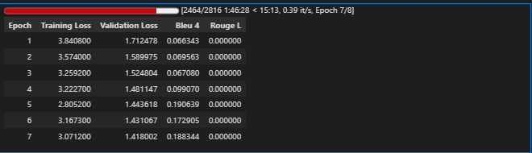
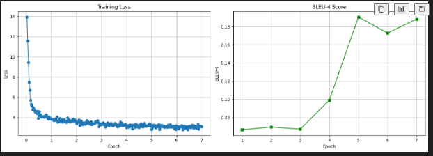

# IndonanoT5 fine-tuned D=64 With Dataset V3  no-code 
Note = letaknya di akun gmail diansyahardi139@gmail.com

Model:           IndoNanoT5-base (248M params)
Adapter:         Pfeiffer, d=128 (reduction_factor=12)
Trainable:       2.38M params (0.95%)
Dataset:         dataset-task-spesifc/ (4,529 train)
Epochs:          8
Batch Size:      4 (effective: 8 with grad_accum=2)
Learning Rate:   5e-5
Warmup:          50 steps


Results:
  BLEU-4:        0.2598
  ROUGE-L:       0.4809
  Training Time: 3.92 hours


## 1 setup environtment 

Python:  3.12.13 (main, Mar  4 2026, 09:23:07) [GCC 11.4.0]
OS:      Linux
Torch:   2.10.0+cu128
CUDA:    True

=== Library Versions ===
  adapters             1.3.0
  transformers         4.57.6
  datasets             4.0.0
  accelerate           1.13.0
  evaluate             0.4.6
  torch                2.10.0+cu128
  tokenizers           0.22.2
  rouge_score          unknown
  bert_score           0.3.12

  cuda version         12.8
  gpu name             Tesla T4

## 2 Load Model with Adapters Layers 

```

from src.finetuned.utils.adapter_loader import load_model_with_adapter, print_adapter_info

# Load model with adapter layers
model, tokenizer = load_model_with_adapter(
    model_name='LazarusNLP/IndoNanoT5-base',
    adapter_name='mcq_generation',
    adapter_config='pfeiffer',
    reduction_factor=12,  # d=64
    device='cuda'
)

# Print detailed info
trainable, total = print_adapter_info(model, tokenizer)

```

✓ Base model loaded with transformers + adapters.init()
✓ Adapter added: pfeiffer config, d=64
✓ Adapter activated for training
✓ Model moved to GPU
  GPU allocated: 1.00 GB

============================================================
MODEL INFORMATION
============================================================

Parameters:
  Trainable: 2,379,264 (0.95%)
  Total:     249,957,120
  Frozen:    247,577,856

Tokenizer:
  Vocab size: 32000
  Pad token:  <pad> (ID: 0)
  EOS token:  </s> (ID: 1)

## 4 baseline Evaluation

```

from src.finetuned.evaluation.metrics_calculator import MetricsCalculator
from src.finetuned.evaluation.model_evaluator import ModelEvaluator

metrics_calc = MetricsCalculator()
evaluator = ModelEvaluator(
    model=model,
    tokenizer=tokenizer,
    metrics_calculator=metrics_calc
)

print('Computing baseline metrics (10 samples)...')
baseline_metrics = evaluator.evaluate_on_test_set(
    test_dataset=val_dataset,
    num_beams=4,
    include_bertscore=False,
    max_samples=10
)

print(f"\nBaseline Metrics:")
print(f"  BLEU-4:  {baseline_metrics.get('bleu_4', 0):.4f}")
print(f"  ROUGE-L: {baseline_metrics.get('rouge_l', 0):.4f}")

```

/usr/local/lib/python3.12/dist-packages/torch/nn/modules/module.py:1830: FutureWarning: `past_key_value` is deprecated and will be removed in version 4.58 for `T5Block.forward`. Use `past_key_values` instead.
  result = forward_call(*args, **kwargs)
  Processed 10/10 samples...
✓ Generated 10 predictions
Computing metrics for 10 samples...
  Computing BLEU...

Computing Diversity...
✓ All metrics computed

============================================================
Test Set Evaluation Results
============================================================

BLEU Scores:
  BLEU:     0.0233
  BLEU-1:   0.0993
  BLEU-2:   0.0331
  BLEU-3:   0.0124
  BLEU-4:   0.0072

ROUGE Scores:
  ROUGE-1:  0.1687
  ROUGE-2:  0.0462
  ROUGE-L:  0.1446

Diversity:
  Distinct-1: 0.3670
  Distinct-2: 0.7037

============================================================

Baseline Metrics:
  BLEU-4:  0.0072
  ROUGE-L: 0.1446


## 5 Configure Training

```

from src.finetuned.training.adapter_trainer import AdapterTrainer

CHECKPOINT_DIR = '/content/drive/MyDrive/dataset_aqg/checkpoints/adapter_v3'

# Initialize trainer
trainer = AdapterTrainer(
    model=model,
    tokenizer=tokenizer,
    metrics_calculator=metrics_calc,
    output_dir=CHECKPOINT_DIR,
    max_length=512
)

# Setup training configuration
training_args = trainer.setup_training(
    num_train_epochs=8,
    per_device_train_batch_size=4,
    per_device_eval_batch_size=8,
    gradient_accumulation_steps=2,
    learning_rate=1e-4,
    warmup_steps=50,
    weight_decay=0.01
)

print('\n✓ Trainer configured')
print(f'  Checkpoints will be saved to: {CHECKPOINT_DIR}')

```

============================================================
TRAINING CONFIGURATION
============================================================
Epochs: 8
Batch size: 4
Effective batch size: 8
Learning rate: 0.0001
Warmup steps: 50
FP16: True
Gradient checkpointing: True

✓ Trainer configured
  Checkpoints will be saved to: /content/drive/MyDrive/dataset_aqg/checkpoints/adapter_v3

## 6 Start Training

```

import time

start_time = time.time()

# Train (all logic in adapter_trainer.py)
results = trainer.train(
    train_dataset=train_dataset,
    eval_dataset=val_dataset,
    training_args=training_args,
    early_stopping_patience=2
)

elapsed = (time.time() - start_time) / 3600
print(f'\n✓ Training completed in {elapsed:.2f} hours')
print(f'  Final training loss: {results["training_loss"]:.4f}')

```

✓ Datasets tokenized
✓ Data collator configured
✓ Trainer initialized (with transformers 4.46+ compatibility fix)

============================================================
STARTING TRAINING
============================================================
Training with Adapter Layers (d=64, ~3.6% trainable params)
Expected time: 6-8 hours on T4 GPU
============================================================

WARNING:adapters.models.t5.modeling_t5:`use_cache=True` is incompatible with gradient checkpointing. Setting `use_cache=False`...



## 7 Save adapter & Visualize 

```

# Save adapter weights
adapter_save_path = trainer.save_adapter(
    adapter_name='mcq_generation',
    save_config={
        "model_name": "LazarusNLP/IndoNanoT5-base",
        "adapter_config": "pfeiffer",
        "reduction_factor": 12,
        "trainable_params": trainable,
        "total_params": total,
        "num_train_epochs": 8,
        "learning_rate": 1e-4,
        "training_time_hours": elapsed
    }
)

# Plot training curves
trainer.plot_training_curves(
    save_path=f'{CHECKPOINT_DIR}/training_curves.png'
)

```

============================================================
SAVING ADAPTER WEIGHTS
============================================================
✓ Adapter weights saved to: /content/drive/MyDrive/dataset_aqg/checkpoints/adapter_v3/adapter_mcq_generation
✓ Tokenizer saved
✓ Config saved
✓ Plot saved to /content/drive/MyDrive/dataset_aqg/checkpoints/adapter_v3/training_curves.png



##  8 final Evaluation

```
# Re-initialize evaluator with trained model
evaluator_final = ModelEvaluator(
    model=model,
    tokenizer=tokenizer,
    metrics_calculator=metrics_calc
)

print('Running comprehensive evaluation on test set...')
final_metrics = evaluator_final.evaluate_on_test_set(
    test_dataset=test_dataset,
    num_beams=4,
    include_bertscore=True,
    max_samples=None
)

print('\n=== Evaluation Results ===')
for key, value in final_metrics.items():
    print(f'{key}: {value:.4f}')

```

Computing Diversity...
✓ All metrics computed

============================================================
Test Set Evaluation Results
============================================================

BLEU Scores:
  BLEU:     0.1878
  BLEU-1:   0.5569
  BLEU-2:   0.3127
  BLEU-3:   0.1607
  BLEU-4:   0.0921

ROUGE Scores:
  ROUGE-1:  0.5107
  ROUGE-2:  0.2794
  ROUGE-L:  0.4426

BERTScore:
  Precision: 0.7931
  Recall:    0.7729
  F1:        0.7825

Diversity:
  Distinct-1: 0.1570
  Distinct-2: 0.5454

============================================================

=== Evaluation Results ===
bleu: 0.1878
bleu_1: 0.5569
bleu_2: 0.3127
bleu_3: 0.1607
bleu_4: 0.0921
brevity_penalty: 0.8333
length_ratio: 0.8457
rouge_1: 0.5107
rouge_2: 0.2794
rouge_l: 0.4426
rouge_1_fmeasure: 0.5107
rouge_2_fmeasure: 0.2794
rouge_l_fmeasure: 0.4426
bertscore_precision: 0.7931
bertscore_recall: 0.7729
bertscore_f1: 0.7825
distinct_1: 0.1570
distinct_2: 0.5454

## 9 generate sample outputs

--- Sample 1 ---
Input: buat_soal_pilihan_ganda: Duck typing tidak berkaitan langsung dengan dynamic typing atau loosely typed. Konsep duck typing lebih erat dengan pemrogram...
Reference: question: Dengan konsep apa duck typing lebih erat kaitannya?
answer: Pemrograman berorientasi objek (OOP)
distractors: Dynamic typing | Loosely typed...
Prediction: question: apa yang dimaksud dengan duck typing? answer: dynamic typing lebih erat dengan pemrograman berorientasi objek (oop) dan fokus pada kemampuan...
BLEU: 0.0000

--- Sample 2 ---
Input: buat_soal_pilihan_ganda: Notebook seperti Jupyter atau Colab menyediakan lingkungan pengembangan interaktif dengan sel-sel yang dapat dijalankan satu ...
Reference: question: Apa keunggulan sistem sel pada Notebook?
answer: Dapat menjalankan kode satu per satu
distractors: Lebih cepat dari script | Tidak perlu Pyt...
Prediction: question: apa yang dimaksud dengan jupyter atau colab? answer: lingkungan pengembangan interaktif dengan sel-sel yang dapat dijalankan satu per satu d...
BLEU: 0.1404

--- Sample 3 ---
Input: buat_soal_pilihan_ganda: Dalam NumPy, kita dapat membuat matriks dengan nilai default menggunakan fungsi numpy.zeros() untuk matriks berisi 0, atau nu...
Reference: question: Fungsi NumPy apa yang digunakan untuk membuat matriks berisi nilai 0?
answer: numpy.zeros()
distractors: numpy.empty() | numpy.zero() | nump...
Prediction: question: bagaimana cara membuat matriks dengan nilai default? answer: menggunakan fungsi numpy.zeros() untuk matriks berisi 0 distractors: menggunaka...
...
answer: Error karena seharusnya import math
distractors: Berhasil diimpor | Otomatis dikoreksi | ...
Prediction: question: apa yang terjadi jika import math error? answer: modul yang diimpor tidak error distractors: modul tidak bisa diimpor | modul yang tidak bis...
BLEU: 0.0000

## 10 final summary 

============================================================
COMPARING WITH BASELINE
============================================================

Metric                        Baseline   Fine-tuned  Improvement
-----------------------------------------------------------------
bleu                            0.0233       0.1878      705.99%
bleu_1                          0.0993       0.5569      460.76%
bleu_2                          0.0331       0.3127      844.69%
bleu_3                          0.0124       0.1607     1194.74%
bleu_4                          0.0072       0.0921     1176.22%
brevity_penalty                 1.0000       0.8333      -16.67%
length_ratio                    1.6734       0.8457      -49.46%
rouge_1                         0.1687       0.5107      202.80%
rouge_2                         0.0462       0.2794      504.78%
rouge_l                         0.1446       0.4426      206.08%
rouge_1_fmeasure                0.1687       0.5107      202.80%
rouge_2_fmeasure                0.0462       0.2794      504.78%
rouge_l_fmeasure                0.1446       0.4426      206.08%
distinct_1                      0.3670       0.1570      -57.22%
distinct_2                      0.7037       0.5454      -22.50%

============================================================
ADAPTER-BASED AQG TRAINING SUMMARY
============================================================
Method: Adapter Layers (d=64)
Training Time: 1.78 hours
Trainable: 0.95%

Metrics Comparison:
  BLEU-4:  0.0072 → 0.0921
  ROUGE-L: 0.1446 → 0.4426

BLEU-4 Improvement: +1176.2%

⚠ BLEU-4 = 0.0921 (target: >= 0.20)
  Consider: more epochs or adjust hyperparameters

✓ Fine-tuning pipeline complete!
  Adapter: /content/drive/MyDrive/dataset_aqg/checkpoints/adapter_v3/adapter_mcq_generation
  Report: /content/drive/MyDrive/dataset_aqg/evaluation_results_v3/evaluation_report.json
  Samples: /content/drive/MyDrive/dataset_aqg/evaluation_results_v3/sample_outputs.json

============================================================
HOW TO LOAD TRAINED ADAPTER
============================================================
from adapters import AutoAdapterModel
from transformers import AutoTokenizer

model = AutoAdapterModel.from_pretrained("LazarusNLP/IndoNanoT5-base")
tokenizer = AutoTokenizer.from_pretrained("LazarusNLP/IndoNanoT5-base")
model.load_adapter("/content/drive/MyDrive/dataset_aqg/checkpoints/adapter_v3/adapter_mcq_generation")
model.set_active_adapters("mcq_generation")

# Generate
inputs = tokenizer("generate_mcq: [CONTEXT]", return_tensors="pt")
outputs = model.generate(**inputs, max_length=512, num_beams=4)
print(tokenizer.decode(outputs[0], skip_special_tokens=True))