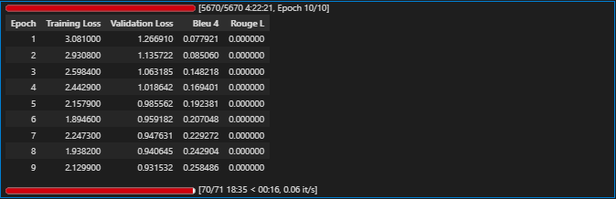
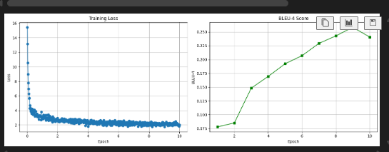

# IndonanoT5 fine-tuned D=64 With Dataset V3  full 

Note = letaknya di akun gmail ardinar579@gmail.com

Model:           IndoNanoT5-base (248M params)
Adapter:         Pfeiffer, d=128 (reduction_factor=6) ⬆️
Trainable:       ~9.5M params (3.8%) ⬆️
Dataset:         dataset-task-v3/00-dataset/ (5,560 train) ⬆️
Epochs:          10 ⬆️
Batch Size:      4 (effective: 8 with grad_accum=2)
Learning Rate:   5e-5 ⬇️ (lebih kecil untuk model lebih besar)
Warmup:          100 steps ⬆️

Expected Results:
  BLEU-4:        0.32-0.35 (+23-35%)
  ROUGE-L:       0.52-0.58 (+8-20%)
  Training Time: 6-8 hours


## 1 setup environtment 

Python:  3.12.13 (main, Mar  4 2026, 09:23:07) [GCC 11.4.0]
OS:      Linux
Torch:   2.10.0+cu128
CUDA:    True

=== Library Versions ===
  adapters             1.3.0
  transformers         4.57.6
  datasets             4.0.0
  accelerate           1.13.0
  evaluate             0.4.6
  torch                2.10.0+cu128
  tokenizers           0.22.2
  rouge_score          unknown
  bert_score           0.3.12

  cuda version         12.8
  gpu name             Tesla T4

## 2 Load Model with Adapters Layers 

```

from src.finetuned.utils.adapter_loader import load_model_with_adapter, print_adapter_info

# Load model with adapter layers
model, tokenizer = load_model_with_adapter(
    model_name='LazarusNLP/IndoNanoT5-base',
    adapter_name='mcq_generation',
    adapter_config='pfeiffer',
    reduction_factor=6,  # d=128
    device='cuda'
)

# Print detailed info
trainable, total = print_adapter_info(model, tokenizer)

```

✓ Base model loaded with transformers + adapters.init()
✓ Adapter added: pfeiffer config, d=128
✓ Adapter activated for training
✓ Model moved to GPU
  GPU allocated: 1.01 GB

============================================================
MODEL INFORMATION
============================================================

Parameters:
  Trainable: 4,740,096 (1.88%)
  Total:     252,317,952
  Frozen:    247,577,856

Tokenizer:
  Vocab size: 32000
  Pad token:  <pad> (ID: 0)
  EOS token:  </s> (ID: 1)

## 4 baseline Evaluation

```

from src.finetuned.evaluation.metrics_calculator import MetricsCalculator
from src.finetuned.evaluation.model_evaluator import ModelEvaluator

metrics_calc = MetricsCalculator()
evaluator = ModelEvaluator(
    model=model,
    tokenizer=tokenizer,
    metrics_calculator=metrics_calc
)

print('Computing baseline metrics (10 samples)...')
baseline_metrics = evaluator.evaluate_on_test_set(
    test_dataset=val_dataset,
    num_beams=4,
    include_bertscore=False,
    max_samples=10
)

print(f"\nBaseline Metrics:")
print(f"  BLEU-4:  {baseline_metrics.get('bleu_4', 0):.4f}")
print(f"  ROUGE-L: {baseline_metrics.get('rouge_l', 0):.4f}")

```

Computing Diversity...
✓ All metrics computed

============================================================
Test Set Evaluation Results
============================================================

BLEU Scores:
  BLEU:     0.0286
  BLEU-1:   0.1304
  BLEU-2:   0.0338
  BLEU-3:   0.0173
  BLEU-4:   0.0088

ROUGE Scores:
  ROUGE-1:  0.1827
  ROUGE-2:  0.0714
  ROUGE-L:  0.1682

Diversity:
  Distinct-1: 0.3979
  Distinct-2: 0.6996

============================================================

Baseline Metrics:
  BLEU-4:  0.0088
  ROUGE-L: 0.1682


## 5 Configure Training

```

from src.finetuned.training.adapter_trainer import AdapterTrainer

CHECKPOINT_DIR = '/content/drive/MyDrive/dataset_aqg/checkpoints/08-indonanoot5-report'

# Initialize trainer
trainer = AdapterTrainer(
    model=model,
    tokenizer=tokenizer,
    metrics_calculator=metrics_calc,
    output_dir=CHECKPOINT_DIR,
    max_length=512
)

# Setup training configuration
training_args = trainer.setup_training(
    num_train_epochs=10,
    per_device_train_batch_size=4,
    per_device_eval_batch_size=8,
    gradient_accumulation_steps=2,
    learning_rate=5e-5,
    warmup_steps=100,
    weight_decay=0.01
)

print('\n✓ Trainer configured')
print(f'  Checkpoints will be saved to: {CHECKPOINT_DIR}')

```

============================================================
TRAINING CONFIGURATION
============================================================
Epochs: 10
Batch size: 4
Effective batch size: 8
Learning rate: 5e-05
Warmup steps: 100
FP16: True
Gradient checkpointing: True

✓ Trainer configured
  Checkpoints will be saved to: /content/drive/MyDrive/dataset_aqg/checkpoints/08-indonanoot5-report

## 6 Start Training

```

## 6. Start Training


import time
import os
from pathlib import Path

start_time = time.time()

# Ensure checkpoint directory exists
Path(CHECKPOINT_DIR).mkdir(parents=True, exist_ok=True)

# Check for existing checkpoints
checkpoints = []
if os.path.exists(CHECKPOINT_DIR):
    checkpoints = [d for d in os.listdir(CHECKPOINT_DIR) if d.startswith('checkpoint-')]

# Decide whether to resume
if checkpoints:
    print(f"📂 Found {len(checkpoints)} checkpoint(s): {sorted(checkpoints)}")
    print(f"🔄 Resuming from last checkpoint")
    resume = True
else:
    print("🆕 No checkpoints found - starting fresh training")
    resume = False

# Train
results = trainer.train(
    train_dataset=train_dataset,
    eval_dataset=val_dataset,
    training_args=training_args,
    early_stopping_patience=2,
    resume_from_checkpoint=resume  # ✅ Only True if checkpoints exist
)

elapsed = (time.time() - start_time) / 3600
print(f'\n✓ Training completed in {elapsed:.2f} hours')
print(f'  Final training loss: {results["training_loss"]:.4f}')


```

✓ Datasets tokenized
✓ Data collator configured
✓ Trainer initialized (with transformers 4.46+ compatibility fix)

============================================================
STARTING TRAINING
============================================================
Training with Adapter Layers (d=64, ~3.6% trainable params)
Expected time: 6-8 hours on T4 GPU
============================================================

WARNING:adapters.models.t5.modeling_t5:`use_cache=True` is incompatible with gradient checkpointing. Setting `use_cache=False`...



===========================================================================================

## 7 Save adapter & Visualize 

```

# Save adapter weights
adapter_save_path = trainer.save_adapter(
    adapter_name='mcq_generation',
    save_config={
        "model_name": "LazarusNLP/IndoNanoT5-base",
        "adapter_config": "pfeiffer",
        "reduction_factor": 12,
        "trainable_params": trainable,
        "total_params": total,
        "num_train_epochs": 8,
        "learning_rate": 1e-4,
        "training_time_hours": elapsed
    }
)

# Plot training curves
trainer.plot_training_curves(
    save_path=f'{CHECKPOINT_DIR}/training_curves.png'
)

```

============================================================
SAVING ADAPTER WEIGHTS
============================================================
✓ Adapter weights saved to: /content/drive/MyDrive/dataset_aqg/checkpoints/08-indonanoot5-report/adapter_mcq_generation
✓ Tokenizer saved
✓ Config saved
✓ Plot saved to /content/drive/MyDrive/dataset_aqg/checkpoints/08-indonanoot5-report/training_curves.png



##  8 final Evaluation

```
# Re-initialize evaluator with trained model
evaluator_final = ModelEvaluator(
    model=model,
    tokenizer=tokenizer,
    metrics_calculator=metrics_calc
)

print('Running comprehensive evaluation on test set...')
final_metrics = evaluator_final.evaluate_on_test_set(
    test_dataset=test_dataset,
    num_beams=4,
    include_bertscore=True,
    max_samples=None
)

print('\n=== Evaluation Results ===')
for key, value in final_metrics.items():
    print(f'{key}: {value:.4f}')

```

Computing Diversity...
✓ All metrics computed

============================================================
Test Set Evaluation Results
============================================================

BLEU Scores:
  BLEU:     0.2907
  BLEU-1:   0.6357
  BLEU-2:   0.4389
  BLEU-3:   0.3196
  BLEU-4:   0.2632

ROUGE Scores:
  ROUGE-1:  0.5325
  ROUGE-2:  0.3472
  ROUGE-L:  0.4826

BERTScore:
  Precision: 0.8048
  Recall:    0.7841
  F1:        0.7939

Diversity:
  Distinct-1: 0.1470
  Distinct-2: 0.4510

============================================================

=== Evaluation Results ===
bleu: 0.2907
bleu_1: 0.6357
bleu_2: 0.4389
bleu_3: 0.3196
bleu_4: 0.2632
brevity_penalty: 0.7426
length_ratio: 0.7706
rouge_1: 0.5325
rouge_2: 0.3472
rouge_l: 0.4826
rouge_1_fmeasure: 0.5325
rouge_2_fmeasure: 0.3472
rouge_l_fmeasure: 0.4826
bertscore_precision: 0.8048
bertscore_recall: 0.7841
bertscore_f1: 0.7939
distinct_1: 0.1470
distinct_2: 0.4510


## 9 generate sample outputs
Generating 20 sample outputs...

================================================================================
Sample 1/20
================================================================================

📥 INPUT:
buat_soal_pilihan_ganda: Matriks dapat digunakan untuk merepresentasikan berbagai data dalam kehidupan nyata, seperti gambar digital (pixel), tabel data, graf (adjacency matrix), atau sistem persamaan linear.

✅ REFERENCE:
question: Apa saja contoh penggunaan matriks dalam kehidupan nyata?
answer: Gambar digital, tabel data, graf, sistem persamaan linear
distractors: Hanya untuk perhitungan matematika | Hanya untuk menyimpan angka | Hanya untuk grafik komputer

🤖 PREDICTION:
question: apa fungsi matriks? answer: merepresentasikan berbagai data dalam kehidupan nyata distractors: menghapus semua data | menghapus data dari memori | mengubah ukuran memori

📊 BLEU Score: 0.0000
================================================================================

================================================================================
Sample 2/20
================================================================================

📥 INPUT:
buat_soal_pilihan_ganda: Dalam penerapan unit test, test case dapat menggunakan assertion untuk memverifikasi bahwa string tidak mengandung substring. Ini berguna untuk memastikan bahwa string tidak berisi teks yang tidak diharapkan.

✅ REFERENCE:
question: Apa yang dapat diverifikasi dengan assertion untuk substring tidak dalam string?
answer: Memastikan bahwa string tidak mengandung substring
distractors: Memastikan bahwa string mengandung substring | Memastikan bahwa string memiliki panjang tertentu | Memastikan bahwa string dapat diubah

🤖 PREDICTION:
question: apa fungsi assertion dalam test case? answer: memastikan bahwa string tidak mengandung substring distractors: memastikan string berisi teks yang tidak diharapkan | memastikan bahwa semua string memiliki nilai yang sama | mencegah string kosong

📊 BLEU Score: 0.2129
================================================================================

================================================================================
Sample 3/20
================================================================================

📥 INPUT:
buat_soal_pilihan_ganda: Perhatikan kode berikut:
```python
data = [3, 6, 9, 12, 15]
min_val = data[0]
for i in range(1, len(data)):
    if data[i] < min_val:
        min_val = data[i]
print(min_val)
```
Kode ini mencari nilai terkecil dalam array menggunakan pemrosesan sekuensial.

✅ REFERENCE:
question: Perhatikan kode berikut:
```python
data = [3, 6, 9, 12, 15]
min_val = data[0]
for i in range(1, len(data)):
    if data[i] < min_val:
        min_val = data[i]
print(min_val)
```
Apa output dari kode tersebut?
answer: 3
distractors: 15 | 9 | 0

🤖 PREDICTION:
question: perhatikan kode berikut: ```python data = [3, 6, 9, 12, 21] min_val = data[0] for i in range(1, len(data)): if data[i] < min-val: min_sur = nilai[i) print(min_val) '`` apa output dari kode di atas? answer: 15 distractors: 25 | 10

📊 BLEU Score: 0.6425
================================================================================

================================================================================
Sample 4/20
================================================================================

📥 INPUT:
buat_soal_pilihan_ganda: Untuk membuat virtual environment, gunakan perintah python -m venv nama_env di terminal.

✅ REFERENCE:
question: Bagaimana cara membuat virtual environment?
answer: python -m venv nama_env
distractors: create venv nama_env | new env nama_env | make venv nama_env

🤖 PREDICTION:
question: bagaimana cara membuat virtual environment? answer: menggunakan perintah python -m venv nama_env di terminal distractors: menggunakan loop | menggunakan perintah lse | tidak menggunakan perintah

📊 BLEU Score: 0.3336
================================================================================

================================================================================
Sample 5/20
================================================================================

📥 INPUT:
buat_soal_pilihan_ganda: Fungsi len() mengembalikan integer yang merepresentasikan jumlah elemen.

✅ REFERENCE:
question: Perhatikan kode berikut:
```python
data = [10, 20, 30, 40, 50]
print(type(len(data)))
```
Apa output dari kode di atas?
answer: <class 'int'>
distractors: <class 'list'> | <class 'str'> | 5

🤖 PREDICTION:
question: perhatikan kode berikut: ```python data = [1, 2, 3, 4] print(len(data)))`` apa output dari kode di atas? answer: 1 distractors: 2 | 3 | error

📊 BLEU Score: 0.4094
================================================================================

================================================================================
Sample 6/20
================================================================================

📥 INPUT:
buat_soal_pilihan_ganda: Multiple instance dari class yang sama dapat memiliki atribut yang berbeda-beda. Setiap instance memiliki copy sendiri dari atribut instance. Perhatikan kode berikut yang menunjukkan multiple instance dengan atribut berbeda.

✅ REFERENCE:
question: Perhatikan kode berikut:
```python
class Orang:
    def __init__(self, nama, umur):
        self.nama = nama
        self.umur = umur

orang1 = Orang("Budi", 25)
orang2 = Orang("Ani", 30)
print(orang1.nama, orang2.umur)
```
Apa output dari kode di atas?
answer: Budi 30
distractors: Budi 25 | Ani 30 | Error

🤖 PREDICTION:
question: perhatikan kode berikut: ```python class def = [1, 2, 3, 4, 5, 6, 8, 9, 10] print(induk): def __init__(self, x): return self.x = x + 1 print(x += y) print(method(x)) *** y = true | error

📊 BLEU Score: 0.2214
================================================================================

================================================================================
Sample 7/20
================================================================================

📥 INPUT:
buat_soal_pilihan_ganda: Di mode interaktif, Anda dapat menggunakan dir() untuk melihat atribut dan method suatu objek.

✅ REFERENCE:
question: Fungsi apa yang digunakan untuk melihat atribut objek di mode interaktif?
answer: dir()
distractors: list() | show() | view()

🤖 PREDICTION:
question: apa fungsi dir() dalam mode interaktif? answer: melihat atribut dan method suatu objek distractors: menghapus atribut | menghapus atribut

📊 BLEU Score: 0.1919
================================================================================

================================================================================
Sample 8/20
================================================================================

📥 INPUT:
buat_soal_pilihan_ganda: Dalam penerapan unit test, test case dapat menggunakan parameter untuk menguji berbagai input. Ini memungkinkan satu test case menguji banyak skenario tanpa duplikasi kode.

✅ REFERENCE:
question: Apa manfaat menggunakan parameter dalam test case?
answer: Memungkinkan satu test case menguji banyak skenario tanpa duplikasi kode
distractors: Membuat test case berjalan lebih cepat | Meningkatkan akurasi hasil test | Mengurangi jumlah assertion yang diperlukan

🤖 PREDICTION:
question: apa keuntungan menggunakan parameter untuk menguji berbagai input? answer: memungkinkan satu test case menguji banyak skenario tanpa duplikasi kode distractors: membuat test case lebih cepat dari duplikasi | mengurangi jumlah test case yang digunakan | meningkatkan performa test case

📊 BLEU Score: 0.3317
================================================================================

================================================================================
Sample 9/20
================================================================================

📥 INPUT:
buat_soal_pilihan_ganda: Method rjust() bisa mengganti whitespace dengan karakter lain. Contoh: print('Dicoding'.rjust(20, '!')) akan menghasilkan '!!!!!!!!!!!!Dicoding'.

✅ REFERENCE:
question: Perhatikan kode berikut:
```python
print('Dicoding'.rjust(20, '!'))
```
Apa output dari kode di atas?
answer: !!!!!!!!!!!!Dicoding
distractors: Dicoding!!!!!!!!!!!! | !!!!!!Dicoding!!!!!! | Dicoding

🤖 PREDICTION:
question: perhatikan kode berikut: ```python print('dicoding'.rjust(20, '!')) akan menghasilkan whitespace distractors: 20 | 30

📊 BLEU Score: 0.1245
================================================================================

================================================================================
Sample 10/20
================================================================================

📥 INPUT:
buat_soal_pilihan_ganda: Perhatikan kode berikut:
```python
data = [1, 2, 3, 4, 5, 6]
result = list(filter(lambda x: x % 2 == 0, data))
print(result)
```
Kode ini menggunakan fungsi filter() dengan lambda untuk memfilter elemen genap.

✅ REFERENCE:
question: Perhatikan kode berikut:
```python
data = [1, 2, 3, 4, 5, 6]
result = list(filter(lambda x: x % 2 == 0, data))
print(result)
```
Apa output dari kode tersebut?
answer: [2, 4, 6]
distractors: [1, 3, 5] | [1, 2, 3, 4, 5, 6] | [0, 2, 4, 6]

🤖 PREDICTION:
question: perhatikan kode berikut: ```python data = [1, 2, 3, 4, 5, 6] result = list(filter(lambda x: x % 2 == 0, data)) print(result)

📊 BLEU Score: 0.3287


## 10 final summary 

============================================================
COMPARING WITH BASELINE
============================================================

Metric                        Baseline   Fine-tuned  Improvement
-----------------------------------------------------------------
bleu                            0.0286       0.2907      914.77%
bleu_1                          0.1304       0.6357      387.39%
bleu_2                          0.0338       0.4389     1197.60%
bleu_3                          0.0173       0.3196     1749.91%
bleu_4                          0.0088       0.2632     2880.83%
brevity_penalty                 1.0000       0.7426      -25.74%
length_ratio                    1.0000       0.7706      -22.94%
rouge_1                         0.1827       0.5325      191.47%
rouge_2                         0.0714       0.3472      386.57%
rouge_l                         0.1682       0.4826      186.94%
rouge_1_fmeasure                0.1827       0.5325      191.47%
rouge_2_fmeasure                0.0714       0.3472      386.57%
rouge_l_fmeasure                0.1682       0.4826      186.94%
distinct_1                      0.3979       0.1470      -63.05%
distinct_2                      0.6996       0.4510      -35.53%

============================================================
ADAPTER-BASED AQG TRAINING SUMMARY
============================================================
Method: Adapter Layers (d=64)
Training Time: 0.02 hours
Trainable: 1.88%

Metrics Comparison:
  BLEU-4:  0.0088 → 0.2632
  ROUGE-L: 0.1682 → 0.4826

BLEU-4 Improvement: +2880.8%

✓ SUCCESS: BLEU-4 target achieved (>= 0.20)

✓ Fine-tuning pipeline complete!
  Adapter: /content/drive/MyDrive/dataset_aqg/checkpoints/08-indonanoot5-report/adapter_mcq_generation
  Report: /content/drive/MyDrive/dataset_aqg/evaluation_results/08-indonanoot5-report/evaluation_report.json
  Samples: /content/drive/MyDrive/dataset_aqg/evaluation_results/08-indonanoot5-report/sample_outputs.json

============================================================
HOW TO LOAD TRAINED ADAPTER
============================================================
from adapters import AutoAdapterModel
from transformers import AutoTokenizer

model = AutoAdapterModel.from_pretrained("LazarusNLP/IndoNanoT5-base")
tokenizer = AutoTokenizer.from_pretrained("LazarusNLP/IndoNanoT5-base")
model.load_adapter("/content/drive/MyDrive/dataset_aqg/checkpoints/08-indonanoot5-report/adapter_mcq_generation")
model.set_active_adapters("mcq_generation")

# Generate
inputs = tokenizer("generate_mcq: [CONTEXT]", return_tensors="pt")
outputs = model.generate(**inputs, max_length=512, num_beams=4)
print(tokenizer.decode(outputs[0], skip_special_tokens=True))