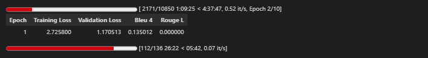
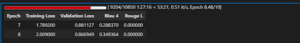
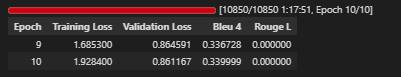
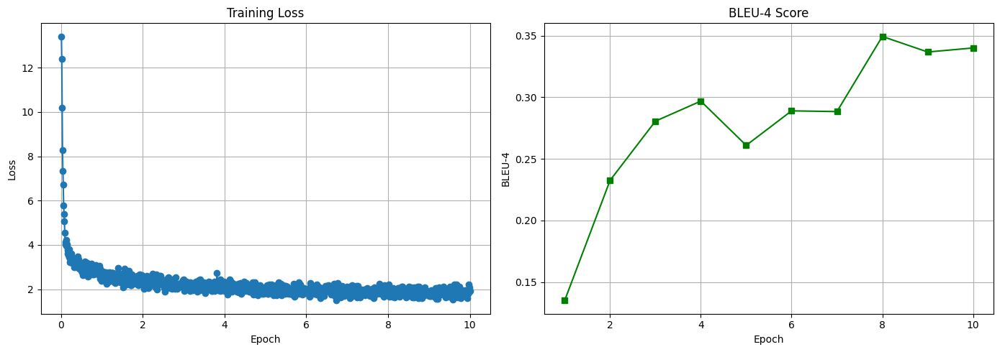

# IndonanoT5 fine-tuned D=64 With Dataset V4  06

Note = letaknya di akun gmail aiimagine@gmail.com

06_task_specific_training.ipynb

Note = letaknya di akun gmail @gmail.com

Model:           IndoNanoT5-base (248M params)
Adapter:         Pfeiffer, d=128 (reduction_factor=6) ⬆️
Trainable:       ~9.5M params (3.8%) ⬆️
Dataset:         dataset-task-v3/00-dataset/ (5,560 train) ⬆️
Epochs:          10 ⬆️
Batch Size:      4 (effective: 8 with grad_accum=2)
Learning Rate:   5e-5 ⬇️ (lebih kecil untuk model lebih besar)
Warmup:          100 steps ⬆️

Expected Results:
  BLEU-4:        0.32-0.35 (+23-35%)
  ROUGE-L:       0.52-0.58 (+8-20%)
  Training Time: 6-8 hours


## 1 setup environtment 

Python:  3.12.13 (main, Mar  4 2026, 09:23:07) [GCC 11.4.0]
OS:      Linux
Torch:   2.10.0+cu128
CUDA:    True

=== Library Versions ===
  adapters             1.3.0
  transformers         4.57.6
  datasets             4.0.0
  accelerate           1.13.0
  evaluate             0.4.6
  torch                2.10.0+cu128
  tokenizers           0.22.2
  rouge_score          unknown
  bert_score           0.3.12

  cuda version         12.8
  gpu name             Tesla T4

## 2 Load Model with Adapters Layers 

```

from src.finetuned.utils.adapter_loader import load_model_with_adapter, print_adapter_info

# Load model with adapter layers
model, tokenizer = load_model_with_adapter(
    model_name='LazarusNLP/IndoNanoT5-base',
    adapter_name='mcq_generation',
    adapter_config='pfeiffer',
    reduction_factor=6,  # d=128
    device='cuda'
)

# Print detailed info
trainable, total = print_adapter_info(model, tokenizer)

```

✓ Base model loaded with transformers + adapters.init()
✓ Adapter added: pfeiffer config, d=128
✓ Adapter activated for training
✓ Model moved to GPU
  GPU allocated: 1.01 GB

============================================================
MODEL INFORMATION
============================================================

Parameters:
  Trainable: 4,740,096 (1.88%)
  Total:     252,317,952
  Frozen:    247,577,856

Tokenizer:
  Vocab size: 32000
  Pad token:  <pad> (ID: 0)
  EOS token:  </s> (ID: 1)

✓ Loaded 1086 entries from /content/dataset_aqg/dataset-task-spesifc/test.jsonl

Dataset loaded:
  Train: 8680 samples
  Val:   1085 samples
  Test:  1086 samples
✓ Using output field: 'output'

=== Dataset Validation Summary ===
Total Entries: 8680
Duplicate Count: 0
Avg Input Length: 199.09 chars
Avg Target Length: 218.32 chars
Has Metadata: True
✓ No duplicates found

=== Sample Entry ===
Input: buat_soal_pilihan_ganda: Dalam percabangan, penting untuk mempertimbangkan edge cases. Edge cases adalah kondisi ekstrem atau tidak biasa yang mungkin menyebabkan bug....
Output: question: Apa yang dimaksud dengan edge cases?
answer: Kondisi ekstrem atau tidak biasa
distractors: Kondisi normal | Kondisi yang sering terjadi | Kondisi yang tidak mungkin...

✓ Dataset ready (supports both v2 and v3 formats)

## 4 baseline Evaluation

```

from src.finetuned.evaluation.metrics_calculator import MetricsCalculator
from src.finetuned.evaluation.model_evaluator import ModelEvaluator

metrics_calc = MetricsCalculator()
evaluator = ModelEvaluator(
    model=model,
    tokenizer=tokenizer,
    metrics_calculator=metrics_calc
)

print('Computing baseline metrics (10 samples)...')
baseline_metrics = evaluator.evaluate_on_test_set(
    test_dataset=val_dataset,
    num_beams=4,
    include_bertscore=False,
    max_samples=10
)

print(f"\nBaseline Metrics:")
print(f"  BLEU-4:  {baseline_metrics.get('bleu_4', 0):.4f}")
print(f"  ROUGE-L: {baseline_metrics.get('rouge_l', 0):.4f}")

```

Computing Diversity...
✓ All metrics computed

Computing Diversity...
✓ All metrics computed

============================================================
Test Set Evaluation Results
============================================================

BLEU Scores:
  BLEU:     0.0568
  BLEU-1:   0.1642
  BLEU-2:   0.0719
  BLEU-3:   0.0373
  BLEU-4:   0.0237

ROUGE Scores:
  ROUGE-1:  0.1948
  ROUGE-2:  0.0753
  ROUGE-L:  0.1511

Diversity:
  Distinct-1: 0.3403
  Distinct-2: 0.6438

============================================================

Baseline Metrics:
  BLEU-4:  0.0237
  ROUGE-L: 0.1511


## 5 Configure Training

```

from src.finetuned.training.adapter_trainer import AdapterTrainer

CHECKPOINT_DIR = '/content/drive/MyDrive/dataset_aqg/checkpoints/08-indonanoot5-report'

# Initialize trainer
trainer = AdapterTrainer(
    model=model,
    tokenizer=tokenizer,
    metrics_calculator=metrics_calc,
    output_dir=CHECKPOINT_DIR,
    max_length=512
)

# Setup training configuration
training_args = trainer.setup_training(
    num_train_epochs=10,
    per_device_train_batch_size=4,
    per_device_eval_batch_size=8,
    gradient_accumulation_steps=2,
    learning_rate=5e-5,
    warmup_steps=100,
    weight_decay=0.01
)

print('\n✓ Trainer configured')
print(f'  Checkpoints will be saved to: {CHECKPOINT_DIR}')

```

============================================================
TRAINING CONFIGURATION
============================================================
Epochs: 10
Batch size: 4
Effective batch size: 8
Learning rate: 5e-05
Warmup steps: 100
FP16: True
Gradient checkpointing: True

✓ Trainer configured
  Checkpoints will be saved to: /content/drive/MyDrive/dataset_aqg/checkpoints/10-indonanoot5-report

## 6 Start Training

```

# ✅ SIMPLIFIED: Let trainer handle checkpoint detection
resume = True  # Set to False if you want fresh training

# Train - trainer will auto-detect and resume from last checkpoint
results = trainer.train(
    train_dataset=train_dataset,
    eval_dataset=val_dataset,
    training_args=training_args,
    early_stopping_patience=2,
    resume_from_checkpoint=resume
)

```

============================================================
PREPROCESSING DATASETS
============================================================

✓ Datasets tokenized
✓ Data collator configured
✓ Trainer initialized (with transformers 4.46+ compatibility fix)
🆕 Starting fresh training (no resume)

============================================================
STARTING TRAINING
============================================================
Training with Adapter Layers (d=64, ~3.6% trainable params)
Expected time: 6-8 hours on T4 GPU
Total epochs: 10
============================================================

WARNING:adapters.models.t5.modeling_t5:`use_cache=True` is incompatible with gradient checkpointing. Setting `use_cache=False`...





## 7 Save adapter & Visualize 

```

# Save adapter weights
adapter_save_path = trainer.save_adapter(
    adapter_name='mcq_generation',
    save_config={
        "model_name": "LazarusNLP/IndoNanoT5-base",
        "adapter_config": "pfeiffer",
        "reduction_factor": 12,
        "trainable_params": trainable,
        "total_params": total,
        "num_train_epochs": 8,
        "learning_rate": 1e-4,
        "training_time_hours": elapsed
    }
)

# Plot training curves
trainer.plot_training_curves(
    save_path=f'{CHECKPOINT_DIR}/training_curves.png'
)

```

============================================================
SAVING ADAPTER WEIGHTS
============================================================
✓ Adapter weights saved to: /content/drive/MyDrive/dataset_aqg/checkpoints/10-indonanoot5-report/adapter_mcq_generation
✓ Tokenizer saved
✓ Config saved
✓ Plot saved to /content/drive/MyDrive/dataset_aqg/checkpoints/10-indonanoot5-report/training_curves.png



##  8 final Evaluation

```
# Re-initialize evaluator with trained model
evaluator_final = ModelEvaluator(
    model=model,
    tokenizer=tokenizer,
    metrics_calculator=metrics_calc
)

print('Running comprehensive evaluation on test set...')
final_metrics = evaluator_final.evaluate_on_test_set(
    test_dataset=test_dataset,
    num_beams=4,
    include_bertscore=True,
    max_samples=None
)

print('\n=== Evaluation Results ===')
for key, value in final_metrics.items():
    print(f'{key}: {value:.4f}')

```

Computing Diversity...
✓ All metrics computed

============================================================
Test Set Evaluation Results
============================================================

BLEU Scores:
  BLEU:     0.2970
  BLEU-1:   0.5990
  BLEU-2:   0.3888
  BLEU-3:   0.2683
  BLEU-4:   0.2097

ROUGE Scores:
  ROUGE-1:  0.5464
  ROUGE-2:  0.3582
  ROUGE-L:  0.5009

BERTScore:
  Precision: 0.8129
  Recall:    0.7972
  F1:        0.8045

Diversity:
  Distinct-1: 0.1052
  Distinct-2: 0.3690

============================================================

=== Evaluation Results ===
bleu: 0.2970
bleu_1: 0.5990
bleu_2: 0.3888
bleu_3: 0.2683
bleu_4: 0.2097
brevity_penalty: 0.8778
length_ratio: 0.8847
rouge_1: 0.5464
rouge_2: 0.3582
rouge_l: 0.5009
rouge_1_fmeasure: 0.5464
rouge_2_fmeasure: 0.3582
rouge_l_fmeasure: 0.5009
bertscore_precision: 0.8129
bertscore_recall: 0.7972
bertscore_f1: 0.8045
distinct_1: 0.1052
distinct_2: 0.3690
bleu: 
## 9 generate sample outputs

Generating 20 sample outputs...

================================================================================
Sample 1/20
================================================================================

📥 INPUT:
buat_soal_pilihan_ganda: Perulangan memungkinkan kita menghindari penulisan kode yang repetitif. Dengan perulangan, kita dapat menulis kode sekali dan menjalankannya berkali-kali.

✅ REFERENCE:
question: Apa manfaat utama menggunakan perulangan?
answer: Menghindari penulisan kode repetitif
distractors: Membuat program lebih lambat | Menambah ukuran file | Mengurangi readability

🤖 PREDICTION:
question: bagaimana perulangan mencegah penulisan kode yang repetitif? answer: memungkinkan penulisan kode sekali dan menjalankannya berkali-kali distractors: membuat kode berjalan lebih cepat | membuat kode lebih lambat | mengurangi ukuran file

📊 BLEU Score: 0.0000
================================================================================

================================================================================
Sample 2/20
================================================================================

📥 INPUT:
buat_soal_pilihan_ganda: Dalam PEP8, sebaiknya tidak ada spasi sebelum koma, tetapi ada satu spasi setelah koma. Contoh: [1, 2, 3], bukan [1 , 2 , 3].

✅ REFERENCE:
question: Bagaimana penggunaan spasi di sekitar koma dalam PEP8?
answer: Tidak ada spasi sebelum, ada satu spasi setelah koma
distractors: Ada spasi sebelum dan sesudah | Tidak ada spasi sama sekali | Dua spasi setelah

🤖 PREDICTION:
question: apa yang dimaksud dengan spasi dalam pep8? answer: tidak ada spasi sebelum koma distractors: hanya satu spasi | hanya spasi setelah koma | tidak ada aturan khusus

📊 BLEU Score: 0.0000
================================================================================

================================================================================
Sample 3/20
================================================================================

📥 INPUT:
buat_soal_pilihan_ganda: Dalam duck typing, aspect-oriented programming dapat diterapkan dimana cross-cutting concerns seperti logging atau caching dapat ditambahkan tanpa mengubah kode existing.

✅ REFERENCE:
question: Apa keuntungan aspect-oriented programming dengan duck typing?
answer: Cross-cutting concerns dapat ditambahkan tanpa mengubah kode existing
distractors: Kode existing harus diubah | Aspect-oriented tidak mungkin | Concerns tidak bisa ditambahkan

🤖 PREDICTION:
question: bagaimana aspect-oriented programming dapat diterapkan dalam duck typing? answer: cross-cutting concerns seperti logging atau caching dapat ditambahkan tanpa mengubah kode existing distractors: tidak ada aturan khusus | hanya logging | tidak ada batasan

📊 BLEU Score: 0.3176
================================================================================

================================================================================
Sample 4/20
================================================================================

📥 INPUT:
buat_soal_pilihan_ganda: Perhatikan kode berikut:
```python
a = 6
b = 9
result = a + b
```
Operasi penjumlahan bersifat komutatif (a + b = b + a). Jika urutan inisialisasi a dan b ditukar, nilai result tetap sama karena 6 + 9 = 9 + 6 = 15.

✅ REFERENCE:
question: Perhatikan kode berikut:
```python
a = 6
b = 9
result = a + b
```
Jika urutan a dan b ditukar, apakah result akan berubah?
answer: Tidak
distractors: Ya | Tergantung nilai | Error

🤖 PREDICTION:
question: apa hasil dari operasi penjumlahan 6 + 9 result = a + b ``` apa output dari kode di atas? answer: 9 distractors: 15 | 9 | error

📊 BLEU Score: 0.2196
================================================================================

================================================================================
Sample 5/20
================================================================================

📥 INPUT:
buat_soal_pilihan_ganda: Control flow adalah skill yang terus berkembang. Semakin banyak experience, semakin baik dalam memilih construct yang tepat.

✅ REFERENCE:
question: Bagaimana improve skill control flow?
answer: Dengan experience dan practice
distractors: Hanya membaca teori | Tidak bisa improve | Sekali belajar cukup

🤖 PREDICTION:
question: apa yang dimaksud dengan control flow? answer: skill terus berkembang distractors: skill yang terus berkembang | skill yang selalu berubah | control flow tidak ada

📊 BLEU Score: 0.1601
================================================================================

================================================================================
Sample 6/20
================================================================================

📥 INPUT:
buat_soal_pilihan_ganda: Dalam PEP8, aturan tentang trailing comma dan statement gabungan merupakan bagian dari panduan gaya yang lebih luas. Tujuan utamanya adalah membuat kode Python yang ditulis oleh berbagai programmer terlihat konsisten dan mudah dibaca.

✅ REFERENCE:
question: Apa tujuan utama dari panduan gaya PEP8 secara keseluruhan?
answer: Membuat kode Python yang ditulis oleh berbagai programmer terlihat konsisten dan mudah dibaca
distractors: Membuat program Python berjalan lebih cepat dan efisien | Memastikan kompatibilitas kode dengan semua versi Python | Mencegah programmer membuat kesalahan logika dalam kode

🤖 PREDICTION:
question: apa tujuan utama dari aturan trailing comma dan statement gabungan dalam pep8? answer: membuat kode python terlihat konsisten dan mudah dibaca distractors: membuat program berjalan lebih cepat | mengurangi ukuran file program | membuat kode lebih aman

📊 BLEU Score: 0.1939
================================================================================

================================================================================
Sample 7/20
================================================================================

📥 INPUT:
buat_soal_pilihan_ganda: Subprogram dapat digunakan untuk circuit breaker pattern, yaitu mencegah pemanggilan ke service yang sedang down untuk menghindari cascading failures.

✅ REFERENCE:
question: Apa tujuan circuit breaker pattern?
answer: Mencegah pemanggilan ke service down untuk menghindari cascading failures
distractors: Memutus semua koneksi | Membuat service selalu down | Menghapus error handling

🤖 PREDICTION:
question: apa fungsi dari circuit breaker pattern? answer: mencegah pemanggilan ke service yang sedang down untuk menghindari cascading failures distractors: membuat program berjalan lebih cepat | mengurangi ukuran file program | menghapus error

📊 BLEU Score: 0.3376
================================================================================

================================================================================
Sample 8/20
================================================================================

📥 INPUT:
buat_soal_pilihan_ganda: Interpreter menerjemahkan kode Python satu per satu secara langsung, memungkinkan Anda melihat hasil segera setelah setiap baris dieksekusi. Ini berbeda dengan compiler yang menerjemahkan seluruh program sekaligus.

✅ REFERENCE:
question: Apa perbedaan utama interpreter dengan compiler?
answer: Interpreter menerjemahkan satu per satu, compiler seluruh program
distractors: Tidak ada perbedaan | Interpreter lebih lambat saja | Compiler hanya untuk Python

🤖 PREDICTION:
question: bagaimana interpreter menerjemahkan kode python satu per satu secara langsung? answer: compiler menerjemahkan kode secara langsung distractors: hanya menerjemahkan satu baris | hanya untuk python | tidak ada perbedaan

📊 BLEU Score: 0.0000
================================================================================

================================================================================
Sample 9/20
================================================================================

📥 INPUT:
buat_soal_pilihan_ganda: Perhatikan kode:
```python
# Workaround for bug #123
result = value * 2 + 1
```
Komentar menjelaskan alasan kode tidak standar.

✅ REFERENCE:
question: Apa fungsi komentar di atas?
answer: Menjelaskan workaround untuk bug
distractors: Menjalankan kode | Menyimpan bug | Error

🤖 PREDICTION:
question: perhatikan kode berikut: ```python # workaround for bug #123 result = value * 2 + 1 apa output dari kode di atas? answer: true distractors: false | 12 | error

📊 BLEU Score: 0.1231
================================================================================

================================================================================
Sample 10/20
================================================================================

📥 INPUT:
buat_soal_pilihan_ganda: Prosedur berbeda dengan fungsi dalam beberapa hal. Prosedur tidak mengharuskan adanya parameter input atau output, sedangkan fungsi biasanya memiliki keduanya.

✅ REFERENCE:
question: Apa perbedaan prosedur dengan fungsi terkait parameter dan output?
answer: Prosedur tidak mengharuskan adanya parameter input atau output
distractors: Prosedur harus memiliki parameter dan output | Prosedur dan fungsi sama saja | Prosedur lebih kompleks dari fungsi

🤖 PREDICTION:
question: apa perbedaan antara prosedur dan fungsi dalam beberapa hal? answer: prosedur tidak mengharuskan adanya parameter input atau output distractors: prosedur lebih cepat dari fungsi | prosedur tidak memerlukan parameter input | tidak ada perbedaan

📊 BLEU Score: 0.2733
================================================================================

================================================================================
Sample 11/20
================================================================================

📥 INPUT:
buat_soal_pilihan_ganda: Dalam Python, positional-or-keyword adalah jenis parameter default yang dapat dipanggil dengan positional maupun keyword argument. Ini adalah jenis parameter yang paling fleksibel.

✅ REFERENCE:
question: Apa yang dimaksud dengan positional-or-keyword parameter dalam Python?
answer: Parameter yang dapat dipanggil dengan positional maupun keyword argument
distractors: Parameter yang hanya bisa dipanggil dengan positional | Parameter yang hanya bisa dipanggil dengan keyword | Parameter yang tidak bisa diubah

🤖 PREDICTION:
question: apa yang dimaksud dengan positional-or-keyword dalam python? answer: parameter default yang dapat dipanggil menggunakan positional maupun keyword argument distractors: parameter yang tidak bisa dipanggil | parameter yang hanya bisa dipanggil sekali | fungsi yang hanya dapat dipanggil sekali

📊 BLEU Score: 0.3152
================================================================================

================================================================================
Sample 12/20
================================================================================

📥 INPUT:
buat_soal_pilihan_ganda: Perhatikan kode Python berikut:
print('         Dicoding          '.strip())
Method strip() menghapus whitespace di kedua sisi string.

✅ REFERENCE:
question: Perhatikan kode berikut:
```python
print('         Dicoding          '.strip())
```
Apa output dari kode di atas?
answer: Dicoding
distractors: '         Dicoding          ' | Dicoding (dengan spasi) | Error

🤖 PREDICTION:
question: perhatikan kode berikut: ```python print(' dicoding '.strip())) method apa output dari kode di atas? answer: true distractors: false | 1 | error

📊 BLEU Score: 0.4670
================================================================================

================================================================================
Sample 13/20
================================================================================

📥 INPUT:
buat_soal_pilihan_ganda: PEP8 merupakan salah satu dari banyak panduan PEP yang ada untuk Python. PEP8 secara khusus membahas tentang gaya penulisan kode, sementara PEP lainnya membahas aspek berbeda dari pengembangan Python seperti fitur bahasa atau proses rilis.

✅ REFERENCE:
question: Apa yang secara khusus dibahas oleh PEP8 dibandingkan panduan PEP lainnya?
answer: Arahan gaya penulisan kode Python
distractors: Fitur-fitur baru yang ditambahkan ke bahasa Python | Proses rilis dan distribusi versi Python | Standar keamanan dalam pengembangan aplikasi Python

🤖 PREDICTION:
question: apa yang dimaksud dengan pep8 dalam python? answer: panduan pep yang membahas aspek berbeda dari pengembangan python distractors: panduan python yang membahas fitur bahasa | panduan python untuk python | tutorial python yang tidak ada

📊 BLEU Score: 0.0000
================================================================================

================================================================================
Sample 14/20
================================================================================

📥 INPUT:
buat_soal_pilihan_ganda: Dalam PEP8, sebaiknya menggunakan unpacking untuk mengekstrak nilai dari tuple atau list. Contoh: a, b, c = [1, 2, 3]. Unpacking membuat kode lebih readable.

✅ REFERENCE:
question: Apa fungsi dari unpacking dalam PEP8?
answer: Mengekstrak nilai dari tuple atau list dengan cara yang readable
distractors: Membuat tuple atau list | Menggabungkan tuple atau list | Menghapus tuple atau list

🤖 PREDICTION:
question: apa fungsi dari unpacking dalam pep8? answer: mengekstrak nilai dari tuple atau list distractors: membuat kode lebih readable | menghapus semua tuple | mengurangi ukuran file

📊 BLEU Score: 0.2217
================================================================================

================================================================================
Sample 15/20
================================================================================

📥 INPUT:
buat_soal_pilihan_ganda: Penamaan self dan cls adalah konvensi dalam Python. Self digunakan untuk parameter pertama object method yang merujuk pada objek, sedangkan cls digunakan untuk parameter pertama class method yang merujuk pada kelas.

✅ REFERENCE:
question: Apa perbedaan konvensi self dan cls?
answer: Self merujuk pada objek di object method, cls merujuk pada kelas di class method
distractors: Tidak ada perbedaan | Self merujuk pada kelas, cls merujuk pada objek | Keduanya merujuk pada objek

🤖 PREDICTION:
question: apa yang dimaksud dengan self dan cls dalam python? answer: parameter pertama object method yang merujuk pada objek distractors: parameter kedua class method | parameter pertama class method, cls tidak ada

📊 BLEU Score: 0.0000
================================================================================

================================================================================
Sample 16/20
================================================================================

📥 INPUT:
buat_soal_pilihan_ganda: Multiple inheritance dari exception classes memungkinkan exception memiliki multiple types. Namun, ini jarang digunakan dan bisa membingungkan.

✅ REFERENCE:
question: Apakah multiple inheritance untuk exception direkomendasikan?
answer: Tidak, jarang digunakan dan membingungkan
distractors: Ya, sangat direkomendasikan | Tergantung kasus | Tidak bisa dilakukan

🤖 PREDICTION:
question: apa yang dimaksud dengan multiple inheritance dari exception classes? answer: memiliki multiple types distractors: tidak ada hubungan | tidak ada perbedaan

📊 BLEU Score: 0.0000
================================================================================

================================================================================
Sample 17/20
================================================================================

📥 INPUT:
buat_soal_pilihan_ganda: Signature atau tanda tangan fungsi mencakup nama fungsi, jumlah parameter, dan tipe parameter. Signature ini menentukan bagaimana fungsi dipanggil.

✅ REFERENCE:
question: Apa yang dimaksud dengan signature fungsi?
answer: Nama fungsi, jumlah parameter, dan tipe parameter
distractors: Hanya nama fungsi saja | Kode implementasi fungsi | Output yang dihasilkan fungsi

🤖 PREDICTION:
question: apa yang dimaksud dengan signature atau tanda tangan fungsi? answer: nama fungsi, jumlah parameter, dan tipe parameter distractors: tipe data fungsi | jumlah parameter | tipe parameter

📊 BLEU Score: 0.4394
================================================================================

================================================================================
Sample 18/20
================================================================================

📥 INPUT:
buat_soal_pilihan_ganda: Perhatikan kode Python berikut:
```python
x = 5
y = 10
print(x <= y)
```
Operasi x <= y akan membandingkan apakah x lebih kecil atau sama dengan y. Karena 5 lebih kecil dari 10, hasilnya True.

✅ REFERENCE:
question: Perhatikan kode berikut:
```python
x = 5
y = 10
print(x <= y)
```
Apa output dari kode di atas?
answer: True
distractors: False | 5 | 10

🤖 PREDICTION:
question: apa hasil dari operasi x <= y? answer: true distractors: false | 10 | error

📊 BLEU Score: 0.0785
================================================================================

================================================================================
Sample 19/20
================================================================================

📥 INPUT:
buat_soal_pilihan_ganda: Dalam unittest, assertFalse(x) adalah metode assertion yang digunakan untuk memastikan bahwa x bernilai False. Jika x bernilai True, test case akan gagal.

✅ REFERENCE:
question: Apa fungsi dari metode assertFalse(x)?
answer: Memastikan bahwa x bernilai False
distractors: Memastikan bahwa x bernilai True | Memastikan bahwa x sama dengan nilai tertentu | Memastikan bahwa x ada dalam koleksi

🤖 PREDICTION:
question: apa fungsi dari metode assertfalse(x) dalam unittest? answer: memastikan bahwa x bernilai false distractors: memeriksa apakah x bernilai true | memeriksa apakah nilai true (self) berhasil | memastikan bahwa nilai true

📊 BLEU Score: 0.0000
================================================================================

================================================================================
Sample 20/20
================================================================================

📥 INPUT:
buat_soal_pilihan_ganda: Menurut Stack Overflow Developers Survey 2022, Python menempati posisi teratas dalam kategori bahasa pemrograman yang paling banyak dipelajari oleh programmer dan pemula.

✅ REFERENCE:
question: Menurut Stack Overflow Developers Survey 2022, di posisi manakah Python berada?
answer: Tiga peringkat teratas
distractors: Peringkat sepuluh besar | Peringkat kedua puluh | Peringkat terakhir

🤖 PREDICTION:
question: berapa nilai dari stack overflow developers survey 2022? answer: 1 distractors: 2 | 3 | error

📊 BLEU Score: 0.0000
================================================================================

✓ Samples saved to /content/drive/MyDrive/dataset_aqg/evaluation_results/10-indonanoot5-report/sample_outputs.json

✓ 20 samples generated and saved
✓ Full output displayed above with BLEU scores


## 10 final summary 

============================================================
COMPARING WITH BASELINE
============================================================

Metric                        Baseline   Fine-tuned  Improvement
-----------------------------------------------------------------
bleu                            0.0462       0.2970      542.92%
bleu_1                          0.1667       0.5990      259.38%
bleu_2                          0.0607       0.3888      540.57%
bleu_3                          0.0341       0.2683      686.99%
bleu_4                          0.0132       0.2097     1488.54%
brevity_penalty                 1.0000       0.8778      -12.22%
length_ratio                    1.4654       0.8847      -39.63%
rouge_1                         0.1931       0.5464      183.01%
rouge_2                         0.0565       0.3582      534.38%
rouge_l                         0.1461       0.5009      242.98%
rouge_1_fmeasure                0.1931       0.5464      183.01%
rouge_2_fmeasure                0.0565       0.3582      534.38%
rouge_l_fmeasure                0.1461       0.5009      242.98%
distinct_1                      0.3704       0.1052      -71.60%
distinct_2                      0.7402       0.3690      -50.15%

============================================================
ADAPTER-BASED AQG TRAINING SUMMARY
============================================================
Method: Adapter Layers (d=64)
Training Time: 1.31 hours
Trainable: 1.88%

Metrics Comparison:
  BLEU-4:  0.0132 → 0.2097
  ROUGE-L: 0.1461 → 0.5009

BLEU-4 Improvement: +1488.5%

✓ SUCCESS: BLEU-4 target achieved (>= 0.20)

✓ Fine-tuning pipeline complete!
  Adapter: /content/drive/MyDrive/dataset_aqg/checkpoints/10-indonanoot5-report/adapter_mcq_generation
  Report: /content/drive/MyDrive/dataset_aqg/evaluation_results/10-indonanoot5-report/evaluation_report.json
  Samples: /content/drive/MyDrive/dataset_aqg/evaluation_results/10-indonanoot5-report/sample_outputs.json

============================================================
HOW TO LOAD TRAINED ADAPTER
============================================================
from adapters import AutoAdapterModel
from transformers import AutoTokenizer

model = AutoAdapterModel.from_pretrained("LazarusNLP/IndoNanoT5-base")
tokenizer = AutoTokenizer.from_pretrained("LazarusNLP/IndoNanoT5-base")
model.load_adapter("/content/drive/MyDrive/dataset_aqg/checkpoints/10-indonanoot5-report/adapter_mcq_generation")
model.set_active_adapters("mcq_generation")

# Generate
inputs = tokenizer("generate_mcq: [CONTEXT]", return_tensors="pt")
outputs = model.generate(**inputs, max_length=512, num_beams=4)
print(tokenizer.decode(outputs[0], skip_special_tokens=True))