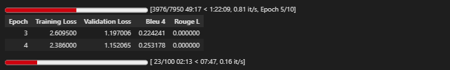
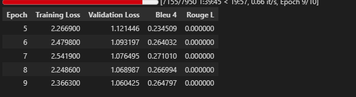
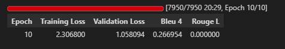
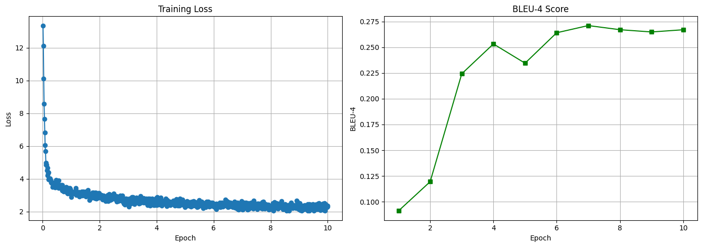

# IndonanoT5 fine-tuned D=64 With Dataset V4  No Code 06

06_task_specific_training.ipynb

Note = letaknya di akun gmail ard9125@gmail.com

Model:           IndoNanoT5-base (248M params)
Adapter:         Pfeiffer, d=128 (reduction_factor=6) ⬆️
Trainable:       ~9.5M params (3.8%) ⬆️
Dataset:         dataset-task-v3/00-dataset/ (5,560 train) ⬆️
Epochs:          10 ⬆️
Batch Size:      4 (effective: 8 with grad_accum=2)
Learning Rate:   5e-5 ⬇️ (lebih kecil untuk model lebih besar)
Warmup:          100 steps ⬆️

Expected Results:
  BLEU-4:        0.32-0.35 (+23-35%)
  ROUGE-L:       0.52-0.58 (+8-20%)
  Training Time: 6-8 hours


## 1 setup environtment 

Python:  3.12.13 (main, Mar  4 2026, 09:23:07) [GCC 11.4.0]
OS:      Linux
Torch:   2.10.0+cu128
CUDA:    True

=== Library Versions ===
  adapters             1.3.0
  transformers         4.57.6
  datasets             4.0.0
  accelerate           1.13.0
  evaluate             0.4.6
  torch                2.10.0+cu128
  tokenizers           0.22.2
  rouge_score          unknown
  bert_score           0.3.12

  cuda version         12.8
  gpu name             Tesla T4

## 2 Load Model with Adapters Layers 

```

from src.finetuned.utils.adapter_loader import load_model_with_adapter, print_adapter_info

# Load model with adapter layers
model, tokenizer = load_model_with_adapter(
    model_name='LazarusNLP/IndoNanoT5-base',
    adapter_name='mcq_generation',
    adapter_config='pfeiffer',
    reduction_factor=6,  # d=128
    device='cuda'
)

# Print detailed info
trainable, total = print_adapter_info(model, tokenizer)

```

✓ Base model loaded with transformers + adapters.init()
✓ Adapter added: pfeiffer config, d=128
✓ Adapter activated for training
✓ Model moved to GPU
  GPU allocated: 1.01 GB

============================================================
MODEL INFORMATION
============================================================

Parameters:
  Trainable: 4,740,096 (1.88%)
  Total:     252,317,952
  Frozen:    247,577,856

Tokenizer:
  Vocab size: 32000
  Pad token:  <pad> (ID: 0)
  EOS token:  </s> (ID: 1)

✓ Loaded 796 entries from /content/dataset_aqg/dataset-task-spesifc/test.jsonl

Dataset loaded:
  Train: 6356 samples
  Val:   794 samples
  Test:  796 samples
✓ Using output field: 'output'

=== Dataset Validation Summary ===
Total Entries: 6356
Duplicate Count: 0
Avg Input Length: 196.88 chars
Avg Target Length: 218.81 chars
Has Metadata: True
✓ No duplicates found

=== Sample Entry ===
Input: buat_soal_pilihan_ganda: Dalam OOP, version control adalah sistem untuk mengelola perubahan pada code. Version control membantu dalam tracking perubahan dan memudahkan collaboration antar developer....
Output: question: Apa fungsi dari version control dalam OOP?
answer: Mengelola perubahan pada code dan memudahkan collaboration
distractors: Menghapus code | Mengubah code | Version control tidak ada...

✓ Dataset ready (supports both v2 and v3 formats)


## 4 baseline Evaluation

```

from src.finetuned.evaluation.metrics_calculator import MetricsCalculator
from src.finetuned.evaluation.model_evaluator import ModelEvaluator

metrics_calc = MetricsCalculator()
evaluator = ModelEvaluator(
    model=model,
    tokenizer=tokenizer,
    metrics_calculator=metrics_calc
)

print('Computing baseline metrics (10 samples)...')
baseline_metrics = evaluator.evaluate_on_test_set(
    test_dataset=val_dataset,
    num_beams=4,
    include_bertscore=False,
    max_samples=10
)

print(f"\nBaseline Metrics:")
print(f"  BLEU-4:  {baseline_metrics.get('bleu_4', 0):.4f}")
print(f"  ROUGE-L: {baseline_metrics.get('rouge_l', 0):.4f}")

```

Computing Diversity...
✓ All metrics computed

============================================================
Test Set Evaluation Results
============================================================

BLEU Scores:
  BLEU:     0.0485
  BLEU-1:   0.1341
  BLEU-2:   0.0560
  BLEU-3:   0.0338
  BLEU-4:   0.0218

ROUGE Scores:
  ROUGE-1:  0.2099
  ROUGE-2:  0.1043
  ROUGE-L:  0.1733

Diversity:
  Distinct-1: 0.4828
  Distinct-2: 0.7857

============================================================

Baseline Metrics:
  BLEU-4:  0.0218
  ROUGE-L: 0.1733


## 5 Configure Training

```

from src.finetuned.training.adapter_trainer import AdapterTrainer

CHECKPOINT_DIR = '/content/drive/MyDrive/dataset_aqg/checkpoints/08-indonanoot5-report'

# Initialize trainer
trainer = AdapterTrainer(
    model=model,
    tokenizer=tokenizer,
    metrics_calculator=metrics_calc,
    output_dir=CHECKPOINT_DIR,
    max_length=512
)

# Setup training configuration
training_args = trainer.setup_training(
    num_train_epochs=10,
    per_device_train_batch_size=4,
    per_device_eval_batch_size=8,
    gradient_accumulation_steps=2,
    learning_rate=5e-5,
    warmup_steps=100,
    weight_decay=0.01
)

print('\n✓ Trainer configured')
print(f'  Checkpoints will be saved to: {CHECKPOINT_DIR}')

```

============================================================
TRAINING CONFIGURATION
============================================================
Epochs: 10
Batch size: 4
Effective batch size: 8
Learning rate: 5e-05
Warmup steps: 100
FP16: True
Gradient checkpointing: True

✓ Trainer configured
  Checkpoints will be saved to: /content/drive/MyDrive/dataset_aqg/checkpoints/11-indonanoot5-report

## 6 Start Training

```

# ✅ SIMPLIFIED: Let trainer handle checkpoint detection
resume = True  # Set to False if you want fresh training

# Train - trainer will auto-detect and resume from last checkpoint
results = trainer.train(
    train_dataset=train_dataset,
    eval_dataset=val_dataset,
    training_args=training_args,
    early_stopping_patience=2,
    resume_from_checkpoint=resume
)

```

✓ Datasets tokenized
✓ Data collator configured
✓ Trainer initialized (with transformers 4.46+ compatibility fix)
📂 Found 2 checkpoint(s): ['checkpoint-795', 'checkpoint-1590']
🔄 Resuming from: checkpoint-1590

============================================================
STARTING TRAINING
============================================================
Training with Adapter Layers (d=64, ~3.6% trainable params)
Expected time: 6-8 hours on T4 GPU
Total epochs: 10
============================================================

There were missing keys in the checkpoint model loaded: ['encoder.embed_tokens.weight', 'decoder.embed_tokens.weight'].
WARNING:adapters.models.t5.modeling_t5:`use_cache=True` is incompatible with gradient checkpointing. Setting `use_cache=False`...





## 7 Save adapter & Visualize 

```

# Save adapter weights
adapter_save_path = trainer.save_adapter(
    adapter_name='mcq_generation',
    save_config={
        "model_name": "LazarusNLP/IndoNanoT5-base",
        "adapter_config": "pfeiffer",
        "reduction_factor": 12,
        "trainable_params": trainable,
        "total_params": total,
        "num_train_epochs": 8,
        "learning_rate": 1e-4,
        "training_time_hours": elapsed
    }
)

# Plot training curves
trainer.plot_training_curves(
    save_path=f'{CHECKPOINT_DIR}/training_curves.png'
)

```

============================================================
SAVING ADAPTER WEIGHTS
============================================================
✓ Adapter weights saved to: /content/drive/MyDrive/dataset_aqg/checkpoints/11-indonanoot5-report/adapter_mcq_generation
✓ Tokenizer saved
✓ Config saved
✓ Plot saved to /content/drive/MyDrive/dataset_aqg/checkpoints/11-indonanoot5-report/training_curves.png



##  8 final Evaluation

```
# Re-initialize evaluator with trained model
evaluator_final = ModelEvaluator(
    model=model,
    tokenizer=tokenizer,
    metrics_calculator=metrics_calc
)

print('Running comprehensive evaluation on test set...')
final_metrics = evaluator_final.evaluate_on_test_set(
    test_dataset=test_dataset,
    num_beams=4,
    include_bertscore=True,
    max_samples=None
)

print('\n=== Evaluation Results ===')
for key, value in final_metrics.items():
    print(f'{key}: {value:.4f}')

```


Computing Diversity...
✓ All metrics computed

============================================================
Test Set Evaluation Results
============================================================

BLEU Scores:
  BLEU:     0.2282
  BLEU-1:   0.5365
  BLEU-2:   0.3083
  BLEU-3:   0.1764
  BLEU-4:   0.1117

ROUGE Scores:
  ROUGE-1:  0.5204
  ROUGE-2:  0.3155
  ROUGE-L:  0.4746

BERTScore:
  Precision: 0.7999
  Recall:    0.7893
  F1:        0.7942

Diversity:
  Distinct-1: 0.0991
  Distinct-2: 0.3742

============================================================

=== Evaluation Results ===
bleu: 0.2282
bleu_1: 0.5365
bleu_2: 0.3083
bleu_3: 0.1764
bleu_4: 0.1117
brevity_penalty: 0.9550
length_ratio: 0.9560
rouge_1: 0.5204
rouge_2: 0.3155
rouge_l: 0.4746
rouge_1_fmeasure: 0.5204
rouge_2_fmeasure: 0.3155
rouge_l_fmeasure: 0.4746
bertscore_precision: 0.7999
bertscore_recall: 0.7893
bertscore_f1: 0.7942
distinct_1: 0.0991
distinct_2: 0.3742

## 9 generate sample outputs

Generating 20 sample outputs...

================================================================================
Sample 1/20
================================================================================

📥 INPUT:
buat_soal_pilihan_ganda: Dalam PEP8, jika Anda ragu tentang atribut method atau variabel, jadikan atributnya non-publik. Sebab, lebih mudah menjadikan sebuah variabel/method bersifat non-publik menjadi publik, dibandingkan sebaliknya. Ini adalah best practice dalam OOP.

✅ REFERENCE:
question: Mengapa lebih baik membuat atribut non-publik jika ragu?
answer: Lebih mudah mengubah non-publik menjadi publik daripada sebaliknya
distractors: Lebih aman | Lebih cepat | Lebih mudah dipahami

🤖 PREDICTION:
question: bagaimana cara menjadikan atribut method/method non-publik menjadi publik? answer: jadikan atribut method atau variabel menjadi publik, dibandingkan sebaliknya distractors: gunakan nested loop | gunakan sorting

📊 BLEU Score: 0.0000
================================================================================

================================================================================
Sample 2/20
================================================================================

📥 INPUT:
buat_soal_pilihan_ganda: Dalam inheritance, dynamic type system adalah type system yang memeriksa tipe pada saat runtime. Python menggunakan dynamic type system secara default.

✅ REFERENCE:
question: Apa yang dimaksud dengan dynamic type system?
answer: Type system yang memeriksa tipe pada saat runtime
distractors: Type system yang memeriksa tipe saat compile time | Type system yang tidak memeriksa tipe | Dynamic type system tidak ada

🤖 PREDICTION:
question: apa yang dimaksud dengan dynamic type system dalam inheritance? answer: type system yang memeriksa tipe pada saat runtime distractors: tipe data | type system | tipe data

📊 BLEU Score: 0.3439
================================================================================

================================================================================
Sample 3/20
================================================================================

📥 INPUT:
buat_soal_pilihan_ganda: Dalam operasi perkalian matriks dengan konstanta, setiap elemen matriks dikalikan dengan nilai konstanta yang sama. Ukuran matriks hasil tetap sama dengan matriks asli.

✅ REFERENCE:
question: Apakah ukuran matriks berubah setelah dikalikan dengan konstanta?
answer: Tidak, ukuran tetap sama
distractors: Ya, menjadi lebih besar | Ya, menjadi lebih kecil | Tergantung nilai konstanta

🤖 PREDICTION:
question: apa hasil dari operasi perkalian matriks dengan konstanta? answer: matriks hasil tetap sama dengan matriks asli distractors: matriks baru | matriks yang tidak bisa diubah | semua matriks harus dideklarasikan

📊 BLEU Score: 0.1471
================================================================================

================================================================================
Sample 4/20
================================================================================

📥 INPUT:
buat_soal_pilihan_ganda: Ketika menggunakan formatter kode, programmer perlu memahami bahwa formatter tidak memeriksa dokumentasi kode. Untuk memastikan dokumentasi yang baik, programmer perlu menggunakan alat seperti pydocstyle atau pylint yang dapat memeriksa kelengkapan docstring.

✅ REFERENCE:
question: Alat apa yang digunakan untuk memeriksa kelengkapan dokumentasi kode Python?
answer: pydocstyle atau pylint yang dapat memeriksa kelengkapan docstring
distractors: black atau autopep8 yang memformat kode | flake8 atau pycodestyle yang memeriksa gaya | mypy atau pyright yang memeriksa tipe data

🤖 PREDICTION:
question: apa fungsi dari formatter kode yang tidak memeriksa dokumentasi? answer: memeriksa dokumentasi kode untuk memastikan dokumentasi yang baik distractors: membuat kode berjalan lebih cepat | membuat kode lebih aman | mengurangi ukuran file program

📊 BLEU Score: 0.0000
================================================================================

================================================================================
Sample 5/20
================================================================================

📥 INPUT:
buat_soal_pilihan_ganda: Dalam inheritance, union type adalah tipe yang dapat bernilai salah satu dari beberapa tipe. Union type memungkinkan variable untuk memiliki berbagai tipe.

✅ REFERENCE:
question: Apa yang dimaksud dengan union type dalam inheritance?
answer: Tipe yang dapat bernilai salah satu dari beberapa tipe
distractors: Tipe yang hanya bernilai satu tipe | Tipe yang tidak bisa bernilai | Union type tidak ada

🤖 PREDICTION:
question: apa yang dimaksud dengan union type dalam inheritance? answer: tipe yang dapat bernilai salah satu dari beberapa tipe distractors: type yang hanya bisa bernilai satu tipe | type yang tidak bisa bernilai | union type tidak ada

📊 BLEU Score: 0.6175
================================================================================

================================================================================
Sample 6/20
================================================================================

📥 INPUT:
buat_soal_pilihan_ganda: Dalam penerapan unit test, test case dapat menggunakan assertion untuk memverifikasi bahwa object memiliki atribut dengan nilai yang benar. Ini berguna untuk memastikan bahwa object diinisialisasi dengan benar.

✅ REFERENCE:
question: Apa yang dapat diverifikasi dengan assertion untuk atribut object?
answer: Memastikan bahwa object memiliki atribut dengan nilai yang benar
distractors: Memastikan bahwa object memiliki method yang benar | Memastikan bahwa object dapat digunakan dengan benar | Memastikan bahwa object tidak memiliki bug

🤖 PREDICTION:
question: apa fungsi dari assertion dalam test case? answer: memverifikasi bahwa object memiliki atribut dengan nilai yang benar distractors: memverifikasi atribut yang benar | memverifikasi bahwa atribut yang diinisialisasi tidak bisa diubah | memastikan bahwa atribut tersebut memiliki nilai yang sama

📊 BLEU Score: 0.2779
================================================================================

================================================================================
Sample 7/20
================================================================================

📥 INPUT:
buat_soal_pilihan_ganda: Shortcut Ctrl + / di IDE digunakan untuk memberi atau menghapus komentar pada baris kode.

✅ REFERENCE:
question: Apa fungsi shortcut Ctrl + / di IDE?
answer: Memberi atau menghapus komentar
distractors: Menjalankan kode | Menyimpan file | Membuka terminal

🤖 PREDICTION:
question: apa fungsi shortcut ctrl + / di ide? answer: memberi atau menghapus komentar pada baris kode distractors: menghapus komentar | membuat kode lebih cepat | menghapus komentar

📊 BLEU Score: 0.0000
================================================================================

================================================================================
Sample 8/20
================================================================================

📥 INPUT:
buat_soal_pilihan_ganda: Dynamic typing dapat menyebabkan bug jika programmer tidak hati-hati dengan perubahan tipe data variabel.

✅ REFERENCE:
question: Apa risiko utama dari penggunaan dynamic typing yang tidak hati-hati?
answer: Munculnya bug akibat perubahan tipe data yang tidak terduga
distractors: Komputer akan meledak | Program akan menjadi sangat besar | Kecepatan mengetik akan berkurang

🤖 PREDICTION:
question: apa dampak dynamic typing terhadap bug? answer: bug jika programmer tidak hati-hati dengan perubahan tipe data variabel distractors: lebih cepat | lebih lambat | tidak ada efek

📊 BLEU Score: 0.0000
================================================================================

================================================================================
Sample 9/20
================================================================================

📥 INPUT:
buat_soal_pilihan_ganda: Abstraksi data membantu dalam pengujian program, memastikan data yang dimasukkan valid secara konteks.

✅ REFERENCE:
question: Bagaimana abstraksi data mendukung proses pengujian (testing)?
answer: Memastikan validitas data berdasarkan konteksnya
distractors: Menghapus semua bug secara otomatis | Membuat program tidak perlu diuji | Mengubah hasil pengujian menjadi lulus semua

🤖 PREDICTION:
question: apa manfaat abstraksi data dalam pengujian program? answer: memastikan data yang dimasukkan valid secara konteks distractors: membuat program berjalan lebih cepat | menghemat memori | mengurangi ukuran file

📊 BLEU Score: 0.0000
================================================================================

================================================================================
Sample 10/20
================================================================================

📥 INPUT:
buat_soal_pilihan_ganda: Inisialisasi variabel adalah proses memberikan nilai awal kepada variabel. Dalam Python, inisialisasi dilakukan dengan menggunakan operator assignment (=).

✅ REFERENCE:
question: Apa yang dimaksud dengan inisialisasi variabel?
answer: Memberikan nilai awal kepada variabel
distractors: Mengubah nama variabel | Menghapus variabel | Menyalin nilai variabel

🤖 PREDICTION:
question: apa yang dimaksud dengan inisialisasi variabel dalam python? answer: proses memberikan nilai awal kepada variabel distractors: proses membuat variabel baru | proses menghapus variabel | prosedur menghapus variabel

📊 BLEU Score: 0.3247
================================================================================


✓ Samples saved to /content/drive/MyDrive/dataset_aqg/evaluation_results/11-indonanoot5-report/sample_outputs.json

✓ 20 samples generated and saved
✓ Full output displayed above with BLEU scores


## 10 final summary 

============================================================
COMPARING WITH BASELINE
============================================================

Metric                        Baseline   Fine-tuned  Improvement
-----------------------------------------------------------------
bleu                            0.0651       0.2282      250.52%
bleu_1                          0.1640       0.5365      227.06%
bleu_2                          0.0805       0.3083      283.11%
bleu_3                          0.0471       0.1764      274.83%
bleu_4                          0.0289       0.1117      286.33%
brevity_penalty                 1.0000       0.9550       -4.50%
length_ratio                    1.1835       0.9560      -19.22%
rouge_1                         0.2319       0.5204      124.44%
rouge_2                         0.1159       0.3155      172.22%
rouge_l                         0.1964       0.4746      141.69%
rouge_1_fmeasure                0.2319       0.5204      124.44%
rouge_2_fmeasure                0.1159       0.3155      172.22%
rouge_l_fmeasure                0.1964       0.4746      141.69%
distinct_1                      0.5018       0.0991      -80.25%
distinct_2                      0.7857       0.3742      -52.37%

============================================================
ADAPTER-BASED AQG TRAINING SUMMARY
============================================================
Method: Adapter Layers (d=64)
Training Time: 0.35 hours
Trainable: 1.88%

Metrics Comparison:
  BLEU-4:  0.0289 → 0.1117
  ROUGE-L: 0.1964 → 0.4746

BLEU-4 Improvement: +286.3%

⚠ BLEU-4 = 0.1117 (target: >= 0.20)
  Consider: more epochs or adjust hyperparameters

✓ Fine-tuning pipeline complete!
  Adapter: /content/drive/MyDrive/dataset_aqg/checkpoints/11-indonanoot5-report/adapter_mcq_generation
  Report: /content/drive/MyDrive/dataset_aqg/evaluation_results/11-indonanoot5-report/evaluation_report.json
  Samples: /content/drive/MyDrive/dataset_aqg/evaluation_results/11-indonanoot5-report/sample_outputs.json

