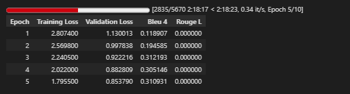
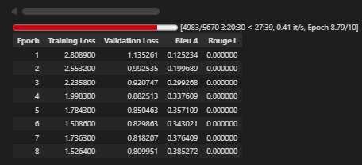
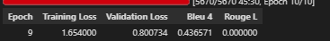
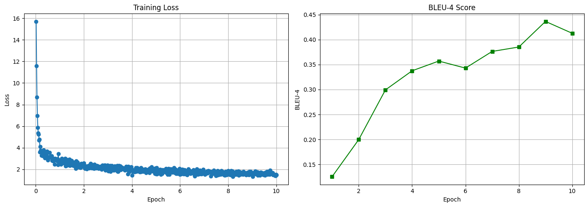

# IndonanoT5 fine-tuned D=512 With Dataset V3  full 07

06_task_specific_training.ipynb

Note = letaknya di akun gmail iansyah@gmail.com

Model:           IndoNanoT5-base (248M params)
Adapter:         Pfeiffer, d=512 (reduction_factor=6) ⬆️
Trainable:       ~9.5M params (3.8%) ⬆️
Dataset:         dataset-task-v3/00-dataset/ (5,560 train) ⬆️
Epochs:          10 ⬆️
Batch Size:      4 (effective: 8 with grad_accum=2)
Learning Rate:   5e-5 ⬇️ (lebih kecil untuk model lebih besar)
Warmup:          100 steps ⬆️

Expected Results:
  BLEU-4:        0.32-0.35 (+23-35%)
  ROUGE-L:       0.52-0.58 (+8-20%)
  Training Time: 6-8 hours


## 1 setup environtment 

Python:  3.12.13 (main, Mar  4 2026, 09:23:07) [GCC 11.4.0]
OS:      Linux
Torch:   2.10.0+cu128
CUDA:    True

=== Library Versions ===
  adapters             1.3.0
  transformers         4.57.6
  datasets             4.0.0
  accelerate           1.13.0
  evaluate             0.4.6
  torch                2.10.0+cu128
  tokenizers           0.22.2
  rouge_score          unknown
  bert_score           0.3.12

  cuda version         12.8
  gpu name             Tesla T4

## 2 Load Model with Adapters Layers 

```

from src.finetuned.utils.adapter_loader import load_model_with_adapter, print_adapter_info

# Load model with adapter layers
model, tokenizer = load_model_with_adapter(
    model_name='LazarusNLP/IndoNanoT5-base',
    adapter_name='mcq_generation',
    adapter_config='pfeiffer',
    reduction_factor=6,  # d=128
    device='cuda'
)

# Print detailed info
trainable, total = print_adapter_info(model, tokenizer)

```

✓ Adapter added: pfeiffer config, d=512.0
✓ Adapter activated for training
✓ Model moved to GPU
  GPU allocated: 1.08 GB

============================================================
MODEL INFORMATION
============================================================

Parameters:
  Trainable: 18,905,088 (7.09%)
  Total:     266,482,944
  Frozen:    247,577,856

Tokenizer:
  Vocab size: 32000
  Pad token:  <pad> (ID: 0)
  EOS token:  </s> (ID: 1)

✓ Loaded 567 entries from /content/dataset_aqg/dataset-task-spesifc/test.jsonl

Dataset loaded:
  Train: 4529 samples
  Val:   566 samples
  Test:  567 samples
✓ Using output field: 'output'

=== Dataset Validation Summary ===
Total Entries: 4529
Duplicate Count: 0
Avg Input Length: 195.65 chars
Avg Target Length: 239.35 chars
Has Metadata: True
✓ No duplicates found

=== Sample Entry ===
Input: buat_soal_pilihan_ganda: Perhatikan kode berikut:
```python
var_mat = [[10, 20],
           [30, 40],
           [50, 60]]
print(var_mat[0][1] + var_mat[2][1])
```
Kode ini menjumlahkan elemen kolom kedua dari baris pertama dan baris terakhir....
Output: question: Perhatikan kode berikut:
```python
var_mat = [[10, 20],
           [30, 40],
           [50, 60]]
print(var_mat[0][1] + var_mat[2][1])
```
Apa output dari kode tersebut?
answer: 80
distractors: 70 | 90 | 60...

✓ Dataset ready (supports both v2 and v3 formats)


## 4 baseline Evaluation

```

from src.finetuned.evaluation.metrics_calculator import MetricsCalculator
from src.finetuned.evaluation.model_evaluator import ModelEvaluator

metrics_calc = MetricsCalculator()
evaluator = ModelEvaluator(
    model=model,
    tokenizer=tokenizer,
    metrics_calculator=metrics_calc
)

print('Computing baseline metrics (10 samples)...')
baseline_metrics = evaluator.evaluate_on_test_set(
    test_dataset=val_dataset,
    num_beams=4,
    include_bertscore=False,
    max_samples=10
)

print(f"\nBaseline Metrics:")
print(f"  BLEU-4:  {baseline_metrics.get('bleu_4', 0):.4f}")
print(f"  ROUGE-L: {baseline_metrics.get('rouge_l', 0):.4f}")

```


Computing Diversity...
✓ All metrics computed

============================================================
Test Set Evaluation Results
============================================================

BLEU Scores:
  BLEU:     0.0000
  BLEU-1:   0.0644
  BLEU-2:   0.0032
  BLEU-3:   0.0000
  BLEU-4:   0.0000

ROUGE Scores:
  ROUGE-1:  0.0743
  ROUGE-2:  0.0084
  ROUGE-L:  0.0658

Diversity:
  Distinct-1: 0.3202
  Distinct-2: 0.6767

============================================================

Baseline Metrics:
  BLEU-4:  0.0000
  ROUGE-L: 0.0658

## 5 Configure Training

============================================================
TRAINING CONFIGURATION
============================================================
Epochs: 10
Batch size: 4
Effective batch size: 8
Learning rate: 5e-05
Warmup steps: 100
FP16: True
Gradient checkpointing: True

✓ Trainer configured
  Checkpoints will be saved to: /content/drive/MyDrive/dataset_aqg/checkpoints/11-indonanoot5-report

## 6 Start Training

```

# ✅ SIMPLIFIED: Let trainer handle checkpoint detection
resume = True  # Set to False if you want fresh training

# Train - trainer will auto-detect and resume from last checkpoint
results = trainer.train(
    train_dataset=train_dataset,
    eval_dataset=val_dataset,
    training_args=training_args,
    early_stopping_patience=2,
    resume_from_checkpoint=resume
)

```

✓ Datasets tokenized
✓ Data collator configured
✓ Trainer initialized (with transformers 4.46+ compatibility fix)
🆕 Starting fresh training (no resume)

============================================================
STARTING TRAINING
============================================================
Training with Adapter Layers (d=64, ~3.6% trainable params)
Expected time: 6-8 hours on T4 GPU
Total epochs: 10
============================================================






## 7 Save adapter & Visualize 

```

# Save adapter weights
adapter_save_path = trainer.save_adapter(
    adapter_name='mcq_generation',
    save_config={
        "model_name": "LazarusNLP/IndoNanoT5-base",
        "adapter_config": "pfeiffer",
        "reduction_factor": 12,
        "trainable_params": trainable,
        "total_params": total,
        "num_train_epochs": 8,
        "learning_rate": 1e-4,
        "training_time_hours": elapsed
    }
)

# Plot training curves
trainer.plot_training_curves(
    save_path=f'{CHECKPOINT_DIR}/training_curves.png'
)

```

============================================================
SAVING ADAPTER WEIGHTS
============================================================
✓ Adapter weights saved to: /content/drive/MyDrive/dataset_aqg/checkpoints/12-indonanoot5-report/adapter_mcq_generation
✓ Tokenizer saved
✓ Config saved
✓ Plot saved to /content/drive/MyDrive/dataset_aqg/checkpoints/12-indonanoot5-report/training_curves.png



##  8 final Evaluation

```
# Re-initialize evaluator with trained model
evaluator_final = ModelEvaluator(
    model=model,
    tokenizer=tokenizer,
    metrics_calculator=metrics_calc
)

print('Running comprehensive evaluation on test set...')
final_metrics = evaluator_final.evaluate_on_test_set(
    test_dataset=test_dataset,
    num_beams=4,
    include_bertscore=True,
    max_samples=None
)

print('\n=== Evaluation Results ===')
for key, value in final_metrics.items():
    print(f'{key}: {value:.4f}')

```

Computing Diversity...
✓ All metrics computed

============================================================
Test Set Evaluation Results
============================================================

BLEU Scores:
  BLEU:     0.3052
  BLEU-1:   0.6159
  BLEU-2:   0.4164
  BLEU-3:   0.3026
  BLEU-4:   0.2476

ROUGE Scores:
  ROUGE-1:  0.5405
  ROUGE-2:  0.3547
  ROUGE-L:  0.4909

BERTScore:
  Precision: 0.8060
  Recall:    0.7920
  F1:        0.7984

Diversity:
  Distinct-1: 0.1422
  Distinct-2: 0.4342

============================================================


## 9 generate sample outputs

Generating 20 sample outputs...

================================================================================
Sample 1/20
================================================================================

📥 INPUT:
buat_soal_pilihan_ganda: Matriks dapat digunakan untuk merepresentasikan berbagai data dalam kehidupan nyata, seperti gambar digital (pixel), tabel data, graf (adjacency matrix), atau sistem persamaan linear.

✅ REFERENCE:
question: Apa saja contoh penggunaan matriks dalam kehidupan nyata?
answer: Gambar digital, tabel data, graf, sistem persamaan linear
distractors: Hanya untuk perhitungan matematika | Hanya untuk menyimpan angka | Hanya untuk grafik komputer

🤖 PREDICTION:
question: bagaimana matriks dapat merepresentasikan berbagai data dalam kehidupan nyata? answer: gambar digital (pixel), tabel data, graf (adjacency matrix) atau sistem persamaan linear distractors: hanya angka | hanya gambar | tidak ada fungsi

📊 BLEU Score: 0.3005
================================================================================

================================================================================
Sample 2/20
================================================================================

📥 INPUT:
buat_soal_pilihan_ganda: Dalam penerapan unit test, test case dapat menggunakan assertion untuk memverifikasi bahwa string tidak mengandung substring. Ini berguna untuk memastikan bahwa string tidak berisi teks yang tidak diharapkan.

✅ REFERENCE:
question: Apa yang dapat diverifikasi dengan assertion untuk substring tidak dalam string?
answer: Memastikan bahwa string tidak mengandung substring
distractors: Memastikan bahwa string mengandung substring | Memastikan bahwa string memiliki panjang tertentu | Memastikan bahwa string dapat diubah

🤖 PREDICTION:
question: apa yang dapat diverifikasi dengan assertion untuk string? answer: memastikan bahwa string tidak mengandung substring distractors: membuat string lebih lambat | menghapus string | mengubah tipe data string

📊 BLEU Score: 0.3226
================================================================================

================================================================================
Sample 3/20
================================================================================

📥 INPUT:
buat_soal_pilihan_ganda: Perhatikan kode berikut:
```python
data = [3, 6, 9, 12, 15]
min_val = data[0]
for i in range(1, len(data)):
    if data[i] < min_val:
        min_val = data[i]
print(min_val)
```
Kode ini mencari nilai terkecil dalam array menggunakan pemrosesan sekuensial.

✅ REFERENCE:
question: Perhatikan kode berikut:
```python
data = [3, 6, 9, 12, 15]
min_val = data[0]
for i in range(1, len(data)):
    if data[i] < min_val:
        min_val = data[i]
print(min_val)
```
Apa output dari kode tersebut?
answer: 3
distractors: 15 | 9 | 0

🤖 PREDICTION:
question: perhatikan kode berikut: ```python data = [3, 6, 9, 12, 25] min_val = data[0] for i in range(1, len(data)): if data[i] < min-val: min_zer = nilai[i, i] print(min_val)`` apa output dari kode tersebut? answer: 9 distractors: 15 | 10

📊 BLEU Score: 0.7271
================================================================================

================================================================================
Sample 4/20
================================================================================

📥 INPUT:
buat_soal_pilihan_ganda: Untuk membuat virtual environment, gunakan perintah python -m venv nama_env di terminal.

✅ REFERENCE:
question: Bagaimana cara membuat virtual environment?
answer: python -m venv nama_env
distractors: create venv nama_env | new env nama_env | make venv nama_env

🤖 PREDICTION:
question: perintah apa yang digunakan untuk membuat virtual environment? answer: python -m venv nama_env distractors: java | python | java

📊 BLEU Score: 0.3903
================================================================================

================================================================================
Sample 5/20
================================================================================

📥 INPUT:
buat_soal_pilihan_ganda: Fungsi len() mengembalikan integer yang merepresentasikan jumlah elemen.

✅ REFERENCE:
question: Perhatikan kode berikut:
```python
data = [10, 20, 30, 40, 50]
print(type(len(data)))
```
Apa output dari kode di atas?
answer: <class 'int'>
distractors: <class 'list'> | <class 'str'> | 5

🤖 PREDICTION:
question: perhatikan kode berikut: ```python data = [1, 2, 3, 4, 5] print(len(data[0], 0])) `'` apa output dari kode di atas? answer: 2 distractors: 1 | 2 | error

📊 BLEU Score: 0.3603
================================================================================

================================================================================
Sample 6/20
================================================================================

📥 INPUT:
buat_soal_pilihan_ganda: Multiple instance dari class yang sama dapat memiliki atribut yang berbeda-beda. Setiap instance memiliki copy sendiri dari atribut instance. Perhatikan kode berikut yang menunjukkan multiple instance dengan atribut berbeda.

✅ REFERENCE:
question: Perhatikan kode berikut:
```python
class Orang:
    def __init__(self, nama, umur):
        self.nama = nama
        self.umur = umur

orang1 = Orang("Budi", 25)
orang2 = Orang("Ani", 30)
print(orang1.nama, orang2.umur)
```
Apa output dari kode di atas?
answer: Budi 30
distractors: Budi 25 | Ani 30 | Error

🤖 PREDICTION:
question: perhatikan kode berikut: ```python class mobil: def __init__(self, warna): self.warna = warna mobil = mobil("merah") print(mobil.warna, warna, ukuran): return mobil() self.merek = "mobil" mobil.merek mobil: mobil.bersuara() mobil.mobil.merek) mobil | error

📊 BLEU Score: 0.2509
================================================================================

================================================================================
Sample 7/20
================================================================================

📥 INPUT:
buat_soal_pilihan_ganda: Di mode interaktif, Anda dapat menggunakan dir() untuk melihat atribut dan method suatu objek.

✅ REFERENCE:
question: Fungsi apa yang digunakan untuk melihat atribut objek di mode interaktif?
answer: dir()
distractors: list() | show() | view()

🤖 PREDICTION:
question: perhatikan kode berikut: ```python class mobil: def __init__(self, warna): self.warna = warna mobil = mobil("merah") print(r(mobil.warna)) * (mobil, mobil, mobil), mobil.mobil.merek): mobil() + mobil | error

📊 BLEU Score: 0.0000
================================================================================

================================================================================
Sample 8/20
================================================================================

📥 INPUT:
buat_soal_pilihan_ganda: Dalam penerapan unit test, test case dapat menggunakan parameter untuk menguji berbagai input. Ini memungkinkan satu test case menguji banyak skenario tanpa duplikasi kode.

✅ REFERENCE:
question: Apa manfaat menggunakan parameter dalam test case?
answer: Memungkinkan satu test case menguji banyak skenario tanpa duplikasi kode
distractors: Membuat test case berjalan lebih cepat | Meningkatkan akurasi hasil test | Mengurangi jumlah assertion yang diperlukan

🤖 PREDICTION:
question: apa keuntungan menggunakan parameter dalam test case? answer: memungkinkan satu test case menguji berbagai skenario tanpa duplikasi kode distractors: membuat test case berjalan lebih cepat | mengurangi jumlah test case yang perlu dilakukan | membuat semua test case dapat dijalankan

📊 BLEU Score: 0.4289
================================================================================

================================================================================
Sample 9/20
================================================================================

📥 INPUT:
buat_soal_pilihan_ganda: Method rjust() bisa mengganti whitespace dengan karakter lain. Contoh: print('Dicoding'.rjust(20, '!')) akan menghasilkan '!!!!!!!!!!!!Dicoding'.

✅ REFERENCE:
question: Perhatikan kode berikut:
```python
print('Dicoding'.rjust(20, '!'))
```
Apa output dari kode di atas?
answer: !!!!!!!!!!!!Dicoding
distractors: Dicoding!!!!!!!!!!!! | !!!!!!Dicoding!!!!!! | Dicoding

🤖 PREDICTION:
question: perhatikan kode berikut: ```python print('dicoding'.rjust(20, '!')) `'` apa output dari kode di atas? answer: 20 distractors: 10 | 15 | error

📊 BLEU Score: 0.2616
================================================================================

================================================================================
Sample 10/20
================================================================================

📥 INPUT:
buat_soal_pilihan_ganda: Perhatikan kode berikut:
```python
data = [1, 2, 3, 4, 5, 6]
result = list(filter(lambda x: x % 2 == 0, data))
print(result)
```
Kode ini menggunakan fungsi filter() dengan lambda untuk memfilter elemen genap.

✅ REFERENCE:
question: Perhatikan kode berikut:
```python
data = [1, 2, 3, 4, 5, 6]
result = list(filter(lambda x: x % 2 == 0, data))
print(result)
```
Apa output dari kode tersebut?
answer: [2, 4, 6]
distractors: [1, 3, 5] | [1, 2, 3, 4, 5, 6] | [0, 2, 4, 6]

🤖 PREDICTION:
question: perhatikan kode berikut: ```python data = [1, 2, 3, 4, 5, 6] result = list(filter(lambda x: x % 2 == 0, data)) print(result) '`` apa output dari kode di atas? answer: 1 distractors: 3 | 1 | error

📊 BLEU Score: 0.4714
================================================================================

================================================================================
Sample 11/20
================================================================================

📥 INPUT:
buat_soal_pilihan_ganda: One-liner untuk pertukaran variabel lebih efisien dalam hal memori karena tidak memerlukan alokasi variabel bantuan temp. Python menangani pertukaran secara internal.

✅ REFERENCE:
question: Mengapa one-liner lebih efisien dalam memori?
answer: Tidak memerlukan alokasi variabel bantuan
distractors: Menggunakan lebih banyak memori | Memerlukan variabel tambahan | Tidak ada perbedaan

🤖 PREDICTION:
question: mengapa one-liner lebih efisien dalam hal memori? answer: karena tidak memerlukan alokasi variabel distractors: karena python tidak mendukung pertukaran secara internal | karena tidak perlu alokasi variabel | tidak ada keuntungan

📊 BLEU Score: 0.1915
================================================================================

================================================================================
Sample 12/20
================================================================================

📥 INPUT:
buat_soal_pilihan_ganda: Library unittest menyediakan method assertRaises() untuk menguji bahwa fungsi melempar exception yang diharapkan. Ini penting untuk memverifikasi error handling dalam kode.

✅ REFERENCE:
question: Apa fungsi method assertRaises() dalam unittest?
answer: Menguji bahwa fungsi melempar exception yang diharapkan
distractors: Menguji bahwa fungsi tidak melempar exception | Menangkap exception yang tidak diharapkan | Mengabaikan exception yang terjadi saat test

🤖 PREDICTION:
question: apa kegunaan method assertraises() dalam unittest? answer: menguji bahwa fungsi melempar exception yang diharapkan distractors: menguji apakah fungsi melempar eksception terlalu cepat | menguji bahwa variabel tidak bisa dipanggil | memverifikasi bahwa fungsi tidak dapat dipanggil

📊 BLEU Score: 0.3509
================================================================================

================================================================================
Sample 13/20
================================================================================

📥 INPUT:
buat_soal_pilihan_ganda: Operasi matriks dengan konstanta bersifat komutatif untuk perkalian, artinya `A * k = k * A` dimana A adalah matriks dan k adalah konstanta.

✅ REFERENCE:
question: Apakah operasi `mat * 5` sama dengan `5 * mat` dalam NumPy?
answer: Ya, karena perkalian dengan konstanta bersifat komutatif
distractors: Tidak, urutan mempengaruhi hasil | Ya, tetapi hanya untuk matriks persegi | Tidak, yang kedua akan menghasilkan error

🤖 PREDICTION:
question: apa yang dimaksud dengan `a * k = k * a` dalam operasi matriks? answer: a adalah matriks dan k adalah konstanta distractors: a | k | a

📊 BLEU Score: 0.0000
================================================================================

================================================================================
Sample 14/20
================================================================================

📥 INPUT:
buat_soal_pilihan_ganda: Abstraksi data memungkinkan pemisahan antara apa yang dilakukan oleh data dan bagaimana data itu diimplementasikan.

✅ REFERENCE:
question: Apa yang dipisahkan oleh konsep abstraksi data?
answer: Apa yang dilakukan data dan bagaimana data diimplementasikan
distractors: Keyboard dan mouse | Monitor dan CPU | Listrik dan sinyal

🤖 PREDICTION:
question: apa manfaat utama dari abstraksi data? answer: pemisahan antara apa yang dilakukan oleh data dan bagaimana data diimplementasikan distractors: membuat data lebih lambat | menghapus data | membuat data tidak bisa diubah

📊 BLEU Score: 0.2883
================================================================================

================================================================================
Sample 15/20
================================================================================

📥 INPUT:
buat_soal_pilihan_ganda: Dalam OOP, nama kelas menggunakan konvensi PascalCase dimana setiap kata dimulai dengan huruf kapital. Contohnya MobilSport, ManusiaDeasa, atau KendaraanBermotor.

✅ REFERENCE:
question: Konvensi penamaan apa yang digunakan untuk nama kelas?
answer: PascalCase dimana setiap kata dimulai dengan huruf kapital
distractors: snake_case dengan underscore | camelCase dengan huruf kecil di awal | UPPER_CASE semua huruf kapital

🤖 PREDICTION:
question: apa yang dimaksud dengan pascalcase dalam oop? answer: setiap kata dimulai dengan huruf kapital distractors: huruf kapital semua kata | huruf besar semua huruf kapital | nama variabel

📊 BLEU Score: 0.2529
================================================================================

================================================================================
Sample 16/20
================================================================================

📥 INPUT:
buat_soal_pilihan_ganda: Method chaining bekerja dari kiri ke kanan.

✅ REFERENCE:
question: Perhatikan kode berikut:
```python
print('hello'.replace('h', 'H').upper())
```
Apa output dari kode di atas?
answer: HELLO
distractors: Hello | HELLO | hELLO

🤖 PREDICTION:
question: perhatikan kode berikut: ```python data = [1, 2, 3, 4, 5] print(data[1]) `'` apa output dari kode di atas? answer: false distractors: true | python | error

📊 BLEU Score: 0.3011
================================================================================

================================================================================
Sample 17/20
================================================================================

📥 INPUT:
buat_soal_pilihan_ganda: Google Colaboratory otomatis menyimpan perubahan notebook secara berkala.

✅ REFERENCE:
question: Bagaimana Google Colaboratory menyimpan perubahan?
answer: Otomatis secara berkala
distractors: Harus manual Ctrl+S | Tidak menyimpan | Hanya saat ditutup

🤖 PREDICTION:
question: apa fungsi google colaboratory otomatis? answer: menyimpan perubahan notebook secara berkala distractors: menghapus semua perubahan | membuat notebook baru | menghapus error

📊 BLEU Score: 0.1596
================================================================================

================================================================================
Sample 18/20
================================================================================

📥 INPUT:
buat_soal_pilihan_ganda: Perhatikan kode berikut:
```python
try:
    for i in range(3):
        print(f"Iterasi {i}")
        if i == 1:
            raise StopIteration("Berhenti")
except StopIteration as e:
    print(e)
```
Kode ini menggunakan StopIteration untuk menghentikan loop secara manual.

✅ REFERENCE:
question: Perhatikan kode berikut:
```python
try:
    for i in range(3):
        print(f"Iterasi {i}")
        if i == 1:
            raise StopIteration("Berhenti")
except StopIteration as e:
    print(e)
```
Berapa kali "Iterasi" dicetak?
answer: 2 kali
distractors: 3 kali | 1 kali | 0 kali

🤖 PREDICTION:
question: perhatikan kode berikut: ```python try: for i in range(3): print(f"iterasi {i}") if i == 1: raise stopiteration("berhenti") except stopiterated("tidak berhenti") print(e) `‘` apa output dari kode di atas? answer: true distractors: false | 1 | error

📊 BLEU Score: 0.5271
================================================================================

================================================================================
Sample 19/20
================================================================================

📥 INPUT:
buat_soal_pilihan_ganda: Perhatikan kode berikut yang menunjukkan fungsi dengan variabel lokal:
```python
def hitung():
    x = 10
    y = 20
    hasil = x + y
    return hasil

print(hitung())
```
Kode ini mendefinisikan fungsi hitung dengan variabel lokal x, y, dan hasil yang hanya ada di dalam fungsi.

✅ REFERENCE:
question: Perhatikan kode berikut:
```python
def hitung():
    x = 10
    y = 20
    hasil = x + y
    return hasil

print(hitung())
```
Apa output dari kode di atas?
answer: 30
distractors: 10 | 20 | 0 | Error

🤖 PREDICTION:
question: perhatikan kode berikut: ```python def hitung(): x = 10 y = x + y return hasil print(hitung()) '`` apa output dari kode di atas? answer: 20 distractors: 30 | 15 | error

📊 BLEU Score: 0.6430
================================================================================

================================================================================
Sample 20/20
================================================================================

📥 INPUT:
buat_soal_pilihan_ganda: Namespace adalah ruang nama yang memetakan nama ke objek. Setiap fungsi memiliki namespace lokalnya sendiri yang terpisah dari namespace global.

✅ REFERENCE:
question: Apa yang dimaksud dengan namespace dalam fungsi?
answer: Ruang nama yang memetakan nama ke objek, terpisah dari namespace global
distractors: Nama fungsi yang digunakan | Jumlah parameter fungsi | Tipe data return value

🤖 PREDICTION:
question: apa yang dimaksud dengan namespace? answer: ruang nama yang memetakan nama ke objek distractors: fungsi yang tidak memiliki namespace | fungsi yang hanya bisa dipanggil sekali | ruang yang tidak bisa dipanggil

📊 BLEU Score: 0.2554
================================================================================

✓ Samples saved to /content/drive/MyDrive/dataset_aqg/evaluation_results/12-indonanoot5-report/sample_outputs.json

✓ 20 samples generated and saved
✓ Full output displayed above with BLEU scores


## 10 final summary 

============================================================
COMPARING WITH BASELINE
============================================================

Metric                        Baseline   Fine-tuned  Improvement
-----------------------------------------------------------------
bleu                            0.0063       0.3052     4768.82%
bleu_1                          0.0623       0.6159      888.18%
bleu_2                          0.0057       0.4164     7145.99%
bleu_3                          0.0029       0.3026    10279.63%
bleu_4                          0.0015       0.2476    16639.13%
brevity_penalty                 1.0000       0.8198      -18.02%
length_ratio                    1.4617       0.8342      -42.93%
rouge_1                         0.0939       0.5405      475.80%
rouge_2                         0.0133       0.3547     2569.00%
rouge_l                         0.0919       0.4909      434.43%
rouge_1_fmeasure                0.0939       0.5405      475.80%
rouge_2_fmeasure                0.0133       0.3547     2569.00%
rouge_l_fmeasure                0.0919       0.4909      434.43%
distinct_1                      0.6102       0.1422      -76.69%
distinct_2                      0.8523       0.4342      -49.05%

============================================================
ADAPTER-BASED AQG TRAINING SUMMARY
============================================================
Method: Adapter Layers (d=512) ⭐ Dataset V3 (5,662 samples)
Training Time: 0.01 hours
Trainable: 7.09%

Metrics Comparison:
  BLEU-4:  0.0015 → 0.2476
  ROUGE-L: 0.0919 → 0.4909

BLEU-4 Improvement: +16639.1%

✓ SUCCESS: BLEU-4 target achieved (>= 0.20)

✓ Fine-tuning pipeline complete!
  Adapter: /content/drive/MyDrive/dataset_aqg/checkpoints/12-indonanoot5-report/adapter_mcq_generation
  Report: /content/drive/MyDrive/dataset_aqg/evaluation_results/12-indonanoot5-report/evaluation_report.json
  Samples: /content/drive/MyDrive/dataset_aqg/evaluation_results/12-indonanoot5-report/sample_outputs.json

============================================================
HOW TO LOAD TRAINED ADAPTER
============================================================
from adapters import AutoAdapterModel
from transformers import AutoTokenizer

model = AutoAdapterModel.from_pretrained("LazarusNLP/IndoNanoT5-base")
tokenizer = AutoTokenizer.from_pretrained("LazarusNLP/IndoNanoT5-base")
model.load_adapter("/content/drive/MyDrive/dataset_aqg/checkpoints/12-indonanoot5-report/adapter_mcq_generation")
model.set_active_adapters("mcq_generation")

# Generate
inputs = tokenizer("generate_mcq: [CONTEXT]", return_tensors="pt")
outputs = model.generate(**inputs, max_length=512, num_beams=4)
print(tokenizer.decode(outputs[0], skip_special_tokens=True))