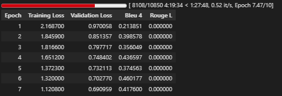

# IndonanoT5 fine-tuned D=512 With Dataset V5  No Code 08

06_task_specific_training.ipynb

Note = letaknya di akun gmail @gmail.com

Model:           IndoNanoT5-base (248M params)
Adapter:         Pfeiffer, d=512 (reduction_factor=6) ⬆️
Trainable:       ~9.5M params (3.8%) ⬆️
Dataset:         dataset-task-v3/00-dataset/ (5,560 train) ⬆️
Epochs:          10 ⬆️
Batch Size:      4 (effective: 8 with grad_accum=2)
Learning Rate:   5e-5 ⬇️ (lebih kecil untuk model lebih besar)
Warmup:          100 steps ⬆️

Expected Results:
  BLEU-4:        0.32-0.35 (+23-35%)
  ROUGE-L:       0.52-0.58 (+8-20%)
  Training Time: 6-8 hours


## 1 setup environtment 

Python:  3.12.13 (main, Mar  4 2026, 09:23:07) [GCC 11.4.0]
OS:      Linux
Torch:   2.10.0+cu128
CUDA:    True

=== Library Versions ===
  adapters             1.3.0
  transformers         4.57.6
  datasets             4.0.0
  accelerate           1.13.0
  evaluate             0.4.6
  torch                2.10.0+cu128
  tokenizers           0.22.2
  rouge_score          unknown
  bert_score           0.3.12

  cuda version         12.8
  gpu name             Tesla T4

## 2 Load Model with Adapters Layers 

```

from src.finetuned.utils.adapter_loader import load_model_with_adapter, print_adapter_info

# Load model with adapter layers
model, tokenizer = load_model_with_adapter(
    model_name='LazarusNLP/IndoNanoT5-base',
    adapter_name='mcq_generation',
    adapter_config='pfeiffer',
    reduction_factor=6,  
    device='cuda'
)

# Print detailed info
trainable, total = print_adapter_info(model, tokenizer)

```


✓ Adapter added: pfeiffer config, d=512.0
✓ Adapter activated for training
✓ Model moved to GPU
  GPU allocated: 1.08 GB

✓ Loaded 1086 entries from /content/dataset_aqg/dataset-task-spesifc/test.jsonl

Dataset loaded:
  Train: 8680 samples
  Val:   1085 samples
  Test:  1086 samples
✓ Using output field: 'output'

=== Dataset Validation Summary ===
Total Entries: 8680
Duplicate Count: 0
Avg Input Length: 199.09 chars
Avg Target Length: 218.32 chars
Has Metadata: True
✓ No duplicates found

=== Sample Entry ===
Input: buat_soal_pilihan_ganda: Dalam percabangan, penting untuk mempertimbangkan edge cases. Edge cases adalah kondisi ekstrem atau tidak biasa yang mungkin menyebabkan bug....
Output: question: Apa yang dimaksud dengan edge cases?
answer: Kondisi ekstrem atau tidak biasa
distractors: Kondisi normal | Kondisi yang sering terjadi | Kondisi yang tidak mungkin...

✓ Dataset ready (supports both v2 and v3 formats)


## 4 baseline Evaluation

```

from src.finetuned.evaluation.metrics_calculator import MetricsCalculator
from src.finetuned.evaluation.model_evaluator import ModelEvaluator

metrics_calc = MetricsCalculator()
evaluator = ModelEvaluator(
    model=model,
    tokenizer=tokenizer,
    metrics_calculator=metrics_calc
)

print('Computing baseline metrics (10 samples)...')
baseline_metrics = evaluator.evaluate_on_test_set(
    test_dataset=val_dataset,
    num_beams=4,
    include_bertscore=False,
    max_samples=10
)

print(f"\nBaseline Metrics:")
print(f"  BLEU-4:  {baseline_metrics.get('bleu_4', 0):.4f}")
print(f"  ROUGE-L: {baseline_metrics.get('rouge_l', 0):.4f}")

```

Computing Diversity...
✓ All metrics computed

============================================================
Test Set Evaluation Results
============================================================

BLEU Scores:
  BLEU:     0.0166
  BLEU-1:   0.0773
  BLEU-2:   0.0207
  BLEU-3:   0.0081
  BLEU-4:   0.0059

ROUGE Scores:
  ROUGE-1:  0.1187
  ROUGE-2:  0.0354
  ROUGE-L:  0.0924

Diversity:
  Distinct-1: 0.2270
  Distinct-2: 0.5230

============================================================

Baseline Metrics:
  BLEU-4:  0.0059
  ROUGE-L: 0.0924

============================================================
TRAINING CONFIGURATION
============================================================
Epochs: 10
Batch size: 4
Effective batch size: 8
Learning rate: 5e-05
Warmup steps: 100
FP16: True
Gradient checkpointing: True

✓ Trainer configured
  Checkpoints will be saved to: /content/drive/MyDrive/dataset_aqg/checkpoints/13-indonanoot5-report


## 6 Start Training

```

# ✅ SIMPLIFIED: Let trainer handle checkpoint detection
resume = True  # Set to False if you want fresh training

# Train - trainer will auto-detect and resume from last checkpoint
results = trainer.train(
    train_dataset=train_dataset,
    eval_dataset=val_dataset,
    training_args=training_args,
    early_stopping_patience=2,
    resume_from_checkpoint=resume
)

```

✓ Datasets tokenized
✓ Data collator configured
✓ Trainer initialized (with transformers 4.46+ compatibility fix)
🆕 Starting fresh training (no resume)

============================================================
STARTING TRAINING
============================================================
Training with Adapter Layers (d=64, ~3.6% trainable params)
Expected time: 6-8 hours on T4 GPU
Total epochs: 10
============================================================




## 7 Save adapter & Visualize 

```

# Save adapter weights
adapter_save_path = trainer.save_adapter(
    adapter_name='mcq_generation',
    save_config={
        "model_name": "LazarusNLP/IndoNanoT5-base",
        "adapter_config": "pfeiffer",
        "reduction_factor": 12,
        "trainable_params": trainable,
        "total_params": total,
        "num_train_epochs": 8,
        "learning_rate": 1e-4,
        "training_time_hours": elapsed
    }
)

# Plot training curves
trainer.plot_training_curves(
    save_path=f'{CHECKPOINT_DIR}/training_curves.png'
)

```


##  8 final Evaluation

```
# Re-initialize evaluator with trained model
evaluator_final = ModelEvaluator(
    model=model,
    tokenizer=tokenizer,
    metrics_calculator=metrics_calc
)

print('Running comprehensive evaluation on test set...')
final_metrics = evaluator_final.evaluate_on_test_set(
    test_dataset=test_dataset,
    num_beams=4,
    include_bertscore=True,
    max_samples=None
)

print('\n=== Evaluation Results ===')
for key, value in final_metrics.items():
    print(f'{key}: {value:.4f}')

```


## 9 generate sample outputs


## 10 final summary 

